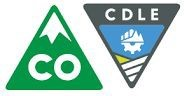

# CDLE Oil and Public Safety Data

**Last Updated:** 01/17/2020

**The Colorado Department of Labor &amp; Employment** (CDLE) connects job seekers with great jobs, provides an up-to-date and accurate picture of the economy to help decision making, assists workers who have been injured on the job, ensures fair labor practices, helps those who have lost their jobs by providing temporary wage replacement through unemployment benefits, and protects the workplace - and Colorado communities - with a variety of consumer protection and safety programs. Find their website at [**https://www.colorado.gov/cdle**](https://www.colorado.gov/cdle).

Within the Colorado Department of Labor &amp; Employment, **the Division of Oil and Public Safety** (OPS) successfully partners with regulated business owners and operators in Colorado to protect the public and our environment by ensuring the safe storage and use of fuel products and explosives and the safe operation of amusement rides, boilers and conveyances.Find their website at [**https://www.colorado.gov/ops**](https://www.colorado.gov/ops).

The OPS Petroleum Program is responsible for protecting human health and the environment from petroleum releases caused by regulated storage tank systems. This includes oversight of assessment and cleanup of regulated substances from both underground storage tank (UST) and above ground storage tank (AST) systems.

## OPS and GoCode Colorado 2019

All of the [Open Petroleum Release Events](https://data.colorado.gov/Environment/Active-OPS-Petroleum-Release-Events-in-Colorado/v5ut-qgp7) from regulated storage tank systems are reported to OPS. These release events are currently being investigated, assessed/remediated or are obtaining closure.

Geodata contained in this dataset can provide insight regarding where petroleum product releases are located in relation to water sources. Since the contact information for OPS technical reviewers is included in this dataset, inquiries may be made directly to them if there are any questions about the release events.

**Active and Closed Events**

For active and closed events, navigate to the [**Active and Closed Petroleum Release Events in Colorado**](https://data.colorado.gov/Environment/Active-Closed-OPS-Petroleum-Release-Events-in-Colo/g3jr-97se) dataset. This dataset is updated monthly from the [**Colorado Storage Tank Information System (COSTIS)**](https://opus.cdle.state.co.us/OIS2000/home.asp), and the locations are generated from point address based geocoding.

## Working with Petroleum Release Data

Each row in these datasets represents one release record, or rather, one site cleanup. Each release record may be researched further on the public-facing COSTIS database.

## Finding the Data

A user may access the OPS Petroleum Release Events dataset by navigating to [**OPS Petroleum Release Events in Colorado**](https://data.colorado.gov/Environment/OPS-Petroleum-Release-Events-in-Colorado/x235-reiv) dataset, or by navigating to [**https://data.colorado.gov**](https://data.colorado.gov/), searching for OPS and selecting the &quot;OPS Petroleum Release Events in Colorado&quot; dataset.

The dataset description is as follows:

Underground Storage Tank (UST) system and Aboveground Storage Tank (AST) system petroleum release events, with their associated locations, contacts for remediation, and status in relation to currently being investigated, assessed, remediated, obtaining closure, or closed, dating back to 1986. Data provided by the State of Colorado, Department of Labor &amp; Employment, Division of Oil &amp; Public Safety. There is no guarantee the data published is 100% accurate, correct, current or complete.

## Other Dataset Information

- This dataset was initially posted in the Colorado Information Marketplace in June 2016 to provide improved data accessibility to the public
- This dataset is updated monthly, usually on the first day of the month
- Additional fields have been added to the dataset since its original creation based on user feedback, including county and closure field

## More Resources

More detailed release information is available in the [**COSTIS database**](https://opus.cdle.state.co.us/OIS2000/home.asp), which is managed by OPS technical reviewers and administrative staff.

Reports and site maps are also available to the public via a [**request to the OPS Public Records Center**](https://www.colorado.gov/ops/PetroleumDataDocuments).

For more information about the OPS Petroleum Storage Tank program requirements, view the [Petroleum Program Guidance](http://www.coworkforce.gov/petroleumguidance/).

## CDLE FAQ

[**Colorado Department of Labor and Employment**](https://www.colorado.gov/cdle)

[**Colorado Division of Oil and Public Safety**](http://www.coworkforce.gov/petroleumguidance/Default.htm)

If you have any questions about this dataset, please feel free to reach out to the following people:

Melanie Moore 303-318-8524

### [melanie.moore@state.co.us](mailto:melanie.moore@state.co.us)

Mike Kwiecinski 303-318-8512

### [mike.kwiecinski@state.co.us](mailto:mike.kwiecinski@state.co.us)

Amy Miller 303-318-8530

### [amy.miller@state.co.us](mailto:amy.miller@state.co.us)
