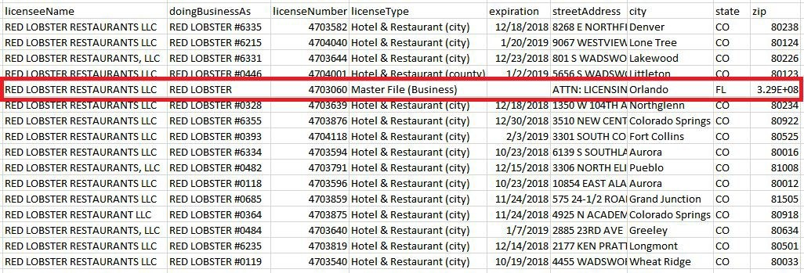

# Liquor License Data

## Liquor License Enforcement Division Data

Seven datasets are available on the Colorado Information Marketplace. The first three (1-3) are related with fields in common, see more below. The second three (4-6) are thematically similar as they generally relate to liquor licenses issued for events. The seventh dataset stands alone as a Compliance Report.

1. [Liquor Licenses in Colorado](https://data.colorado.gov/Business/Liquor-Licenses-in-Colorado/ier5-5ms2)

Names and locations of business with active liquor licenses from the Colorado Department of Revenue (DOR) Liquor Enforcement Division

2. [Recently Expired and Surrendered Liquor Licenses in Colorado](https://data.colorado.gov/Business/Recently-Expired-and-Surrendered-Liquor-Licenses-i/pwjb-9dd5)

Names, locations, license numbers and status of liquor licenses surrendered or expired by businesses in Colorado within the last three months from the Colorado Department of Revenue (DOR) Liquor Enforcement Division. Note: Retail licenses that are listed as expired may be pending with local licensing authority. Pursuant to Colorado Law, any renewal applications that were filed prior to expiration and are pending at the local licensing authority are still valid until final agency action.

3. [Recently Approved Liquor Licenses in Colorado](https://data.colorado.gov/Business/Recently-Approved-Liquor-Licenses-in-Colorado/htyp-tqzh)

Names and locations of business with active liquor licenses approved in the last three months from the Colorado Department of Revenue (DOR) Liquor Enforcement Division.

4. [Liquor Permits for Special Events in Colorado](https://data.colorado.gov/Business/Liquor-Permits-for-Special-Events-in-Colorado/d6t8-xish)

Event and festival locations, dates and organization addresses for special event liquor license registration with the Colorado Department of Revenue (DOR) Liquor Enforcement Division for 2018.

5. [Sales Rooms in Colorado](https://data.colorado.gov/Business/Sales-Rooms-in-Colorado/9pwz-gi5v)

Sales rooms are permanent fixtures (ie tasting room) where beer, wine, or spirits are sold for on/or off premises sales. Data provided from the Colorado Department of Revenue (DOR) Liquor Enforcement Division.

6. [Manufacturer Temporary Sales Room Permits in Colorado](https://data.colorado.gov/Business/Manufacturer-Sales-Room-Permits-in-Colorado/d4s4-xqg6)

Names, locations and dates of events for liquor permits. Data provided by the Colorado Department of Revenue (DOR) Liquor Enforcement Division.

7. [Liquor Compliance Check Statistics in Colorado](https://data.colorado.gov/Business/Liquor-Compliance-Check-Statistics-in-Colorado/kapc-ib6e/data)

Business names, location, liquor license type and dates regarding liquor compliance checks done by the Colorado Department of Revenue, Liquor Enforcement Division. These compliance checks consists of whether or not alcohol was sold to a minor in the past 3 years.

## Understanding Liquor Licenses

NOTE: There is overlap between theses these datasets: **Liquor Licenses in Colorado**, **Recently Expired and Surrendered Liquor Licenses in Colorado**, and **Recently Approved Liquor Licenses in Colorado**. As newly registered licenses are issued, their record is included in this roster and also in the Recently Approved Liquor Licenses in Colorado as this is a frequently requested subset. When licenses expire, their record is transferred to the Recently Surrendered or Expired Liquor Licenses in Colorado dataset where they are listed for two months before being dropped from all public active liquor license lists.

## Using Liquor Licenses to Map Locations

Not all businesses list their point of sale locations with their liquor license registration and the listed address is not always guaranteed to be the physical location of the business&#39; main operation for the liquor license datasets, but event locations are expected to be the actual locations of the events.

## Liquor Licenses With Locations Outside of Colorado

NOTE: **Liquor Licenses in Colorado** , **Recently Expired and Surrendered Liquor Licenses in Colorado** , and **Recently Approved Liquor Licenses in Colorado** may contain address information from either a distributor, a manufacturer, or the headquarters of a business outside of Colorado.

**Example 1.** PF Chang&#39;s China Bistro Inc has an address listed in Scottsdale, AZ. The license type for this licensee is a &quot;Master File (Business).&quot; This means that PF Chang&#39;s China Bistro Inc. has one master liquor license for all restaurant locations in Colorado. As such, there is no way to determine locations in Colorado holding an active liquor license.

**Example 2.** Alaskan Brewing LLC. This licensee is headquartered in Juneau, AK, but does not maintain any manufacturing or sales room locations in Colorado. The license type held by the licensee is a &quot;Nonresident Manufacturer (malt liquor).&quot;

## Businesses With Locations Inside of Colorado

**Example 1:** Red Lobster maintains a liquor license for each of its locations in Colorado and is listed by restaurant number in addition to a &quot;Master File (Business)&quot; license held by the headquarters in Orlando, FL. Each restaurant listed by number maintains a &quot;Hotel &amp; Restaurant (city)&quot; or &quot;Hotel &amp; Restaurant (county)&quot; license. In this example, the individual restaurants can be geolocated based on address, but the record containing the Master File cannot.

**Example 2:** Alaskan Brewing LLC. This licensee is headquartered in Juneau, AK, but does not maintain any manufacturing or sales room locations in Colorado. The license type held by the licensee is a &quot;Nonresident Manufacturer (malt liquor).&quot;

This likely means that Alaskan Brewing LLC is required to obtain a license to either:

1. Import and sell malt liquors within the state of Colorado to persons licensed as wholesalers pursuant to this article;
2. Maintain stocks of malt liquors and to operate malt liquor warehouses by procuring a malt liquor wholesaler&#39;s license for each such operation as provided in this article;
3. Solicit orders from retail licensees and fill such orders through malt liquor
