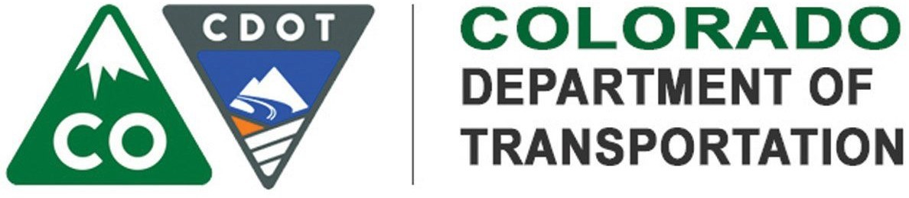

# CDOT Road Surface Definitions

**Last Update:** 01/20/2020

From [CDOT Strategic Plan FY 2012-2013](https://www.colorado.gov/pacific/sites/default/files/FY2013%20CDOT%20Strategic%20Plan.pdf)

## Roadway Surface

1. The structure, smoothness, and durability of the pavement surface are excellent. The surface is free of potholes and exhibits little or no cracking. Past repairs (e.g., patches, sealed cracks) are in excellent condition. There is little or no drop-off from the pavement or shoulder edge. Surface materials properties have not degraded.

2. The pavement is in overall good structural condition, offers a satisfactory ride, and exhibits sound materials quality. Occurrences of distress such as cracking, potholes, rutting, and materials problems are infrequent and minor. Past repairs are in good condition, with limited need for rework. Edge drop-offs are infrequent.

3. Pavement shows moderate problems with structural deterioration (e.g., cracking, potholes, past repairs), ride quality (excessive rutting, roughness, edge drop-off), or materials degradation (oxidation of asphalt surface, flushing / bleeding, or loss of material through raveling).

4. Pavement deterioration is significant, with up to half of the pavement area exhibiting one or more types of serious distress: structural deterioration (e.g., large areas or numbers of cracks, potholes), ride quality (e.g., deep ruts, surface roughness, edge drop-off), and materials degradation. Surface condition may affect speed and vehicle handling.

5. Pavement is deteriorated over more than half its area. The integrity of the surface and the ride quality it offers are degraded by extensive damage (cracking, potholes), deformation (rutting, roughness), degradation of the asphalt concrete (raveling, flushing / bleeding, or oxidation), or edge drop-off. Speed and vehicle handling likely affected.

## Roadside Facilities

1. Condition of drainage inlets, structures, and ditches, right-of-way fences, roadside slopes, and noise walls is excellent, with no damage. Drainage inlets and ditches are free of debris. Very few or no effects of slope failures or washouts have affected the road in the past year. There is no litter or debris on travel way or shoulder.

2. Roadside facilities show only minor deterioration. Blockages of drainage inlets and ditches are infrequent. Maintenance of fencing or of sound walls is needed in only a few locations. There are scattered pieces of litter or occasional roadway / shoulder debris. A small number of slope failures / washouts affect the road annually.

3. Roadside facilities show moderate deterioration. Several drainage structures are blocked with silt or debris. Fencing or sound walls require maintenance at a number of locations. Slope failures / washouts affect road availability. Limited patches of litter or sand or debris on the travel way or shoulder occur.

4. A significant level of deterioration has occurred in roadside facilities, including blocked or silted drainage features, damaged right-of way fencing, damaged or defaced sound walls, and a high annual frequency of slope failures and washouts. There are several patches of unsightly litter or sand / debris on the travel way / shoulder.

5. More than half of roadside facilities require maintenance. The condition and intended functions of these facilities are impeded by extensive blockages of drainage inlets and roadside ditches, damaged fencing, damaged or defaced sound walls, or frequent slope failures / washouts. A lot of sand, debris, and litter cover the road and roadside.

## Roadside Appearance

1. Roadappearanceisexcellent,characterizedbywelltendedlandscapingandvegetation, grass mowing at intended locations and schedules, and absence of noxious

2. Roadappearanceissuperior,withnlyinfrequentrminorinstancesfunkemptr infested landscaping and other vegetation, grass requiring mowing, or scattered occurrences of noxious

3. Overall appearance is good, but with one or more of the following problems: grass requiringmowing;selectedareasflandscapingrvegetationrequiringtrimmingr treatment; and locations where noxious weeds are

4. A significant number of items detract from road appearance, including high grass requiringmowing,anumberflandscapedrvegetatedareasrequiringtrimmingr treatment, and noxious weeds affecting up to half of road

5. Roadappearanceisextensivelydegradedbysituationssuchasexcessivelyhighgrass requiring mowing, landscaping and vegetation requiring trimming or treatment, and noxious weeds affecting most of the road

## Structure Maintenance

1. Maintenance items of bridges are in excellent condition. Decks, deck features, and weep holes are clean. Deck, curbs, expansion
joints, and railings are in good condition with all defects repaired. Bearings are clean and serviced. Paint coating on bridge steel is intact. Bridge structure, approaches, and slopes do not require maintenance.

2. Maintenance items of bridges are in superior condition. Decks, deck features, and weep holes are mostly clean, with little debris or need for washing. Minor or infrequent defects occur in deck surface, railings, expansion joints, structure, approaches, or slopes. A small percentage of bearings and of painted steel require maintenance.

3. Maintenance items of bridges are in good condition, but some features require work:
e.g., cleaning or washing of decks, curbs, and weep holes; patching of deck surface; and repair, servicing, or painting of expansion devices, railings, bearings, structural members, approaches, or slopes.

4. A significant number of bridge features require maintenance. Decks, deck features, and weep holes must be cleaned or washed. Decks, curbs, expansion joints, or railings may impede use and require repair. Bearings must be cleaned and serviced. Bridge steel requires painting. Bridge structure, approaches, and slopes need repair.

5. An extensive number of bridge features require maintenance of potentially major distress. Decks, curbs, expansion joints, or railings require repair and may pose a safety hazard. Bearings must be cleaned and serviced. Bridge steel requires painting to allay structural deterioration. Bridge structure, approaches, and slopes need repair.

## Snow & Ice Control

1. Plowing and chemicals or abrasives applications proactively maintain very high levels of mobility throughout storms (refer to
accompanying tables). Snow drifts and localized ice patches are treated quickly to avoid closures and hazards. Proactive avalanche control minimizes traffic interruptions and avoids unanticipated road closures.

2. Plowing and abrasives or chemicals applications maintain high levels of mobility as much as possible (refer to accompanying tables). Snow drifts and localized ice patches may be treated during storm with abrasives or chemicals. Proactive avalanche control minimizes traffic interruptions and avoids unanticipated road closures.

3. Plowing and abrasives or chemicals applications maintain good levels of mobility on high-standard roads (refer to accompanying
tables). Snow drifts and localized ice patches are treated as soon as possible at end of storm. Avalanche control focuses on high-priority locations and situations.

4. Plowing and abrasives or chemicals applications are performed on limited basis and some traffic delays are anticipated on all roads (refer to accompanying tables). Snow drifts and localized ice patches are treated after mainline roads are cleared. Limited avalanche control is performed. Chain station operation may be scaled back.

5. Plowing and abrasives or chemicals applications are performed on very limited basis, impairing mobility on all roads (refer to
accompanying tables). Snow drifts and localized ice patches may not be treated for some time. No preventive avalanche control is performed. Chain station operations are scaled back or suspended.

##Major Tunnels

1. Condition of the tunnel structure is excellent. Operation of electrical, electronic, and mechanical systems is highly reliable.
Inspections and repairs are performed on schedule. Response to incidents is immediate and effective, and frequent, attentive care of the facilities (e.g., washing, clearing of ice and debris) maintains safe and efficient passage.

2. Condition of the tunnel structure is very good. Operation of electrical, electronic, and mechanical systems is reliable. Inspections and repairs are performed on schedule. Response to incidents is virtually immediate, and care of the facilities (e.g., washing, clearing of ice and debris) maintains a high degree of safe, efficient passage.

3. Condition of the tunnel structure is good. Operation of electrical, electronic, and mechanical systems is reliable overall, with few nonfunctioning items. Inspections and repairs are performed regularly. Response to incidents is immediate most of the time. Care of the facilities is good overall, although conditions may degrade temporarily.

4. Condition of the tunnel structure is fair. Operation of electrical, electronic, and mechanical systems is somewhat degraded, and
response time exceeds desirable limit. Inspections, calibrations, and repairs are behind schedule. Response to incidents is immediate much of the time, but delays may occur. Care of the facilities is overdue.

5. Condition of the tunnel structure is poor. Operation of electrical, electronic, and mechanical systems is degraded, with response time exceeding desirable limit, and multiple concurrent failures in systems. Inspections, calibrations, and repairs are infrequent. Response to incidents is irregular. Care of the facilities is lacking.
