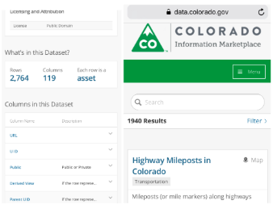
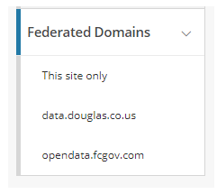
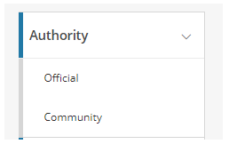
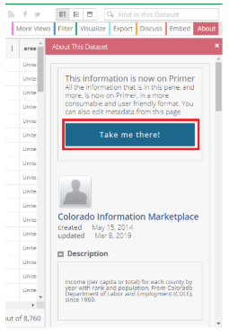
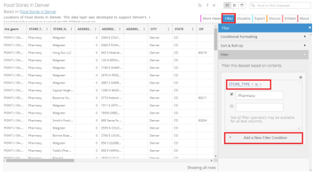
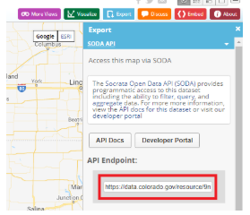
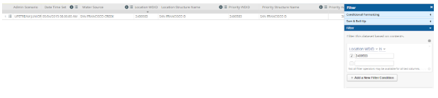

# CIM Basics

**Last Updated:** 01/21/2020

Competition participants can explore Colorado public data through the [Colorado Information Marketplace (CIM)](https://data.colorado.gov./) public data portal and learn tips and tricks for using CIM. This article is the first in a series of three and describes how to access data in the Colorado Information Marketplace (CIM), the State of Colorado’s official open data portal and the data resource for Go Code Colorado. The three articles in this series on using CIM are:

1. CIM Basics - Describes the basics of working with CIM and highlights important features to be aware of when using CIM.
2. CIM Tips and Tricks - Describes more tips on how to use CIM effectively.
3. CIM Quick Viz - Describes how to quickly create visualizations from CIM data using a variety of tools

## Introduction to Colorado Information Marketplace

Go Code Colorado organizers use their knowledge of state government operations to make public government data, most commonly known as “public data”, easier to find and easier to use. Quality, fresh, machine-readable data helps participants in the Go Code Colorado competition turn that public data into useful business insights and tools.

Government agencies collect mountains of data in the course of regular operations. That data has tremendous potential beyond the agency’s primary purpose, and the private sector is much better positioned to define that value and use the data accordingly. The Go Code Colorado competition asks data analysts, software developers, designers, business and marketing professionals, entrepreneurs and other big thinkers to find the value in the data we collect and do something awesome with it.

The Colorado Information Marketplace is provided by the Colorado Governor’s Office of Information Technology to make Colorado public data available to citizens in a centralized and easily discoverable location. It offers a dataset catalog and dataset repository, an application programming interface (API) and several tools for exploring and visualizing data.

Learn more about Go Code Colorado’s data resources:

- [Current Datasets](https://gocode.colorado.gov/data/current-data-sets/)
- [Additional Resources](http://gocode.colorado.gov/data/additional-resources/)
- [Data Exploration Examples](https://gocode.colorado.gov/data/data-exploration-examples/)
- [Search Data Connections](https://gocode.colorado.gov/data/search-data-connections/)
- [Quality Data](http://gocode.colorado.gov/data/quality-data/)

### Finding Data - The Catalog and The Asset Inventory

There are over 1,000 objects on the portal, and that number is growing every day from a collective effort of folks in the Governor’s Office for OIT, individual state agencies, and of course the Go Code Colorado Data Tech team! Downloads and Views allow users to see the relative popularity of each dataset, but make sure to be critical when using these reference points.

The [Asset Inventory](https://data.colorado.gov/dataset/Asset-Inventory/e7nm-tn2z) contains the count of ‘downloads’ and ‘views’ for every item on the portal. Use ‘name’ and dissolve duplicates to improve the accuracy of your results (As of 3/21/2019 there were 2746 items in asset inventory, but only 1940 items actually on CIM). Specifically - use name as the unique id column (you might have to merge duplicates to get a true uid) not the 4x4.

### Federated Domains

Some localities have their own public data catalogs. Two localities have partnered with CIM to provide access to their data as a “Federated Domain”. These localities are the City of Fort Collins and Douglas County. These federated domains can be found by scrolling down on the CIM catalog, and are in the bottom left corner of CIM underneath Tags

### Official vs Community Datasets

CIM allows users to publish filtered views of a dataset already published to CIM as a community view.The “community views” are great feature of CIM and its ability to create filtered views on tables, save them, and make them publicly available to others. When a user is looking for a known dataset, seeing data interpretations that have been completed by others can be greatly beneficial. While it is nice to see variations others have created, when picking a dataset to use to work with it is best to work with the “Official” version of that data. To filter datasets on CIM by Official or Community, simply click which option is desired in the top left corner of the catalog under “Authority”. By choosing “Official” only data that that is authoritative to the source (listed in the metadata) will be displayed.

**Example of Official dataset with known Community Views**
[Business Entities](https://data.colorado.gov/browse?q=business+entities&utf8=%E2%9C%93&page=2) is the Official dataset, with these three Community views:
- [Colorado Businesses in Good Standing](https://data.colorado.gov/Business/Colorado-Business-in-Good-Standing/mj3d-m5wq)
- [Denver Businesses in Good Standing](https://data.colorado.gov/Business/Denver-Business-in-Good-Standing/hm8z-ph9x)
- [All CO Businesses Geocoded](https://data.colorado.gov/Business/All-CO-businesses-geocoded/k5bm-9tcj)

There is a detriment to the filtered views feature, however, and it comes into play for times when users don’t know which dataset they’re looking for. In this scenario, simply browsing the catalog can seem a bit overwhelming, because users are looking for ONLY the raw data in an effort to see which unique datasets are available to them. A simple solution is to view just “Datasets” or “Maps” under the "View Types" on the left-hand navigation.

### Working with Data on CIM

This section provides an introduction to working with data. The subsequent docs in this series provide greater detail on the ways to maximize use of the data.

#### Good Metadata

Talk about Primer pages, how do they work, why do some have primer pages and some don't? (a: we are updating all geo datasets to the new way, but its taking time - look at Denver for the new way).

#### Field Descriptions

Field descriptions can be found on the primer page of each dataset. To get to the Primer, first click on “View Data”. Next, click on “About” and click “Take me there!” to go to the Primer page. Field descriptions are located at the bottom of the primer page.

Also there is a .csv on this github repository. Find the link [here](https://github.com/GoCodeColorado/GoCodeColorado-kbase-public/tree/master/Data/Field_Descriptions).

#### Rollup and Sort Data

Roll-up and Sort can also be implemented as a method to begin exploring the dataset. The type of data will dictate whether either of these actions will reveal any interesting information.

#### Featured Datasets and Map Views on CIM:

Socrata recently altered the way in which geospatial datasets are displayed on a data portal. Previously, any geospatial dataset that was uploaded to CIM would automatically display a map. Some of the most recently published data, however, is subject to the new Socrata standards. These new geo-datasets therefore do not display a map automatically - they have “Featured Content Using this Data”, which is set to be a simple map visualization of the same data. See [Denver Food Stores](https://data.colorado.gov/Economic-Growth/Food-Stores-in-Denver/hysf-mrke) as an example of this.

#### Filtering Data on CIM

Follow these steps to filter data on CIM:

1. In the View Data screen of any dataset, select the Filter option at the top right. A filter wizard pops up and allows the user to enter filters to sort the dataset.
2. Box 1 is the first filter and can be selected from one of two dropdowns.
  a. The first being the column to sort by
  b. The second being a condition: is, is not, contains, etc.
3. The next step is to enter parameters to match the conditional statement.
  a. In this case, filter where principal city is Denver or Colorado Springs.
4. You may add additional filters (Box 2) by clicking “Add a New Filter Condition.”
5. The final filtered dataset here shows business entities in Denver or Colorado Springs that are Limited Liability Companies.

## Access Methods

There are three primary methods to access data in the CIM.

1. Through the CIM web application
2. Through the Socrata Open Dat API (SODA)
3. In Microsoft Excel using an OData link

#### Access Through the Web application

The CIM web application enables searching  and browsing datasets and views.  Browse datasets by view type (e.g., “datasets”, “maps”), by category (e.g., “demographics”), or by category (e.g., “Local Aggregation”).  The CIM contains multiple public datasets, but those datasets published specifically for Go Code Colorado will be “tagged” with “gocodecolorado” topic keywords.

Use the CIM web application to **view the dataset** itself in one of several views:
  - as a table
  - as a rich list
  - as single records

The CIM web application provides several other features for **exploring** datasets:

  - Filter
  - Sort
  - Visualize (charts, map, etc.)
  - View metadata

**Export** the datasets in several formats:
  - CSV
  - JSON
  - PDF
  - RDF
  - RSS
  - XLS
  - XLSX
  - XML

And for geospatial datasets:
  - KML
  - KMZ
  - SHP
  - Original
    - Note that this is the only option to maintain the original dataset projection - otherwise the projection will export as WGS84
  - GeoJSON
  - JSON (non-geospatial)
  - CSV (non-geospatial)

Then import the datasets into local and or project data architecture/platforms.

#### Access Data Through the SODA API

Browse CIM by scrolling down to the data catalog and using the search box and browse filters to find datasets of interest. Every dataset is accessible via the SODA API. SODA provides an open, standards-based, RESTful application programming interface to access datasets in the CIM.

- Every hosted dataset is readily and uniformly accessible
- Data can be displayed, and advanced operations such as searching and filtering can be performed
- Datasets can be combined with other Web services to create new mashups and applications
- Socrata Open Data API (SODA) specifications were released to the Open Data community under a Creative Commons license

SODA is supported by a developer site http://beta.dev.socrata.com/.

The [Socrata Open Data API](https://dev.socrata.com/consumers/getting-started.html) allows programmatic access to open data resources from the CIM. Click the link below and for an example on how queries are structured in SODA.

`http://soda.demo.socrata.com/resource/earthquakes.json?$where=magnitude > 5.5`

The SODA API documentation has been broken down into three user categories: App Developers; Data Publishers; Data Consumers.

**Paging**
For performance, SODA APIs are paged and return a maximum of 1000 records per page. So, to request subsequent pages, use the $limit and $offset parameters to request more data. The $limit parameter chooses how many records to return per page, and $offset tells the API on what record to start returning data. Read the detailed documentation on [Paging](https://dev.socrata.com/docs/paging.html) for more info.

**What is an API Endpoint?**

An endpoint in a SODA API is simply a unique URL that represents an object or collection of objects. Every Socrata dataset, and even every data record, has its own endpoint. The endpoint is to point an HTTP client to interact with data resources.

All resources are accessed through a common base path of /resource/ along with their dataset identifier. This paradigm holds true for most every dataset in every SODA API.
There are two types of dataset identifiers:

Simple Socrata datasets have a unique “4x4” identifier - eight alphanumeric characters split into two four-character phrases by a dash. For example, State Collected City Sales Tax CSV data set:https://data.colorado.gov/Revenue/City-Areas-Collecting-State-Sales-Tax-in-Colorado/wx84-he7r has a 4x4 of “wx84-he7r.”

Note: The 4x4 identifiers are generated by Socrata and are unique within each data site.
The endpoint URL for any SODA API can be created via this simple rule:

https://$domain/resource/$dataset_identifier

For example, the endpoint for the [State Collected City Sales Tax](https://data.colorado.gov/Revenue/City-Areas-Collecting-State-Sales-Tax-in-Colorado/wx84-he7r) dataset would be:
https://data.colorado.gov/resource/wx84-he7r.json

It is important to note that this is not the case for ALL datasets. As of 2018, geospatial datasets have a different API 4x4 than the main dataset.

For example:
[Noxious Weeds in Colorado 2014](https://data.colorado.gov/Environment/Noxious-Weeds-in-Colorado-2014/mguq-rjzb) has a 4x4 of mguq-rjzb while the API endpoint is https://data.colorado.gov/resource/9mid-gqwm.json. Try to use the dataset 4x4 to discover the endpoint points to a dataset that doesn’t exist.

To find the API endpoint for geospatial datasets, look to the “Developers” section of Socrata-powered data sites or they can be found by clicking the “Export” button on the top right, then clicking “SODA API.” The endpoint location will be under “API Endpoint” field (see photo below).

Also, find API endpoints in the “Developers” section of Socrata-powered data sites, or under “Export” then “API” on any Socrata dataset page.

#### Side by Side Comparison of CIM Filter and API Where Query

Filtering data via a SODA API is fairly straightforward. There are two primary mechanisms available to filter data: [Simple Filters](https://dev.socrata.com/docs/filtering.html) and [SoQL Queries](https://dev.socrata.com/docs/queries/).

**Simple Filters**

SODA APIs are self-describing - the schema and contents of the dataset itself determines how it can be queried. Any field within the data can be used as a filter simply by appending it to the API endpoint as a GET parameter.

Additional filters can be added and the filters will be “AND”ed together. Read the detailed documentation on [Filtering Datasets](https://dev.socrata.com/docs/filtering.html) for more info.

**SoQL Queries**

The ”Socrata Query Language” (SoQL) is a simple, SQL-like query language specifically designed for making it easy to work with data on the web. The language is both powerful and easy to learn and everything works via GET parameters. Many different functions are available via SoQL. Read the detailed documentation on [SoQL Queries](https://dev.socrata.com/docs/queries/) for more info.

A great resource for API testing is [Postman](https://www.getpostman.com/). It is a free API development tool for sending requests, savings responses, creating tests, creating workflows, and sharing.

**Examples using a filter to return a single row of data in the data browser on CIM:**
To return a single record by using a filter to select a single record:

**Examples using a browser to return JSON data from an API endpoint:**
To return a single record by selecting a unique id from a given column:
[https://data.colorado.gov/resource/cg8h-amtj.json?$where=location_wdid = “2400583”](https://data.colorado.gov/resource/cg8h-amtj.json?$where=location_wdid%20=%20%222400583%22)

#### Access in Microsoft Excel Through an OData Link

The CIM provides an OData link for every hosted dataset.  With OData, create a spreadsheet in Microsoft Excel to analyze or visualize a dataset. By using an OData link, the data will be refreshable.  Use the OData link with Microsoft Excel 2010, Microsoft Excel 2013 or Microsoft Power Query.

For more details check out the Go Code Colorado Website http://gocode.colorado.gov/data/.

The Socrata Open Data API (SODA) allows software developers to access data hosted in Socrata data sites programmatically. Developers can create applications that use the SODA APIs to visualize and “mash-up” Socrata data sets in creative ways.
