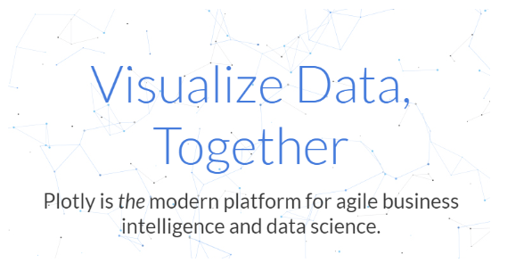
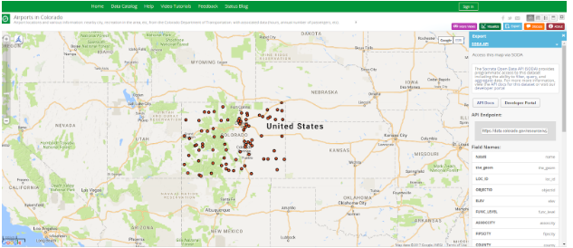
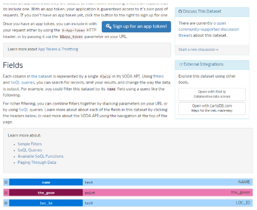
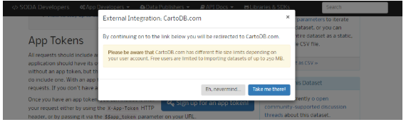
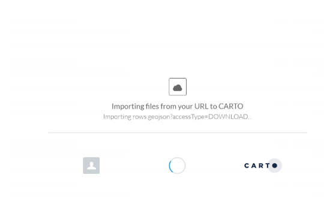

# Quick Visualizations for CIM Data

Some example of the visuals you can creat can be found on our [website](https://gocode.colorado.gov/data/data-exploration-examples/). Below are the descriptions and resources so you can create your own!

### Tableau
Tableau lets you connect to data from various sources and explore that data through charts, dashboards, and analytics. Tableau [desktop](https://www.tableau.com/products/desktop) can be downloaded, be sure to look at the limitations of the free trial as compared to the premium tiers. For most visualization needs,  [instructions](https://support.socrata.com/hc/en-us/articles/115011744048) for using tableau to visualize Socrata data (which powers the Colorado Information Marketplace) are easy and straightforward to follow. Tableau also offers an abundance of [tutorials](https://www.tableau.com/learn/training/20194) for the beginner to advanced Tableau user.

### Plot.ly
Plot.ly has statistical and more options to explore the data at a deeper level. The nice thing here is that Carto and Plot.ly have buttons to click. But careful the file limit is only 5MB. For things like correlation and statistical analysis, it is easy to get a quick reference.

### Carto

CARTO is a great Software as a Service (SaaS) for geospatial data. There is a free account tier, which contains 250mb of space. This is enough for a lot of datasets, and it will allow for exploration of geospatial datasets in a variety of ways. For more info, check out their [tutorials](https://carto.com/help/tutorials/your-account/). GoCode Colorado Participants can get extended access to CARTO, go to the #carto channel on slack to get access.

One option is to download and then upload data into carto, but there is also a one-click option! The first step is to log into a personal Carto account, and then navigate to the api docs (see image). Halfway down that page there is a button on the right side that says “Open in Carto”. There is always a warning message about the limited amount of space on Carto, regardless of the size of the data being opened so ignore it, and hit “Take me there!”. This will load the dataset from the [Colorado Information Marketplace (CIM)](https://data.colorado.gov/) into the personal Carto account logged into the browser, from that point the Carto documentation will provide examples of ways to play with different visualizations.

Carto is different because it can be used as a production system, whereas the other data exploration tools on here may not be as useful for a production system.

### PowerBI
