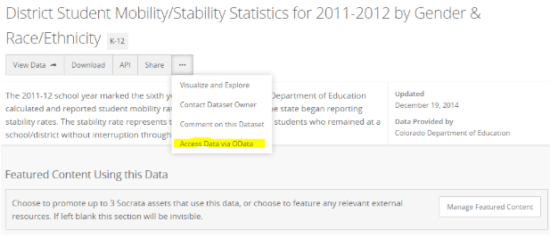
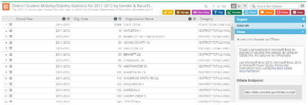
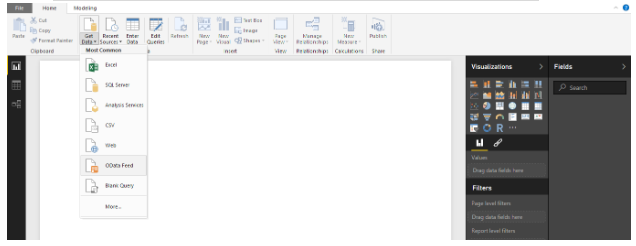

# Quick Visualizations for CIM Data

Some example of the visuals you can creat can be found on our [website](https://gocode.colorado.gov/data/data-exploration-examples/). Below are the descriptions and resources so you can create your own!

### Tableau
Tableau lets you connect to data from various sources and explore that data through charts, dashboards, and analytics. Tableau [desktop](https://www.tableau.com/products/desktop) can be downloaded, be sure to look at the limitations of the free trial as compared to the premium tiers. For most visualization needs,  [instructions](https://support.socrata.com/hc/en-us/articles/115011744048) for using tableau to visualize Socrata data (which powers the Colorado Information Marketplace) are easy and straightforward to follow. Tableau also offers an abundance of [tutorials](https://www.tableau.com/learn/training/20194) for the beginner to advanced Tableau user.

### Plot.ly
Plot.ly has statistical and more options to explore the data at a deeper level. The nice thing here is that Carto and Plot.ly have buttons to click. But careful the file limit is only 5MB. For things like correlation and statistical analysis, it is easy to get a quick reference.

### Carto

CARTO is a great Software as a Service (SaaS) for geospatial data. There is a free account tier, which contains 250mb of space. This is enough for a lot of datasets, and it will allow for exploration of geospatial datasets in a variety of ways. For more info, check out their [tutorials](https://carto.com/help/tutorials/your-account/).

One option is to download and then upload data into carto, but there is also a one-click option! The first step is to log into a personal Carto account, and then navigate to the api docs (see image). Halfway down that page there is a button on the right side that says “Open in Carto”. There is always a warning message about the limited amount of space on Carto, regardless of the size of the data being opened so ignore it, and hit “Take me there!”. This will load the dataset from the [Colorado Information Marketplace (CIM)](https://data.colorado.gov/) into the personal Carto account logged into the browser, from that point the Carto documentation will provide examples of ways to play with different visualizations.

Carto is different because it can be used as a production system, whereas the other data exploration tools on here may not be as useful for a production system.

### PowerBI

PowerBI is a desktop application
There is not a data size limit for loading data into a desktop environment, however there is a limit of 1GB to publish a visualization to the web.

To work with PowerBI from the CIM, use the “OData” feed. OData is a REST-based protocol for querying and updating data and is built on standardized technologies such as HTTP, Atom/XML, and JSON. It is different from other REST-based web services in that it provides a uniform way to describe both the data and the data model.
Access the feed url in 2 ways.

1.  Go to the metadata landing page, click on the menu (next to the share button), click on “Access Data via OData”, and copy the link.

2. Go to the old view (hit the “View Data” tab), to the blue export tab, then go to the OData endpoint and copy the link

3. Open up the PowerBI application, hit get data, and then select OData feed.

If for some reason this doesn’t work, download an excel or csv version of the data, and then load it into PowerBI that way. The advantage of OData is that a soft link is retained to the, so if the data needs to be refreshed it can easily be done by clicking a link.

4. Under visualizations there are all sorts of options. Click on one, or drag & drop to create multiple visualizations that interact with each other, all on one page!

Every visualization has different ways to combine the data, feel free to explore different ways and combinations. Keep dragging and dropping to get a feel for what the different values mean!

5. Next is filtering to look at only specific subsets of the data. There are page level filters and visual filters, to remove outliers, look at only a subset of the data, and do a number of different things!

6. Click off of the graphic to ‘start over’ and make a new graphic with new fields, and there is no limit to fields that can be added to the canvas.

Also, link multiple visualizations on one page together to see relationships. Once 2 visualizations are created, click on a visualization, and then hit the Format button at the top of the application, then Edit Interactions. Notice there are two or more items on every other visualization on the page. This provides an example what happens when clicking an item on the first visualization: to filter the second visualization, highlight the differences, or do nothing. This allows visibility of the see relationships between items that otherwise would be difficult to see.

7. Next, on each of the graphs just created, hover and select from the menu in the upper right “filter” “highlight” “remove”. Clicking on one feature initiates its interaction with everything else.

Another option is to set up “drill down” visualizations, typically this works best with data organized by date values. A good example is of the business entities dataset on our [data explorations page](http://gocode.colorado.gov/data/data-exploration-examples/).

8. Multiple datasets can be joined or “mashed”, as long as they have a field with a common column that can be joined on.This tool allows people to explore the data and see patterns that would not be readily apparent by typical filters and browsing.

9. To publish the visualization, embed it as an iframe.

### Where to get support

For questions about PowerBI or other data tools, please reach out on the #tech-support channel in the Go Code Colorado slack team. Also remember the goal isn’t to display information, CIM already does that. The goal is to help business and to answer questions for business decision makers, not display raw data in pretty colors. These tools work well to explore and visualize data, but the analysis involved in the extraction of information from the data still requires the work of dedicated data scientists, mappers and entrepreneurs!
