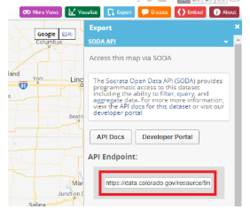
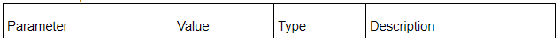

# Tip and Tricks for Using CIM

Go Code Colorado competition participants can explore Colorado public data through the Colorado Information Marketplace (CIM) public data portal and learn tips and tricks for using CIM.

### Introduction

The Colorado Information Marketplace is an effort by the Colorado Governor’s Office of Information Technology to provide Colorado public data to citizens. It offers a dataset catalog and dataset repository, an application programming interface (API) and several tools for exploring and visualizing data. The Go Code Colorado data team collects, reviews and reformats (if necessary) data to make it easier to work with before uploading it to CIM.

### What is an API Endpoint?

An endpoint in a SODA API is simply a unique URL that represents an object or collection of objects. Every Socrata dataset, and even every data record, has its own endpoint. The endpoint is to point an HTTP client to interact with data resources.

All resources are accessed through a common base path of /resource/ along with their dataset identifier. This paradigm holds true for most every dataset in every SODA API.
There are two types of dataset identifiers:

Simple Socrata datasets have a unique “4x4” identifier - eight alphanumeric characters split into two four-character phrases by a dash. For example, State Collected City Sales Tax CSV data set:https://data.colorado.gov/Revenue/City-Areas-Collecting-State-Sales-Tax-in-Colorado/wx84-he7r has a 4x4 of “wx84-he7r.”

Note: The 4x4 identifiers are generated by Socrata and are unique within each data site.
The endpoint URL for any SODA API can be created via this simple rule:

https://$domain/resource/$dataset_identifier

For example, the endpoint for the [State Collected City Sales Tax](https://data.colorado.gov/Revenue/City-Areas-Collecting-State-Sales-Tax-in-Colorado/wx84-he7r) dataset would be:
https://data.colorado.gov/resource/wx84-he7r.json

It is important to note that this is not the case for ALL datasets. As of 2018, geospatial datasets have a different API 4x4 than the main dataset.

For example:
[Noxious Weeds in Colorado 2014](https://data.colorado.gov/Environment/Noxious-Weeds-in-Colorado-2014/mguq-rjzb) has a 4x4 of mguq-rjzb while the API endpoint is https://data.colorado.gov/resource/9mid-gqwm.json. Try to use the dataset 4x4 to discover the endpoint points to a dataset that doesn’t exist.

To find the API endpoint for geospatial datasets, look to the “Developers” section of Socrata-powered data sites or they can be found by clicking the “Export” button on the top right, then clicking “SODA API.” The endpoint location will be under “API Endpoint” field (see photo below).

Also, find API endpoints in the “Developers” section of Socrata-powered data sites, or under “Export” then “API” on any Socrata dataset page.

### How to work with API Endpoints Filters, Verbs, Parameters

Working with an API can often be intimidating for those considering themselves average or beginner users. It can even be difficult to visualize what an API could do, when being only familiar with browsing data in a data catalog. So to transcend this gap, it is best to start with simple exercises, and compare the results to the known results of what is returned when using sort, roll up, filter, etc. on the Colorado Information Marketplace data display page.

To view an entire dataset on CIM is the equivalent of performing a GET request on an API endpoint using an HTTP client (such as a web browser, a simple utility like cURL, or a REST client like Postman), automatically get the first 1000 unfiltered records will be displayed, just like the GUI in the Catalog will display the first 1000 unfiltered records.. To narrow down what’s returned, use SODA 2.0’s filtering capability or filter the data using the GUI in the browser.

**Using the $WHERE Parameter**

The simplest form of filtering is equality. Use the field name as a query parameter, and its value as the filter value. The request will return only results where that field is equal to that value.
Use the $where query parameter to only return results that meet certain criteria. The $where parameter supports a number of comparison operations:

| Operations     | Description    |
| :------------- | :------------- |
| <       | Less than (numbers) or alphabetically before (strings)       |
| <=       | Less than or equal (numbers) or alphabetically before or equal (strings)       |
| =      | Equal       |
| !=       | Not equal       |
| >       | Greater than (numbers) or alphabetically after (strings)       |
| >=      | Greater than or equal (numbers) or alphabetically after or equal (strings)       |
| starts_with(x, y)    | String x starts with y (strings only)       |
| contains(x,y)     | String x contains string y (strings only)       |
| IS NULL      | Whether a value is null       |
| IS NOT NULL      | Whether a value is not null       |

In addition, it supports these Boolean Operations:

- AND
- OR
- NOT

Parenthesis can be used as to specify the order of operations. For more details, see the [queries](https://dev.socrata.com/docs/queries/) page.

**Examples Using the API Where Query**

The following example returns only earthquakes with a magnitude greater than 5:
`http://soda.demo.socrata.com/resource/earthquakes.json?$where=magnitude > 5`

The following example returns only earthquakes with a magnitude greater than or equal to 5 but less than 5.5:
`http://soda.demo.socrata.com/resource/earthquakes.json?$where=magnitude >= 5 AND magnitude < 5.5`

### Number and Boolean Operations with Get

**Number**

Numbers are arbitrary precision, arbitrary scale numbers. They can represent any number exactly, except for some numbers that repeat infinitely. Since, numbers can be larger than doubles allow and more precise, many formats need to serialize them as strings.

| Operations     | Description    |
| :------------- | :------------- |
| <       | True for numbers less than this one.       |
| <=       | True for numbers that are less than or equal to this one.       |
| =      | True for numbers that are equal to this one.       |
| !=       | True for numbers that are not equal to this one.       |
| >       | True for numbers that are greater than this one.       |
| >=      | True for numbers that are greater than or equal to this one.       |
| *    | Multiplies two numbers       |
| /     | Divides one number by another       |
| +      | Adds two numbers |
| -      | subtracts one number from another       |

**Double**

A double (used to be number) is an IEEE floating point double. They are easy to use and are represented as numbers in all the response formats, however, they have less precision than the regular Number data type. Currently, all numbers are stored as Numbers. Doubles exist as a way of making responses easier to consume, in the case the caller wants results that are easier to parse and can potentially give up precision to do so.

| Operations     | Description    |
| :------------- | :------------- |
| <       | True for numbers less than this one.       |
| <=       | True for numbers that are less than or equal to this one.       |
| =      | True for numbers that are equal to this one.       |
| !=       | True for numbers that are not equal to this one.       |
| >       | True for numbers that are greater than this one.       |
| >=      | True for numbers that are greater than or equal to this one.       |
| *    | Multiplies two numbers       |
| /     | Divides one number by another       |
| +      | Adds two numbers |
| -      | subtracts one number from another       |

**Boolean**

| Operations     | Description    |
| :------------- | :------------- |
| AND       | The logical and of two expressions.       |
| OR       | The logical or of two expressions.       |
| NOT     | The logical not of an expression.       |

### Throttling and Application Tokens

A certain number of requests can be made without an application token, but they come from a shared pool and an individual connection will eventually get cut off.

To get more requests, [register for an application token](https://opendata.socrata.com/login) to be granted up to 1000 requests per rolling hour period. Special exceptions for projects requiring more than 1000 requests per rolling hour period can be provided upon request. Use the Help! tab on the right of this page to file a trouble ticket, and read the detailed documentation on [Paging](https://dev.socrata.com/docs/paging.html) for more info.

### Differences between SODA 2.0 and 2.1

When working with the SODA end points it is important to understand some of the differences between them. SODA 2.0 was originally released in 2011. Although 2.1 is backwards-compatible with 2.0, there are a number of differences between the two APIs:
- 2.0 supports fewer SoQL functions than 2.1.
- The only geospatial data type supported is the Location datatype
- Text comparisons are case-insensitive

Also important to note is tabular datasets are created and initially stored in what is call the Original Back End (OBE). Upon creation, a copy of the dataset is replicated to the New Back End (NBE). Each copy of the dataset will have a different UID.  This means that 2.1 endpoint will be different that the 2.0 endpoint.  The other major difference is when data is updated in the OBE it can take up to 1 hour before the NBE (2.1) endpoint is showing that new information.

### Additional Detailed References:

- https://dev.socrata.com/docs/functions/
- https://dev.socrata.com/docs/endpoints.html
- https://support.socrata.com/hc/en-us/articles/115012661308-Socrata-Data-Refresh-Process

### CIM API Example with CDHE Degrees Awarded

https://dev.socrata.com/foundry/data.colorado.gov/yt5k-hawq

API: CDHE - Degrees Awarded

The Degree File includes all students who have received a certificate, degree, or formal award approved by DHE during the report year. Degrees earned but not conferred during the report period should be included in the following year’s report. The file is collected annually for federal and state reporting. A summer degree file is collected for use in graduation rate calculations, but these records are reported again in the full year file.

“Get” view exposes:

All communication with the API is done through HTTPS, and errors are communicated through HTTP response codes. Available response types include JSON, XML, and CSV, which are selectable by the "extension" on API requests or by HTTPAccepts headers.

This documentation also includes inline, runable examples. Click on any link that contains a gear symbol next to it to run that example live against the API: CDHE - Degrees Awarded API.
Fields
Below is an example of the fields are available on the API: CDHE - Degrees Awarded API.

**Field Name**: year
**Human Name**: year
**Type**: [number](https://dev.socrata.com/docs/datatypes/number.html#,)

Examples
Copy and paste these to a browser as examples

Retrieve all records with year equal to 2012:

GET `https://data.colorado.gov/resource/cdhe-degrees-awarded.json?year=2012`

Retrieve all records that are greater than 2001:

GET `https://data.colorado.gov/resource/cdhe-degrees-awarded.json?$where=year > 2001`
