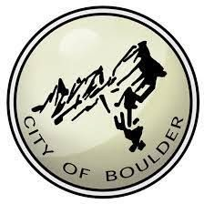
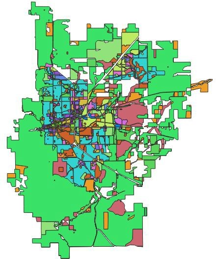
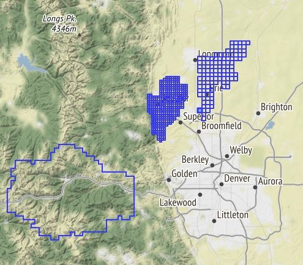
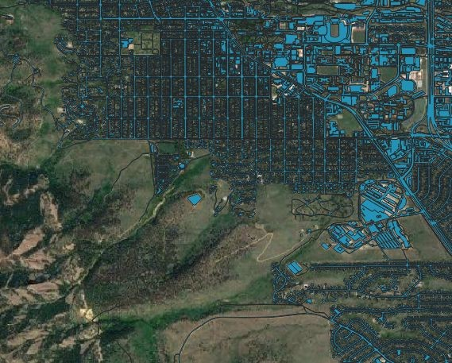

**Last Updated:** 01/20/2020

# City of Boulder Data

City of Boulder has 87 datasets, everything from prairie dog colonies and open space trails to rental housing, public trees and fire response times. Public data resources are strong with the City of Boulder, so be sure to check in with them to see new data being published.

[City of Boulder Open Data](https://bouldercolorado.gov/open-data)

## City of Boulder - Overview of Relevant Datasets

There are many interesting datasets available through the Boulder Open Data Portal, including [Addresses](https://bouldercolorado.gov/open-data/boulder-addresses/), [Building Performance (energy usage)](https://bouldercolorado.gov/open-data/boulder-building-performance-program/), [WiFi coverage](https://bouldercolorado.gov/open-data/boulder-connect-boulder-wifi-coverage/) and even [Lidar Data.](https://bouldercolorado.gov/open-data/city-of-boulder-lidar/)

## How to Get Started

Browse [the portal](https://bouldercolorado.gov/open-data/) by category or department to see all their information, or use this [City of Boulder Open Data Portal Inventory of Datasets](https://bouldercolorado.gov/open-data/boulder-open-data-catalog-datasets/)! Be sure to check out other great resources like [Areas of Inquiry](https://bouldercolorado.gov/open-data/areas-of-inquiry) and the [Showcase](https://bouldercolorado.gov/open-data/showcase), the FAQ section with of the [Open Data Engagement Portal](https://bouldercolorado.gov/open-data-engage), or see how the city of Boulder powers their [City Measures Dashboard](https://bouldercolorado.gov/boulder-measures).

## City of Boulder Spatial Data

In parallel to the open data catalog, City of Boulder also publishes a [Geospatial Portal](https://bouldercolorado.gov/maps) that showcases some spatial data in apps.

## Metadata

Basic metadata can be found beneath the download links for each dataset, under &quot;Details&quot;.

## BVCP Future Land Use Dataset

The Boulder Valley Comprehensive Plan (BVCP) land use map defines the desired [future land use pattern](https://bouldercolorado.gov/open-data/boulder-bvcp-future-land-use/) for the Boulder Valley regarding location, type, and intensity of development.

The data is available in the following formats: shapefile, GeoJSON, csv, and kmz. The City of Boulder department that provides the data is &quot;Planning, Housing, and Sustainability&quot;, and the data is listed under the &quot;Environment and Public Lands&quot; and &quot;Zoning and Private Property&quot; categories. The shapefile contains data on the desired land use category as well as the parcel&#39;s area and length.

## City of Boulder and Surrounding Areas LiDAR

Boulder offers datasets containing classified [LiDAR point clouds](https://bouldercolorado.gov/open-data/city-of-boulder-lidar/) covering 133 square miles including the City of Boulder and surrounding open space. High resolution data with a point density of 16-24 points per meter squared, vertical accuracy of .34 ft, and a horizontal accuracy of .6 ft. It is recommended that LiDAR data be examined using ESRI&#39;s ArcGIS 10.1 or later versions. The data can also be viewed in AutoCAD Map 3D or AutoCAD Civil 3D. There are multiple LiDAR datasets that are available on [geodata.colorado.gov](https://geodata.co.gov/).

Be sure to read the [Fact Sheet](https://www-static.bouldercolorado.gov/docs/opendata/city_of_boulder_lidar_faq.pdf?_ga=2.130772491.526547551.1541434381-2051361335.1541434381) if you are unfamiliar with LiDAR data.

## Other Dataset Features

Here&#39;s a list of other great datasets:

- [Boulder Multi-Use Paths](https://bouldercolorado.gov/open-data/city-of-boulder-multi-use-paths/)
- [City Zoning Designations](https://bouldercolorado.gov/open-data/boulder-zoning/)
- [Public Wifi](https://bouldercolorado.gov/open-data/boulder-connect-boulder-wifi-coverage/)
- [Creeks and Ditches](https://bouldercolorado.gov/open-data/city-of-boulder-creeks-and-ditches/)
- [Lakes and Ponds](https://bouldercolorado.gov/open-data/city-of-boulder-lakes-and-ponds/)

## City of Boulder Impervious Areas

This shapefile contains [City of Boulder impervious areas](https://bouldercolorado.gov/open-data/impervious-areas/) which includes buildings, structures, concrete, or paved surfaces. Questions to be explored using this data may include: How much of the city is impervious? How does this compare to other cities? What does this mean in terms of our flood risks based on the 2013 flood data which is also available?

## Much More

There&#39;s a lot more on the site - go see for yourself! [https://bouldercolorado.gov/open-data](https://bouldercolorado.gov/open-data)
