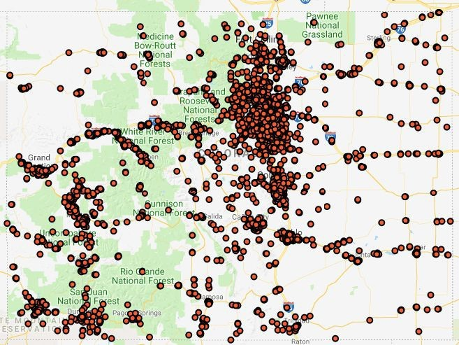
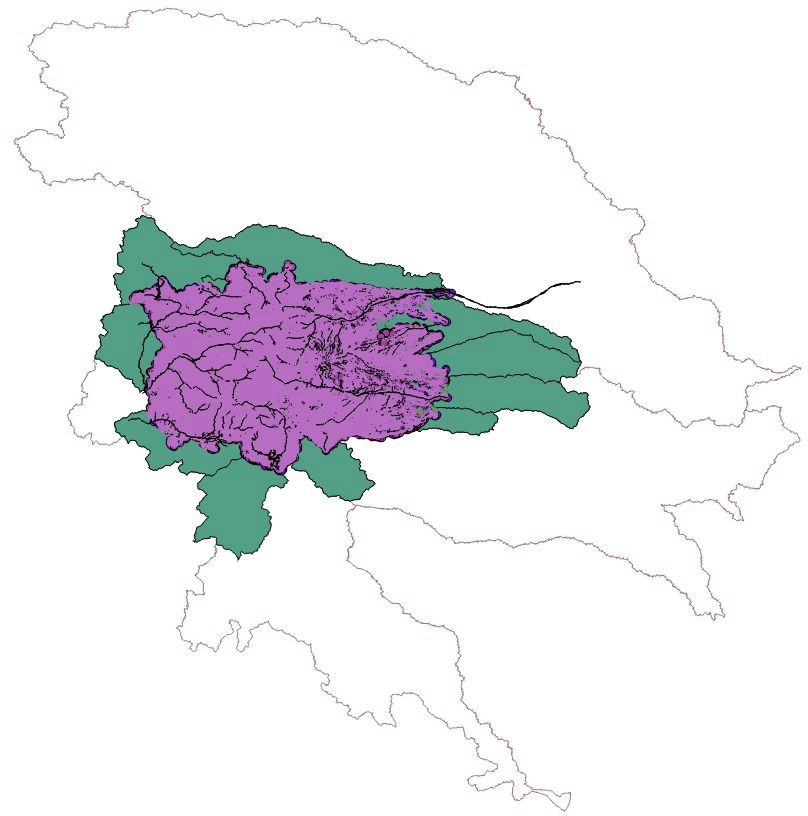
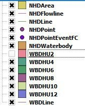
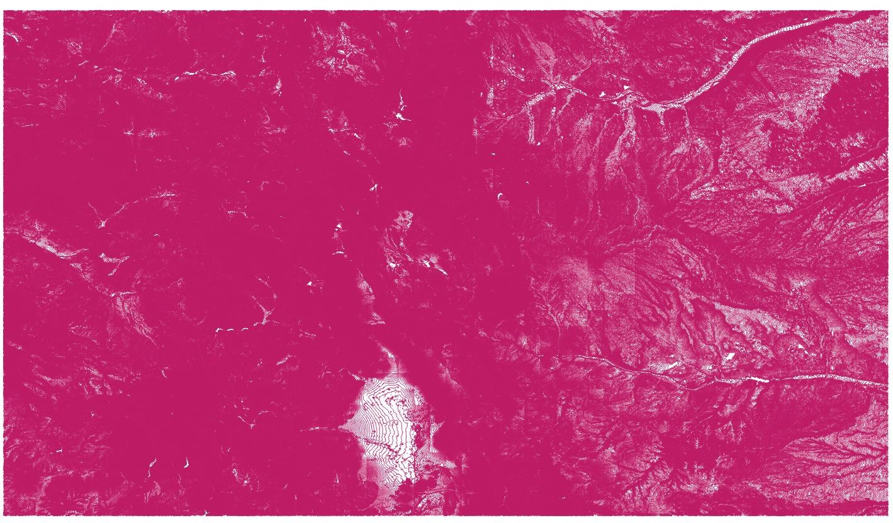
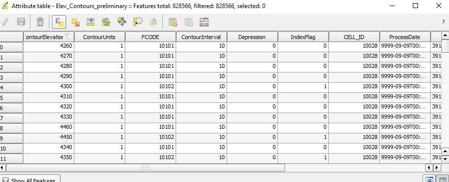
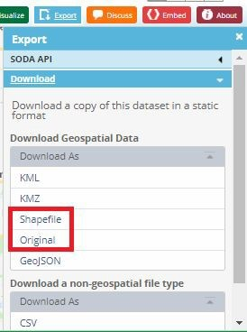
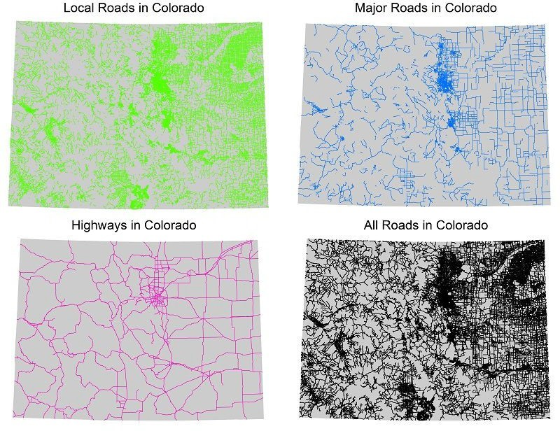

# GIS Data for GoCode Colorado

## Assessor Data

The [Statewide Aggregate Parcels in Colorado 2017](https://data.colorado.gov/Local-Aggregation/Statewide-Aggregate-Parcels-in-Colorado-2017/izys-vycy) dataset was created to facilitate a statewide view of parcels. The fields in this dataset have been intentionally selected to facilitate mapping attribute data across municipal boundaries. This dataset is updated each year and contains polygon features representing approximate location of tax parcels contained in County Assessor tax rolls in 2017 created and published by the Governor&#39;s Office of Information Technology. In many cases, but not always, the assessor data is housed and managed with the municipalities&#39; GIS shop. For the management of the parcel data, the official record is not the GIS file, instead it is the actual Legal Land Survey. Quite often, Re-Surveying is conducted upon request in cases of legal boundary disputes. Day-to-day operations require management of parcel boundaries to properly reflect the land for assessor purposes in accommodating parcel splits and merges. These geometry changes are considered de facto until a surveyor reports official survey grade geometry, and most parcel data should be viewed as an approximate location unless the data specifies otherwise.

## Colorado Anchor Institutions

Locations of schools, libraries, medical and healthcare providers, public safety entities, community colleges and other institutions of higher education, and other community support organizations and entities can be found in the [Community Anchor Institutions dataset](https://data.colorado.gov/Telecommunications/Community-Anchor-Institutions-2017/ysa7-n95j). These locations are gathered in the National Telecommunications Information Administration (NTIA) and State Broadband Data Development Program (SBDD) in an effort to identify existing and potential broadband availability to the public.

Accessing community anchor institutions may involve the use of the external tools.

## FEMA Maps and Boundaries

The Federal Emergency Management Agency (FEMA) uses Digital Flood Insurance Rate Maps (DFIRM) to determine special hazard zones and risk premium zones. These maps are utilized by insurance companies to spatially identify a dwelling&#39;s location in a particular floodplain and to determine the insurance premium for residing in that floodplain. Any changes to these datasets, Letters of Map Revision (LOMR), involve a series of government processes to update. The Colorado Water Conservation Board (CWCB) makes these changes for FEMA using LOMRs and engineering studies to conduct quality control checks and improve overall flood management practices and programs.

In Colorado, flood hazard data is currently managed by the CWCB. They currently maintain the [Colorado Hazard Mapping & Risk MAP Portal](http://coloradohazardmapping.com/hazardMapping/floodplainMapping/). The [National Flood Hazard Layer (NFHL)](https://hazards-fema.maps.arcgis.com/apps/webappviewer/index.html?id=8b0adb51996444d4879338b5529aa9cd) 31 layers (see below) used in the floodplain modeling are used to create the FIRMs and FIRMettes - pdf maps (see below).

There is not a complete coverage of the FEMA dataset for the state. FEMA&#39;s priorities lie with making the paper maps accurate over the digital boundary. As with parcel data, the official record is not the GIS file, instead, it is the actual survey.

This snapshot of the NFHL shows data availability for Colorado.

## National Hydrography Dataset (NHD) Subset to Colorado

To help alleviate the need to query The National Map, the [National Hydrography Dataset](https://data.colorado.gov/Water/National-Hydrography-Dataset-NHD-in-Colorado/5ccs-vx79) subset to Colorado is published to CIM (see below). The NHD contains data on streams, areas, points, flowlines, and watershed basin boundaries in Hydrologic Units 2, 4, 6, 8, 10, and 12. Data is maintained by the U.S. Geological Survey.

CDOT publishes simplified &quot;[lakes](https://data.colorado.gov/Water/Lakes-in-Colorado/uksn-8qya)&quot; and &quot;[streams](https://data.colorado.gov/Water/Streams-in-Colorado/x238-vje7).&quot; As noted on the Online Transportation Information System Catalog (OTIS), &quot;The data is best suited for cartography, and not geographic analysis,&quot; while the NHD is suitable for geographic analysis.

Nation-wide currently available data is on [https://nhd.usgs.gov/data.html](https://nhd.usgs.gov/data.html), and packages are available by querying [The National Map](https://viewer.nationalmap.gov/basic/) to achieve a subset to Colorado. NHD has some overlap with what Division of Water Resources (DWR) publishes on both their portal as well as CIM:

1. DWR has agricultural ditches and irrigation unrelated toNHD
2. Streamflow data on DWR&#39;s portal links directly toUSGS
3. Hydrography data included in the DWR [Online Map Viewer](http://water.state.co.us/DataMaps/GISandMaps/MapViewer/Pages/FAQ.aspx) contains Confluence Points, Source Water Route Framework, and Stream gauge

Additional value add from this process would be to remove codes in attributes. For example, &#39;FCode&#39; values column records &quot;STREAM/RIVER - 46003 - Hydrographic Category|intermittent&quot; would be modified to include &quot;46003 = Stream/River - Intermittent.&quot; At this time, it is necessary to utilize the [FCode data dictionary](https://nhd.usgs.gov/userGuide/Robohelpfiles/NHD_User_Guide/Feature_Catalog/Hydrography_Dataset/Complete_FCode_List.htm) to explain codified records.

In this snapshot of the NHD, the outer boundary without fill is the Watershed Boundaries layer extending into other states. The concentration of data layers overlapping the purple and green fill reflect the location of Colorado in this data rendering. Note the snapshot of the layers displaying what can be expected when loading NHD. Watershed Boundaries Hydrologic Unit 2 is the most common scale at which Watershed Boundaries are worked with.

## Contours for Colorado

The Statewide Topographic Contours for Colorado download is 3.5GB gdb (see below) are published on CIM as [Contour Lines in Colorado](https://data.colorado.gov/Environment/Contour-Lines-in-Colorado/sc9q-ryk8). To work with the data, download a geodatabase containing elevation contours for the entire state of Colorado at contour intervals of 10, 20, and 40. The most recent contour line was entered on 10/01/2009. Dataset is maintained by the U.S. Geological Survey (USGS). The USGS makes available contours for the nation at the [1:24,000 Scale](https://topotools.cr.usgs.gov/contour_data.php) circa 2012.

## All Roads in Colorado from CDOT

The Colorado Department of Transportation maintains three separate shapefiles for roads in Colorado:

1. [Local Roads in Colorado](https://data.colorado.gov/Transportation/Local-Roads-in-Colorado/qvrk-xsmj)
2. [Major Roads in Colorado](https://data.colorado.gov/Transportation/Major-Roads-in-Colorado/e7ye-tasg)
3. [Highways in Colorado](https://data.colorado.gov/Transportation/Highways-in-Colorado/2h6w-z9ry)

These three options allow for different analysis and/or cartographic purposes which is why they are published separately. The process is simple for creating a shapefile with all roads combined.

1. Export each dataset as &quot;Original&quot; if the original projection(NAD83\_UTM\_Zone\_13N) is desired, otherwise export as &quot;Shapefile&quot; for a WGS84 geographic coordinate system

2. Load each dataset into the desired geospatial software
3. Run a Merge for all three Highway Quality, Local\_Roads, and Highways to combine for analysis
4. Symbolize all three layers using the same symbology for cartographic purposes

