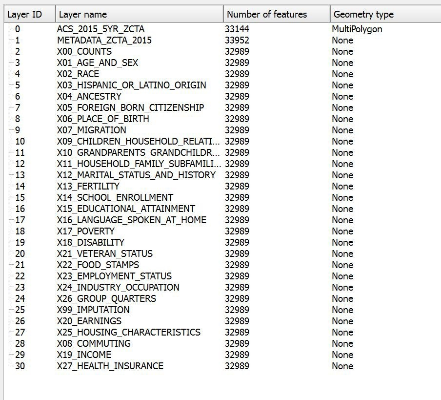
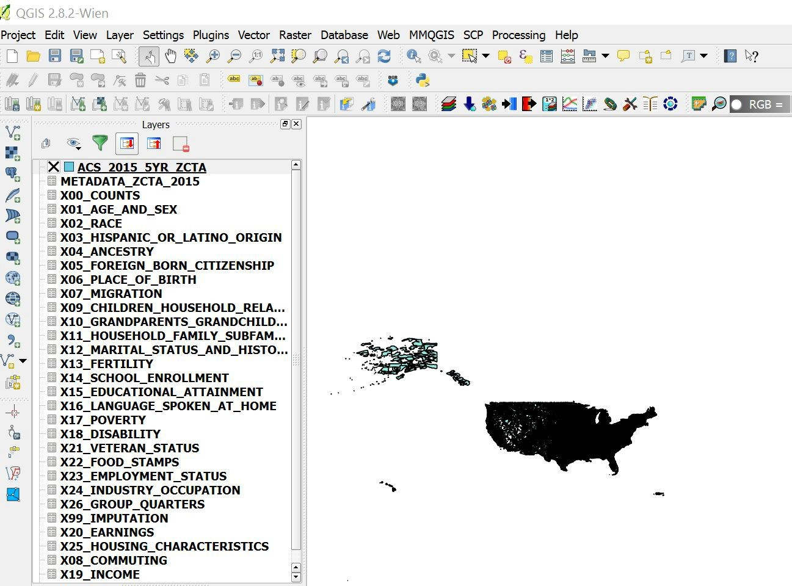
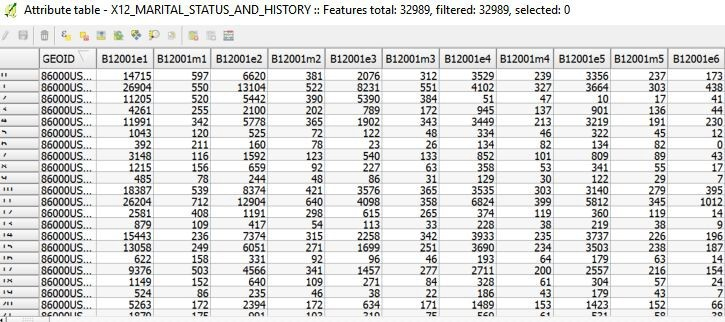
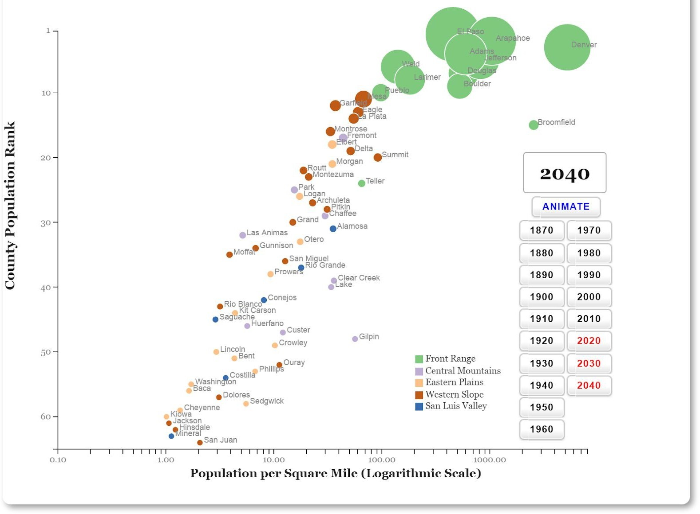
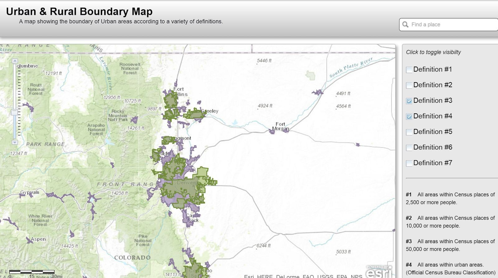
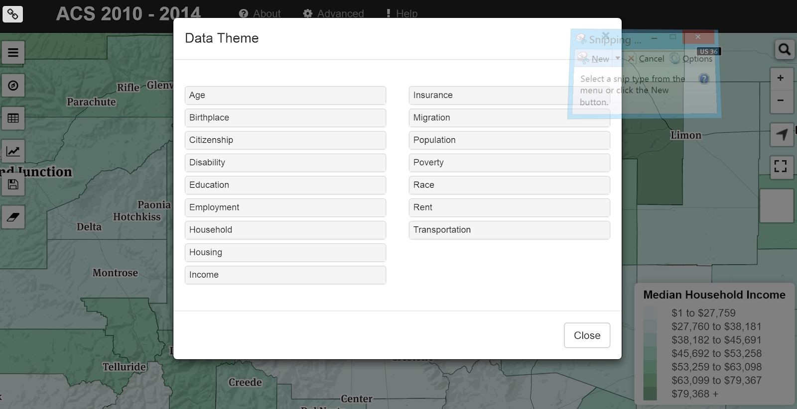
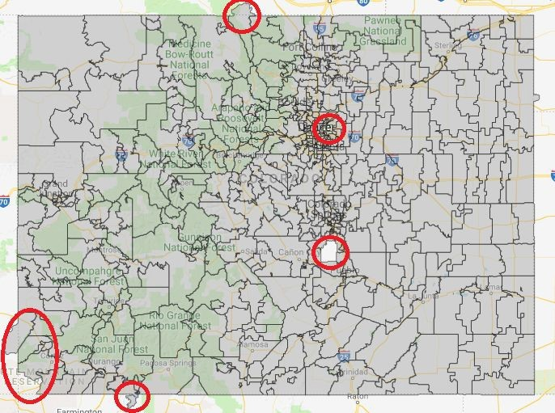
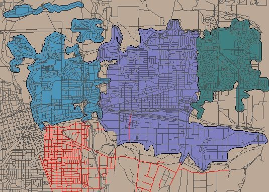
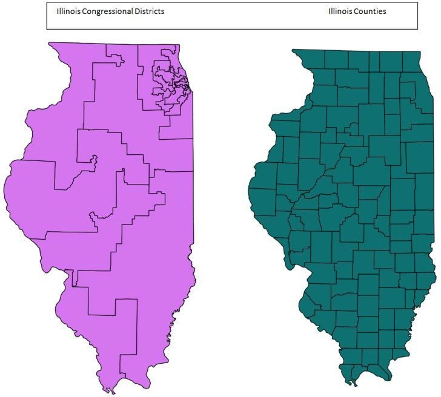
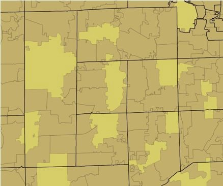

# Census Data for Go Code Colorado

**Last Updated:** 01/20/2020

Hello Go Coders! Welcome to the Census Data Tutorial! There are TONS of Census resources on the Colorado Information Marketplace (CIM) - read on to find out why!

Some stuff is competition specific, some is not. Give it a read-through, we promise you won&#39;t regret it if you do. Happy Data Wrangling!

## Census Datasets Table and Field Descriptions

Since there are so many census datasets (80) and fields (over 700) that are not easily linked we created a list of both to show the linkages. The [Census Datasets on CIM](https://data.colorado.gov/dataset/Census-Datasets-on-Colorado-Information-Marketplac/vcag-iwy7/data) table shows all 80 (and counting) census datasets that are published and a &quot;type&quot; column. This type column links back to the type in the [Census Field Descriptions](https://data.colorado.gov/dataset/Census-Field-Descriptions/qten-sdpn/data) table with the list of fields and descriptions. This format was used instead of a full joined list to provide easier viewing; the full list of fields and descriptions with datasets is approximately 11,000 rows long. Any omitted fields are of unknown origin, and can be considered extraneous to the census information.

## The Basics

2000, 2010 Census Data

Census Data is collected every 10 years by mail surveys to every household with primary data collection fields of population, gender, race and number of occupants. Overcounts are known to exist in student and dual-residence populations, while undercounts are a given for homeless and illegal immigrants. Errors arise from both sampling and non-sampling methods. Sampling errors are misrepresentations of a larger population based on the selection of the representative sample. Accuracy of the estimates depend in part on how typical the people within the sampled housing units are represented within their area. The Census estimates sampling error based on the population and its extent of variability. The long-form of the Census is distributed to a subset of households and includes additional data related to households, economy, employment, occupation, as well as occupancy and building structure data. The SF1 tables provide the official census count of the number of people in an area. The SF3 tables provide estimates of the characteristics of the total population. By the time of the 2010 Census, disk storage was no longer an issue for the size of the Census and the SF1/SF3 were abandoned. Household fields include: Total Households, Total Families, Households by Household Type and Household Size, Persons in Group Quarters by Detailed Group Quarters Type, Persons 25 Years and Over by Educational Attainment, Persons 16 Years and Over Employment Status, Median Household Income, Median Family Income, Per Capita Income, Persons by Poverty Status in Previous Year. Occupancy fields include: Total Housing Units, Housing Units by Occupancy Status, Vacant Housing Units by Vacancy Status, Occupied Housing Units by Tenure, Median Housing Value, Median Contract Rent. The Census, of course, goes back to the origin of the United States as it is part of the Legislative Process. The Department of Local Affairs has made Census data available via API back to 1980 - see more below.

## The American Community Survey

The American Community Survey (ACS) is an ongoing survey that provides data every year that helps determine how more than $400 billion in federal and state funds are distributed each year. It gives communities the current information they need to plan investments and services. Unlike the decennial (every-10-year) census, the ACS survey continues all year, every year, by randomly sampling addresses in every state, thus creating a &quot;rolling average&quot; of data about designated geographic regions to generate up-to-date statistics used by many federal, state, tribal, and local leaders. The U.S. decennial census provides counts of people for the purpose of Congressional apportionment while the ACS measures the changing social and economic characteristics of the U.S. population. The ACS does not provide official counts of the population in between censuses. Some ACS questions have been asked by the census since it first began in 1790. Because ACS data are collected continuously, they are not always comparable to data collected from the decennial census. For example, in the case of employment statistics, both surveys ask about employment status during the week prior to the survey, however, data from the decennial census are typically collected between March and August, whereas data from the ACS are collected each month and reflect employment throughout the year. Differences in these responses may in turn affect data on commuting, occupation, and industry. It is anticipated that the short form (age, gender, race) will continue to be distributed to all households every 10 years. A major advantage of the ACS is ensuring communities with residents in group housing get a fair share of federal funds. Group housing facilities (also called &quot;group quarters&quot;) are randomly selected throughout the year depending on the size of the facility. It is the extra attention to detail that reduces some of the common and seemingly unavoidable errors generated by the previous long form. Demographic Age and Sex, Group Quarters Population, Race, Relationship, Total Population, Social, Ancestry, Citizenship Status, Disability Status, Educational Attainment, Fertility, Field of Degree, Grandparents as Caregivers, Language, Marital History, Marital Status, Place of Birth, School Enrollment, Residence 1 Year Ago/Migration, Veterans, Year of Entry, Economic, Class of Worker, Commuting to Work/Journey to Work, Employment Status, Food Stamps/Supplemental Nutrition Assistance Program (SNAP), Health Insurance Coverage, Income and Earnings, Industry and Occupation, Poverty, Work Status, Housing, Computer Ownership &amp; Internet Access, House Heating Fuel, Kitchen, Facilities, Occupancy/Vacancy Status, Occupants per Room, Owner Monthly Costs, Plumbing Facilities, Rent Statistics, Rooms / Bedrooms, Telephone Service Available, Tenure, Units in Structure, Value of Home, Vehicles Available, Year Householder Moved Into Unit, Year Structure Built.

## Why So Many Census Datasets on CIM?

The short answer is that it can be very difficult to get data from the ACS/Census website that is specific to the area of interest with the correct fields of interest. The other challenge for many Census data consumers is getting the tabular data joined with the spatial data. Thus, 163 of the most valuable columns have been selected and the data has been joined for those columns with their respective spatial data (ie, tracts, block groups, zip codes, etc).

## Geography

All Census data for the Decennial Census is available at all levels of Census Geography. The chart is perhaps the best method to envision the varying scales of Census geography, with Census Blocks being the smallest unit of data aggregation. Census Blocks are not released with every ACS due to their scale, and are therefore not included with each year&#39;s update of cleaned data published to CIM.

## Creation of Census Data for CIM

A downloadable geodatabase of the ACS data is available directly from the census and contains 30 tables for all 50 states and territories totaling approximately 1GB in storage. In order to view this geodatabase, a proficiency in geospatial software (most commonly ESRI or QGIS) or in Ogr2ogr/GDAL (open source command language) is required.

There are a number of different ways to &#39;slice and dice&#39; the Census Database. For those who are more experienced with the architecture and how to utilize a query, consider using the Census API that DOLA curates.

The first step in the more manual process is to subset the 1GB of data to Colorado. The second step is to get all of the desirable fields (163 selected fields in this case) into a single shapefile with the geometry outlines of the zip boundaries and human readable field headers. The query to accomplish this is over 160 lines long. The screenshot shows the attribute table of the raw extract without the field names updated to human readable counterparts.

If the census data needs additional information for a specific use case it can be recreated using these example SQL files in this GitHub knowledge base:

[https://github.com/GoCodeColorado/GoCodeColorado-kbase-public-2018/tree/master/resources/census](https://github.com/GoCodeColorado/GoCodeColorado-kbase-public-2018/tree/master/resources/census)

The acs\_standard file downloads Block Groups, Tracts, Counties, and Places from DOLA. The acs\_different file pulls data directly from the census bureau and subsets the information to Colorado for Zip Codes and Congressional Districts. There are a few WHERE clauses or FROM statements with {{}} around them. These are meant to be replaced for the different area types. Contact the Go Code team for more help/information if required.

## Census Field Descriptions

The census field names and descriptions have changed over time to optimize the information we provide, as well as differences that arise between the ACS census and the Decennial census. There are over 30,000 possible fields to query from the Census as they reflect the bulk of the common combinations and permutations of data by various denominators. The data provided on the Colorado Information Marketplace is a handpicked ~150 fields representing the fields deemed to be of greatest value. You can see our [canonical list of fields and descriptions on CIM](https://data.colorado.gov/dataset/Census-Field-Descriptions/qten-sdpn/data), with a type field. These types correspond to a census dataset, and that list can be found [here](https://data.colorado.gov/dataset/Census-Datasets-on-Colorado-Information-Marketplac/vcag-iwy7/data).

## Glossary of Census Terms in Appendix B

If there is a Census Term listed in the Appendix but the field is not in the Colorado Information Marketplace &quot;handpicked ~150&quot; then it will have to be retrieved from the Census directly. To see all the census datasets on the Colorado Information Marketplace see our [Census Datasets table](https://data.colorado.gov/dataset/Census-Datasets-on-Colorado-Information-Marketplac/vcag-iwy7/data). Datasets may also be discovered on the [Current Datasets](http://gocode.colorado.gov/data/current-data-sets/) page of the Go Code Colorado Website.

## Census API

On the Colorado Information Marketplace (CIM) there is a link to the [Census API in United States 1980, 1990, 2000, 2010, and ACS](https://data.colorado.gov/Demographics/Census-API-1980-1990-2000-2010-ACS-2008-2012-and-A/fcij-msvv) GitHub page listed under &quot;Source Link&quot; in the metadata. Colorado Department of Local Affairs has created an API for all states and all years of Census Data back to 1980. Discover the uses of this API and more by exploring the dedicated GitHub page (link in metadata).

Census Data is collected every 10 years by mail surveys to every household with primary data collection fields of population, gender, race and number of occupants. Additional data related to households, economy, employment, occupation, as well as occupancy and building structure data is generalized from samples of a subset of the population. The 1980 census was the first census not to ask for the name of the &quot;head of household,&quot; and the 1990 census was the first to designate &quot;Native Hawaiian and Other Pacific Islander&quot; as a racial group separate from Asians.

## DOLA Demography Office Census Visualizations Viewers

The Department of Local Affairs (DOLA) Demography Office has a map and data visualization gallery with 37 different interactive data pieces. We encourage you to spend some time in the gallery if you are interested in working with census data and of course if you are curious about the population of Colorado! Take a look at the [ACS Census 2010-2014 Viewer](https://demography.dola.colorado.gov/CensusAPI_Map/?lat=39&amp;amp;lng=-104.8&amp;amp;z=9&amp;amp;s=50&amp;amp;v=mhi&amp;amp;sn=jenks&amp;amp;cs=mh1&amp;amp;cl=7) for an example. The most recent versions of this dataset and more than 50 other fields are provided by the DOLA Demography Office and made available for download (or connection via the SODA API) on the Colorado Information Marketplace at [data.colorado.gov](https://data.colorado.gov/):

- [Zip Codes for Colorado 2016](https://data.colorado.gov/Demographics/Census-Zip-Codes-in-Colorado-2016/rwak-e74e)
- [Block Groups for Colorado 2016](https://data.colorado.gov/Demographics/Census-Block-Groups-in-Colorado-2016/iku4-4bpx)
- [Census Places for Colorado 2016](https://data.colorado.gov/Demographics/Census-Places-in-Colorado-2016/2chb-kzb6)
- [Census Tracts for Colorado 2016](https://data.colorado.gov/Demographics/Census-Tracts-in-Colorado-2016/tfrg-b5pp)
- [Census Counties for Colorado 2016](https://data.colorado.gov/Demographics/Census-Counties-in-Colorado-2016/sn6p-34bq)

If you like Hans Rosling (RIP) and his amazing case for understanding the world around us in his TED Talk [The Best Stats You&#39;ve Ever Seen](https://www.ted.com/talks/hans_rosling_shows_the_best_stats_you_ve_ever_seen/transcript?language=en&amp;amp;t-1163358), then you&#39;ll love the DOLA Demography Office&#39;s [Colorado County Population Animation](https://dola.colorado.gov/gis-php/files/projects/population/allpop2.html). This animation is based off of their [Colorado Population Projections](https://data.colorado.gov/Demographics/Colorado-Population-Projections/q5vp-adf3) dataset, also available on the Colorado Information Marketplace for you to download or connect via the SODA API. Just as Hans concludes, &quot;These countries are lifting more than the economy… as I would like you to be able to do with all the publicly funded data.&quot;

## The Case of the Missing Zip Codes and Other Statistician Stories

This subset of the ACS data for Colorado users from the Colorado Information Marketplace is intended for the &quot;80%&quot; of data consumers. The other &quot;20%&quot; are some highly skilled statisticians that understand the value of having both the measured and derived value. For each Census dataset that is published, the Go Code Colorado and DOLA team have selected 163 fields that we consider to be most useful and valuable. There are other fields available if you are curious, you can take a look at [this spreadsheet from the Census](http://www2.census.gov/programs-surveys/acs/summary_file/2015/documentation/user_tools/ACS2015_Table_Shells.xlsx) - consider yourself warned that there are over 35,000 entries and you are opening one of the great rabbit holes of our time. On a somewhat related note, statisticians would never survey using zip codes, but a majority of the 80% of data users would prefer zip codes. Zip codes are most commonly understood by all Americans which is why the phrase &quot;we surveyed 100 Americans and asked them what Block Group they live in&quot; is rarely if ever heard. Statisticians and geographers can continue disagreeing on zip codes, but until society conforms their mental map of where they live to their Block Code instead of their zip code, people will still have a compelling case to continue the madness of working with zip code data.

There is certainly a reasonable rationale for why not to use zip codes in analysis and the short version is shown above in this screenshot with red circles from CIM of the ACS zip codes. Note that zip codes cross over state boundaries (into WY as in the zip code north-west of Larimer County and also in the south-west corner of the state) some are missing completely. Some areas do not have a zip codes as in the case of Rocky Mountain Arsenal Wildlife Refuge in Denver and Fort Carson near Colorado Springs.

## Geography Time! How to Avoid Zip Code Fallacies:

The zip code is a very interesting phenomena in the data world because it is one of the only non-personally identifiable numbers that people retain in their long and short term memory. That is to say, people memorize their phone numbers, social security numbers, and some even their driver&#39;s license numbers. They remember their phone number, address and zip code. All of these pieces of information are unique to the individual and/or their immediate family. Except their zip code. This number is essential for market analysts, epidemiologists, social scientists and any person doing research with public data, because public data is almost always able to be deanonymized.

In a crazy twist of one of the data world&#39;s most poignant ironies, zip codes are the absolute worst metric of area aggregation for geospatial analysis. The reason for this is two-fold in that not only are zip codes not actually polygons (they are line segments!), and their derived boundary does not align with any other geospatial unit of aggregation.

The best way to grasp the concept of the zip code being a line and not a polygon, is to look at them.

_Source:_ [_www.georeference.org_](http://www.georeference.org/)

In this example, note that the blue area is not contiguous, that there are many regions of overlap between the blue and the purple areas and between the purple and green areas, and the red lines intersect almost all of the drawn polygons. The reason for this is that zip codes are linear features associated with specific roads or with specific addresses such as apartment buildings that are best regarded as a point (the USPS manages address tables). The purpose of zip codes is to deliver mail. Therefore the boundaries of zip codes do not always follow logical straight lines, sometimes dipping in and out of neighborhoods and including areas that are vastly different from each other. Why? Presumably that&#39;s how the mail routes were drawn at one time. To create polygons from roads, analysts over time have taken several approaches to creating them because the USPS does not publish them publicly.

There is no &#39;official&#39; zip code layer. Private companies have also stepped in to fill the void by publishing their own (and slightly different) version of this geography. The Census Bureau uses address tables to create approximations of zip codes that they call ZCTAs (Zip Code Tabulation Areas) and these have become the &#39;de facto&#39; standard. ZCTAs are aggregates of census blocks that attempt to mimic zip codes that exist as areas. Zip codes are created by the USPS based on their needs in network efficiency. It is understandable that there are challenges with getting the derived boundaries to line up with other geographic aggregation units. It is important to realize that zip codes can cross PUMA (Public Use Microdata Areas), Congressional Districts, City Boundaries, Neighborhood Boundaries, County Boundaries, PUMA Boundaries, Census Blocks, and in some cases even state boundaries, and that the USPS can change zip codes on an annual basis. Zip codes are simply too big. As a result they tend to group vastly different socio-economic areas together. For instance, a low income and a high income neighborhood on either side of a major highway can be (and often are) grouped together into one zip code. The overall median income and statistical makeup of the neighborhood thus tends to paint a picture of it being solidly middle class, though the truth is vastly different. While in large part they stay the same, there does tend to be some fluid movement around the edges from year to year.

Thus zip codes are less stable than census geography and as statistical areas, they vary widely in area and population. The Census updates ZCTA boundaries every 10 years with the Decennial Census and ACS ZCTAs might change every five years.

Does this mean that you shouldn&#39;t use zip codes or ZCTAs? Well, it depends on your use of the data. Researchers have been tackling this multi-scale challenge for decades and there are some use cases that the levels of statistical confidence in the conversion between regions is acceptable. The quick answer is that you divide the counts for each of the smaller boundaries that crosses the boundary of the larger area geofences using population as a weight. This is reliable for distributions across large areas. For distributing data into granular geofences like neighborhoods, wards and the like, you cannot simply weight based on population. You need to corroborate the population distribution with air photos or other variables.

Thanks to the Colorado Department of Local Affairs Demography Office, you can easily access Census data aggregated to ZCTAs in [Zip Codes for Colorado 2010-2014](https://data.colorado.gov/Demographics/Census-Zip-Codes-in-Colorado-2010-2014/vne4-cwmy), [Zip Codes for Colorado 2010](https://data.colorado.gov/Demographics/Census-Zipcodes-2010/wcvg-8vki), and Zip Codes for Colorado 2000: [SF1](https://data.colorado.gov/Demographics/Census-Zip-Codes-2000-SF1/khe9-7d2c) and [SF3](https://data.colorado.gov/Demographics/Census-Zip-Codes-2000-SF3/bd44-na6d) all at [data.colorado.gov](https://data.colorado.gov/).

## What&#39;s With All the Mismatched Boundaries?

Here&#39;s where the rabbit hole gets the deepest, which might seem like an outlandish statement to make this far into the readme, but it&#39;s the truth. Anyone who has tried to do a Congressional or Neighborhood level study with Census data will agree this is true. The most basic way to explain the issue is that data is collected at a variety of differing geofences and the fences don&#39;t all nestle into each other. Non-nestling aggregation geofences is not a problem borne by Census data alone, but neither is Census data an exception to the rule. People most easily conceptualize their world in terms of neighborhoods and zip codes, as explained above, but almost all public data collected about people is gathered to political or jurisdictional boundaries like cities, counties, and other special districts. Congressional districts are a classic example of a boundary that almost no other data geofence nestles into. Look at this side by side comparison of Counties and Congressional Districts for Illinois, or the following screenshot zoom in on counties (black lines) overlapping zip codes. Below are a number of different visual examples.

The list of mismatched geofences goes on and on. So why does it matter that the lines don&#39;t match? For example, say you have some very interesting data for counties, but you want to see what the distribution of the data is across the congressional districts. The quick answer is that you divide the counts for each county that crosses a congressional district line into the two congressional districts. The next logical question is whether the distribution should be weighted by any factors. Geographers default to the use of population as a weight, especially as population statistics are often the data being distributed across differing jurisdictional boundaries. This is reliable for distributions across large areas, and therefore describes the basic math behind [MABLE/GEOCORR](http://mcdc2.missouri.edu/websas/geocorr2k.html). MABLE/GEOCORR is the Missouri Census Data Center&#39;s engine to correlate ZCTAs with PUMAs, Congressional Districts, Counties and a few in between. You choose the state, the two geographies you want to relate, the weighting method for allocating one to the other, an output format that includes CSV or HTML, and the option to geofence (select a geographic subset). While the interface looks a little questionable, the conversions are legitimate. The math has been verified for a couple different projects (the population distribution across boundaries was observed and the estimation using aerial imagery and other ancillary datasets were corroborated). Use your best judgement and as many tools and resources as you can find to validate your study to have confidence in the use of your zip code anonymized data!

Appendix A - Glossary - CENSUS TERMS AND DEFINITIONS

**Glossary of**

**CENSUS TERMS AND DEFINITIONS**

Age. The age classification is based on the age of the person in complete years as of April 1, 2000. The age of the person usually was derived from their date of birth information. Their reported age was used only when date of birth information was unavailable.

American Community Survey (ACS). The American Community Survey is a large, continuous demographic survey conducted by the Census Bureau that will eventually provide accurate and up-to-date profiles of America&#39;s communities every year. Questionnaires are mailed to a sample of addresses to obtain information about households - that is, about each person and the

housingunititself.Thesurveyproducesannualandmulti-yearestimatesofpopulationand housing characteristics and produces data for small areas, including tracts and population subgroups. Questions asked are similar to those on the decennial census longform.

AmericanFactFinder.AnelectronicsystemforaccessanddisseminationofCensusBureau data on the Internet. The system offers prepackaged data products and the ability to build user-selected tables and maps. The system serves as the vehicle for accessingand

disseminating data from Census 2000 (as well as the 1990 census, the 1997 Economic Census, andtheAmericanCommunitySurvey).ThesystemwasformerlyknownastheDataAccessand Dissemination System(DADS).

AmericanIndianoff-reservationtrustland.TheUnitedStatesholdstitleforspecificareasintrust for the benefit of federally recognized American Indian tribes (tribal trust land) or for individual American Indians (individual trust land). Although trust land may be located on or off a reservation, the Census Bureau recognizes and tabulates data only for off-reservation trust land. Census data always associate off-reservation trust land with a specific federally recognized reservation or tribalgovernment.

American Indian reservation. A federal American Indian reservation is an area that has been set aside by the United States for the use of one or more federally recognized American Indian tribes. It covers territory over which a tribe(s) has primary governmental authority. Its boundary is defined by tribal treaty, agreement, executive or secretarial order, federal statute, or judicial determination. A state American Indian reservation is an area that a state government has allocated to a tribe recognized by that state, but not by the federal government.

Apportionment counts. The first data product from the decennial census is the apportionment population for each state and the number of representatives each state is entitled to based on the apportionment calculation.

Area. The size, in square miles or square meters, recorded for each geographic entity.

Block. A subdivision of a census tract (or, prior to 2000, a block numbering area), a block is the smallest geographic unit for which the Census Bureau tabulates 100-percent data. Many blocks correspond to individual city blocks bounded by streets, but blocks especially in rural areas may include many square miles and may have some boundaries that are not streets. The Census Bureau established blocks covering the entire nation for the first time in 1990. Previous censuses back to 1940 had blocks established only for part of the nation. Over 8 million blocks are identified for Census 2000.

Block boundary. The features, both visible (street, road, stream, shoreline, and so forth) and invisible (county line, city limit, property line, and so forth), that delimit a census block. A boundary generally must include at least one addressable feature; that is, usually a street or road. The boundary of every legal and statistical entity recognized in the Census Bureau&#39;s standard data tabulations is a tabulation block boundary.

Block group. A statistical subdivision of a census tract. A BG consists of all tabulation blocks whose numbers begin with the same digit in a census tract; for example, for Census 2000, BG 3 within a census tract includes all blocks numbered between 3000 and 3999. The block group is the lowest-level geographic entity for which the Census Bureau tabulates sample data from the decennial census.

Block number. A number assigned to each census block.

- For collecting information for Census 2000, each census block was identified uniquely within a county (or statistically equivalent entity) by a 4- or 5-digit number. All the collection blocks in a county used the same number of digits. As a result of changes to the TIGER® database after the Census Bureau had numbered the blocks in preparation for the Census 2000 field operations, the number could have an alphabetic suffix, to represent one portion of a physical blockthatwassplitbyanaddedstreetrroadrbytheadditionrchangeftheboundaryfa county, American Indian reservation, off-reservation trust land, or military installation; for example, if an added street bisected Block 1005, the block was split into Blocks 1005A and 1005Btorepresenttheportionftheriginalcollectionblockneachsidefthat
- For tabulating data for Census 2000, each census block was identified uniquely within a censustractbya4-digitA1990censusblocknumberhadthreedigits,withapotential alphabetic suffix. The first digit identifies the block group in which the census block is located. Census. A complete enumeration of a population or the business and commercial establishments, factories, farms, or governments in an

Census 2000. The 22nd decennial census, taken as of April 1, 2000, for the United States, Puerto Rico, and several island areas under U.S. jurisdiction. Officially called the 2000 Census of Population and housing.

Census block. An area bounded by visible and/or invisible features shown on Census Bureau maps. A block is the smallest geographic entity for which the Census Bureau collects and tabulates 100-percent decennial census data.

Census day. Reference date for the decennial census. For Census 2000, Census Day was April 1, 2000 for the Census 2000 Dress Rehearsal; April 18, 1998; and for the 1990 Census, April,

1990.

Census designated place (CDP). A statistical entity that serves as a statistical counterpart of an incorporated place for the purpose of presenting census data for a concentration of population, housing, and commercial structures that is identifiable by name, but is not within an incorporated place (example: Evergreen, CO). CDPs usually are delineated cooperatively with state, Puerto Rico, Island Area, local, and tribal government officials, based on Census Bureau guidelines. For Census 2000, CDPs did not have to meet a population threshold to qualify for the tabulation of census data.

Census tract. A small, relatively permanent statistical subdivision of a county or statistically equivalent entity, delineated for data presentation purposes by a local group of census data users or the geographic staff of a regional census center in accordance with Census Bureau guidelines. Designed to be relatively homogeneous units with respect to population characteristics, economic status, and living conditions at the time they are established, census tractsgenerallycontainbetween1,000and8,000people,withanoptimumsizeof4,000people. Census tract boundaries are delineated with the intention of being stable over many decades, so they generally follow relatively permanent visible features. However, they may follow governmental unit boundaries and other invisible features in some instances; the boundary of a state or county (or statistically equivalent entity) is always a census tractboundary.

Census tract number. A 4-digit basic number, followed by an optional 2-digit decimal suffix, used to identify a census tract uniquely within a county or statistically equivalent entity. For

Census 2000, census tract numbers ranged from 0001 to 9999, with 9400 to 9499 reserved for census tracts related to federally recognized American Indian reservations and off-reservation trust land-primarily reservations and trust land that cross county lines.

City. A type of incorporated place in all states and the District of Columbia. In Virginia, all cities are not part of any county, and the Census Bureau treats them as county equivalents as well as places for purposes of data presentation; there also is one such independent city in each of three states: Maryland, Missouri, and Nevada. In 23 states and the District of Columbia, some or all cities are not part of any minor civil division, and the Census Bureau treats them as county subdivisions as well as places for purposes of data presentation. In agreement with the state of Hawaii, the Census Bureau does not recognize the city of Honolulu for presentation of decennial census data. See consolidated city, county equivalent, county subdivision, governmental unit, incorporated place, independent city, and independent place.

Class of worker. All people over the age of 15 who have been employed at any time are asked to designate the type of work normally done or the work performed most regularly. Occupations and types of work are then broken down into the following 5 classes.

Private Wage and Salary Workers. Includes people who worked for wages, salary, commission, tips, pay-in-kind, or piece rates for a private-not-for-profit, tax-exempt, or charitable organization. Self-employed people whose business was incorporated are included with private wage and salary workers because they are paid employees of their own companies. Some tabulations present data separately for these subcategories: &quot;For profit,&quot; &quot;Not-for-profit,&quot; and &quot;Own business incorporated.&quot;

Government Workers. Includes people who are employees of any local, state or federal government unit, regardless of the activity of the particular agency. For some tabulations, the data are presented separately for the three levels of government.

Employees of foreign governments, the United Nations, or other formal international organizations controlled by governments should be classified as &quot;Federal Government employee.&quot;

Self-Employed Workers. Includes people who worked for profit or fees in their own unincorporated business, profession, or trade, or who operated a farm.

Unpaid Family Workers. Includes people who worked 15 hours or more without pay in a business or on a farm operated by a relative.

Salaried/Self-Employed. In tabulations that categorize persons as either salaried or

self-employed, the salaried category includes private and government wage and salary workers; self-employed includes self-employed people and unpaid family workers.

Confidentiality. The guarantee made by law (Title 13, United States Code) to individuals who providecensusinformation,ensuringnondisclosureofthatinformationtoothers.SeePrivacy Act and special sworn statusindividual.

Confidentiality edit. The name for the Census 2000 disclosure avoidance procedure, in which data for one person or household is switched with that of another person or household in order to maintain data confidentiality.

Congressional district (CD). One of 435 areas established by law for the election of people to the U.S. House of Representatives. Each CD is to be as equal in population to all other CDs in the state as practicable, based on the decennial census counts.

Congressional district data summary files. Data files generated for Congressional districts from the decennial census data and made available to the public. They contain the same types of data as the Hundred Percent Summary Files and Sample Data Summary Files.

County. The primary legal division of every state except Alaska and Louisiana. A number of geographic entities are not legally designated as a county, but are recognized by the Census Bureau as equivalent to a county for data presentation purposes. These include the boroughs, city and boroughs, municipality, and census areas in Alaska; parishes in Louisiana; and cities that are independent of any county (independent cities) in Maryland, Missouri, Nevada, and Virginia. They also include the municipios in Puerto Rico, districts and islands in American Samoa, municipalities in the Northern Mariana Islands, and islands in the Virgin Islands of the United States. Because they contain no primary legal divisions, the Census Bureau treats the District of Columbia and Guam each as equivalent to a county (as well as equivalent to a state) for data presentation purposes. In American Samoa, a county is a minor civil division.

Decennial census. The census of population and housing, taken by the Census Bureau in each year ending in zero. Article 1, Section 2 of the Constitution requires that a census be taken every 10 years for the purpose of apportioning the U.S. House of Representatives. The first census of population was taken in 1790. The Census Bureau first conducted the census of housing in 1940.

Disability status. People 5 years old and over are considered to have a disability if they have one or more of the following: (a) blindness, deafness, or a severe vision or hearing impairment;

1. (b)a substantial limitation in the ability to perform basic physical activities, such as walking, climbing stairs, reaching, lifting, or carrying; (c) difficulty learning, remembering, or concentrating;r(d)difficultydressing,bathing,rgettingaroundinsidetheInadditionto the above criteria, people 16 years old and over are considered to have a disability if they have difficulty going outside the home alone to shop or visit a doctor&#39;s office, and people 16-64 years old are considered to have a disability if they have difficulty working at a job or business. Economic census. The collective name for the censuses of construction, manufactures, minerals, minority- and women-owned businesses, retail trade, service industries, transportation, and wholesale trade, conducted by the Census Bureau every five years in years ending in 2 and

Employed. Civilians 16 years old and over who were either (1) &quot;at work&quot; -- those who did any work at all during the reference week as paid employees, worked in their own business or profession, worked on their own farm, or worked 15 hours or more as unpaid workers on a family farm or in a family business; or (2) were &quot;with a job but not at work&quot; -- those who did not work during the reference week but had jobs or businesses from which they were temporarily absent due to illness, bad weather, industrial dispute, vacation, or other personal reasons.

Excluded from the employed are people whose only activity consisted of work around the house or unpaid volunteer work for religious, charitable, and similar organizations; also excluded are people on active duty in the United States Armed Forces. The reference week is the calendar week preceding the date on which the respondents completed their questionnaires or were interviewed. This week may not be the same for all respondents.

Employment status reference week. The data on employment status and journey to work relate to the calendar week preceding the date on which the respondents completed their questionnaires or were interviewed. This week may not be the same for all respondents.

Estimates. The Census Bureau&#39;s Population Estimates Program publishes population numbers between censuses. Estimates usually are for the past, while projections are estimates of the population for future dates. July 1 estimates are published for years after the last decennial census (2000), as well as those for past decades. Data for births, deaths, and domestic and international migration are used to update the decennial census base counts. These estimates are used in federal funding allocations; as inputs to other federal agencies&#39; statistics and per capita time series; as survey controls; and in monitoring recent demographic changes. With each new issue of July 1 estimates, the estimates for the years since the last census are revised.

Family. A family includes a householder and one or more other people living in the same household who are related to the householder by birth, marriage, or adoption. All people in a household who are related to the householder are regarded as members of his or her family. A household can contain only one family for purposes of census tabulations. Not all households contain families since a household may be a group of unrelated people or one person living alone.

Family income. The incomes of all members 15 years old and over in each family are summed and treated as a single amount.

Family type. Families are classified by type as either a &quot;married-couple family&quot; or an &quot;other family&quot; according to the presence of a spouse. &quot;Other family&quot; is further broken out according to the sex of the householder:

Male householder, no wife present - A family with a male householder and no spouse of the householder present.

Female householder, no husband present - A family with a female householder and no spouse of the householder present.

Nonfamily household - A householder living alone or with nonrelatives only.

Geographic hierarchy. A geographic presentation that shows the geographic entities in a superior/subordinate structure. In this system of relationships among geographic entities, each entity (except the smallest one) is subdivided into lower-order units that in turn may be subdivided further. The Census Bureau uses three sets of hierarchies; one is based on states and counties; another on American Indian areas, Alaska Native areas, and Hawaiian home lands; and a third on metropolitan or urban areas.

Group quarters population. The group quarters population includes all people not living in households. Two general categories of people in group quarters are recognized:

1.
  1. (1)the institutionalized population, which includes people under formally authorized, supervised care or custody in institutions. Such people are classified as &quot;patients or inmates.&quot; Generally, the institutionalized population is restricted to the institutional buildings and grounds and thus have limited interaction with the surrounding community. Also, they are generally under the care oftrainedstaffthathaveresponsibilityfortheirsafekeepingandExamples:prisons, Federal detention centers, military disciplinary barracks and `jails, local jails and other confinementfacilities,halfwayhouses,nursinghomes,mentalhospitals,hospitalsrwardsfor

chronically ill, schools, hospitals for mentally retarded and physically handicapped, hospitals for drug/alcohol abuse, juvenile intuitions.

1.
  1. (2)the non institutionalized population, which includes people who live in group quarters other thanIncludesstaffresidinginmilitaryandnonmilitarygroupquartersninstitutional grounds who provide formally authorized, supervised care or custody for the institutionalized population. Examples: group homes, religious group quarters, college quarters off campus, college dormitories, military quarters, agriculture workers&#39; dormitories, dormitories for nurses and interns in general and military hospitals, job corps and vocational training facilities, emergency and transitional shelters (includes people without conventional housing, Salvation Army shelters), shelters for runaways, shelters for abused women, soup kitchens, mobile food vans, crews of maritime vessels, living quarters for victims of natural

Hispanic or Latino. People who identify with the terms &#39;&#39;Hispanic&#39;&#39; or &#39;&#39;Latino&#39;&#39; are those who classify themselves in one of the specific Hispanic or Latino categories listed on the questionnaire-&#39;&#39;Mexican,&#39;&#39; &#39;&#39;Puerto Rican,&#39;&#39; or &#39;&#39;Cuban&#39;&#39;-as well as those who indicate that they are &#39;&#39;other Spanish, Hispanic, or Latino.&#39;&#39; Origin can be viewed as the heritage, nationality group, lineage, or country of birth of the person or the person&#39;s parents or ancestors before their arrival in the United States. People who identify their origin as Spanish, Hispanic, or Latino may be of any race.

Historical Census. Population totals available from the U.S. Census - - 1870 to 2000. Household. A household includes all of the people who occupy a housing unit as their usual place of residence. People not living in households are classified as living in group quarters. The number of households equals the number of occupied housing units in a census.

Household income. Includes income of the householder and all other individuals 15 years old and over in the household, whether they are related to the householder or not. Because many households consist of only one person, average household income is usually less than average family income.

Householder. In most cases, the householder is the person, or one of the people, in whose name the home is owned, being bought, or rented and who is listed as Person 1 on the census questionnaire. If there is no such person in the household, any adult household member 15 years old and over could be designated as the householder (i.e., Person 1). Two types of householders are distinguished: family householders and nonfamily householders. A family householder is a householder living with one or more people related to him or her by birth, marriage, or adoption. The householder and all of the people in the household related to him or her are family members. A nonfamily householder is a householder living alone or with nonrelatives only.

Housing unit. A housing unit may be a house, an apartment, a mobile home, a group of rooms, or a single room that is occupied (or if vacant, is intended for occupancy) as separate living quarters. Separate living quarters are those in which the occupants live separately from any other individuals in the building and which have direct access from outside the building or through a common hall. The occupants may be single family, one person living alone, two or more families living together, or any other group of related or unrelated people who share living quarters. In 100% tabulations, the count of households or householders always equals the

count of occupied housing units. In sample tabulations, the numbers may differ as a result of the weighting process.

Housing unit occupied. A housing unit is classified as occupied if it is the usual place of residence of the person or group of people living in it at the time of enumeration.

Hundred percent data. Population and housing information collected for all living quarters in the United States as of Census Day. These questions appeared on both the short- and long-form questionnaires. The questions include age, Hispanic or Latino origin, race, relationship to the householder, sex, and whether the housing unit is owned or rented. See sample data, long form, and short form.

Incorporated Place. A type of governmental unit incorporated under state law as a city, town, borough, or village and having legally prescribed limits, powers and functions.

Institutionalized population. People under formally authorized, supervised care or custody in institutions at the time of enumeration. Generally, restricted to the institution, under the care or supervision of trained staff, and classified as &quot;patients&quot; or &quot;inmates.&quot;

Journey to work. Includes data on where people work, how they get to work, how long it takes to get from their home to their usual workplace, when they leave home to go to their usual workplace, and carpooling.

Labor force. The labor force includes all people classified in the civilian labor force, plus members of the U.S. Armed Forces (people on active duty with the United States Army, Air Force, Navy, Marine Corps, or Coast Guard). The Civilian Labor Force consists of people classified as employed or unemployed.

Living quarters. Any site where people live, stay, or could live. Living quarters are classified as housing units or group quarters. They are usually found in structures intended for residential use, but also may be found in structures intended for nonresidential use as well as tents, vans, shelters for people without housing, dormitories, barracks, and so forth, or they might not be associated with a structure at all. See separate living quarters.

Long form. The decennial census questionnaire, sent to approximately one in six households for the 1980, 1990, and 2000 censuses, contains all of the questions on the short form, as well as additional questions relating to the social, economic, and housing characteristics of each individual and household. Information derived from the long form is referred to as sample data, and is tabulated for geographic entities as small as the block group level in 1980, 1990, and 2000 census data products.

Mean. This measure represents an arithmetic average of a set of numbers. It is derived by dividing the sum of a group of numerical items by the total number of items in that group. For example, mean family income is obtained by dividing the total of all income reported by people 15 years and over in families by the total number of families.

Means of transportation to work. Means of transportation to work refers to the principal mode of travel or type of conveyance that the worker usually used to get from home to work during the reference week. The category &#39;&#39;Car, truck, or van - drove alone&#39;&#39; includes people who usually drove alone to work, as well as people who were driven to work by someone who then drove back home or to a nonwork destination during the reference week. The category &#39;&#39;Car, truck, or van - carpooled&#39;&#39; includes workers who reported that two or more people usually rode to work in the vehicle during the reference week. The category &#39;&#39;Public transportation (including taxicab)&#39;&#39;

includes workers who usually used a bus or trolley bus, streetcar or trolley car (publico in Puerto Rico), subway or elevated, railroad, ferryboat, or taxicab during the reference week. The category &#39;&#39;Other means&#39;&#39; includes workers who used a mode of travel that is not identified separately

Median. This measure represents the middle value or the average of the two middle values in an ordered list of data values. The median divides the total frequency distribution into two equal parts: one-half of the cases fall below the median and one-half of the cases exceed the median. Median age. The median divides the age distribution into two equal parts, one-half of the cases falling below the median age and one-half above the median.

Median income. The amount obtained by dividing the total income of a particular statistical universe by the number of units in that universe. Thus, mean household income is obtained by dividing total household income by the total number of households.

Minor Civil Division (MCD). A primary governmental and/or administrative subdivision of a county. Most MCDs are legally designated as towns or townships.

Migration. Includes all changes of residence from 5 years ago, including moving into, out of, or within a given area.

Not in labor force. Not in labor force includes all people 16 years old and over who are not classified as members of the labor force. This category consists mainly of students, housewives, retired workers, seasonal workers interviewed in an off season who were not looking for work, institutionalized people, and people doing only incidental unpaid family work (less than 15 hours during the reference week).

Occupation. Occupation describes the kind of work the person does on the job. For employed people, the data refer to the person&#39;s job during the reference week. For those who worked at two or more jobs, the data refer to the job at which the person worked the greatest number of hours. Some examples of occupational groups shown in this product include managerial occupations; business and financial specialists; scientists and technicians; entertainment; healthcare; food service; personal services; sales; office and administrative support; farming; maintenance and repair; and production workers.

Occupied housing unit. A housing unit is classified as occupied if it is the usual place of residence of the person or group of people living in it at the time of enumeration.

Per capita income. Per capita income is the mean income computed for every man, woman, and child in a particular group. It is derived by dividing the total income of a particular group by the total population in that group. For more information, see &quot;Conditional rounding&quot; under &quot;Derived measures.&quot;

Place. A concentration of population either legally bounded as an incorporated place or delineated for statistical purposes as a census designated place.

Place of work. The data on place of work were derived from answers to long-form questionnaire Item 22, which was asked of a sample of the population 15 years old and over. This question was asked of people who indicated in question 21 that they worked at some time during the reference week. (For more information, see &#39;&#39;Reference Week.&#39;&#39;)

Dataweretabulatedforworkers16yearsoldandover;thatis,membersofthearmedforces and civilians who were at work during the reference week. Data on place of work refer to the geographiclocationatwhichworkerscarriedouttheiroccupationalactivitiesduringthe

reference week. The exact address (number and street name) of the place of work was asked, as well as the place (city, town, or post office); whether or not the place of work was inside or outside the limits of that city or town; and the county, state or foreign country, and ZIP Code. If the person&#39;s employer operated in more than one location, the exact address of the location or branch where the respondent worked was requested. When the number and street name were unknown, a description of the location, such as the building name or nearest street or intersection, was to be entered.

In areas where the workplace address was coded to the block level, people were tabulated as working inside or outside a specific place based on the location of that address, regardless of the response to Question 22c concerning city/town limits. In areas where it was impossible to code the workplace address to the block level, people were tabulated as working in a place if a place name was reported in Question 22b and the response to Question 22c was either &#39;&#39;yes&#39;&#39; or the item was left blank. In selected areas, census designated places (CDPs) may appear in the tabulations as places of work. The accuracy of place-of-work data for CDPs may be affected by the extent to which their census names were familiar to respondents, and by coding problems caused by similarities between the CDP name and the names of other geographic jurisdictions in the same vicinity.

Place-of-work data are given for minor civil divisions (MCDs) (generally, cities, towns, and townships) in 12 selected states (Connecticut, Maine, Massachusetts, Michigan, Minnesota, New Hampshire, New Jersey, New York, Pennsylvania, Rhode Island, Vermont, and Wisconsin), based on the responses to the place-of-work question. The MCDs in these 12 states also serve as general-purpose local governments that generally can perform the same governmental functions as incorporated places. The U.S. Census Bureau presents data for the MCDs in all data products in which it provides data for places. Many towns and townships are regarded locally as equivalent to a place, and therefore, were reported as the place of work.

Whenarespondentreportedalocalityorincorporatedplacethatformedapartofatownshipor town, the coding and tabulating procedure was designed to include the response in the total for the township ortown.

Population. All people living in a geographic area.

Population density. The population of an area divided by the number of square miles or square kilometers of land area.

Poverty status in 1999. The poverty data were derived from answers to long-form questionnaire Items 31 and 32, the same questions used to derive income data. The Census Bureau uses the federal government&#39;s official poverty definition. The Social Security Administration (SSA) developed the original poverty definition in 1964, which federal interagency committees subsequently revised in 1969 and 1980. The Office of Management and Budget&#39;s (OMB&#39;s) Directive 14 prescribes this definition as the official poverty measure for federal agencies to use in their statistical work.

Derivation of the Current Poverty Measure. When the Social Security Administration (SSA) created the poverty definition in 1964, it focused on family food consumption. The U.S. Department of Agriculture (USDA) used its data about the nutritional needs of children and adults to construct food plans for families. Within each food plan, dollar amounts varied

according to the total number of people in the family and the family&#39;s composition, such as the number of children within each family. The cheapest of these plans, the Economy Food Plan, was designed to address the dietary needs of families on an austere budget.

Since the USDA&#39;s 1955 Food Consumption Survey showed that families of three or more people across all income levels spent roughly one-third of their income on food, the SSA multiplied the cost of the Economy Food Plan by three to obtain dollar figures for the poverty thresholds. Since the Economy Food Plan budgets varied by family size and composition, so too did the poverty thresholds. For 2-person families, the thresholds were adjusted by slightly higher factors because those households had higher fixed costs. Thresholds for unrelated individuals were calculated as a fixed proportion of the corresponding thresholds for 2-person families.

The poverty thresholds are revised annually to allow for changes in the cost of living as reflected in the Consumer Price Index (CPI-U). The poverty thresholds are the same for all parts of the country - they are not adjusted for regional, state or local variations in the cost of living. For a detailed discussion of the poverty definition, see U.S. Census Bureau, Current Population Reports, &#39;&#39;Poverty in the United States: 1999,&#39;&#39; P-60-210.

Poverty status determined. The poverty status of families and unrelated individuals in 1999 was determined using 48 thresholds (income cutoffs) arranged in a two dimensional matrix. The matrix consists of family size (from 1 person to 9 or more people) cross-classified by presence and number of family members under 18 years old (from no children present to 8 or more children present). Unrelated individuals and 2-person families were further differentiated by the age of the reference person (RP) (under 65 years old and 65 years old and over). To determine a person&#39;s poverty status, one compares the person&#39;s total family income with the poverty threshold appropriate for that person&#39;s family size and composition (see table below). If the total income of that person&#39;s family is less than the threshold appropriate for that family, then the person is considered poor, together with every member of his or her family. If a person is not living with anyone related by birth, marriage, or adoption, then the person&#39;s own income is compared with his or her poverty threshold.

Weighted average thresholds. Even though the official poverty data are based on the 48 thresholds arranged by family size and number of children within the family, data users often want to get an idea of the &#39;&#39;average&#39;&#39; threshold for a given family size. The weighted average thresholds provide that summary. They are weighted averages because for any given family size, families with a certain number of children may be more or less common than families with a different number of children. In other words, among 3-person families, there are more families with two adults and one child than families with three adults. To get the weighted average threshold for families of a particular size, multiply each threshold by the number of families for whom that threshold applies; then add up those products, and divide by the total number of families who are of that family size.

For example, for 3-person families, 1999 weighted thresholds were calculated in the following way using information from the 2000 Current Population Survey: Family type Number of families Threshold No children (three adults) 5,213 x $13,032 = $67,935,816

One child (two adults) 8,208 x $13,410 = $110,069,280 Two children (one adult) 2,656 x $13,423 = $35,651,488 Totals 16,077 $213,656,584

Source: Current Population Survey, March 2000. Dividing $213,656,584 by 16,077 (the total number of 3-person families) yields $13,290, the weighted average threshold for 3-person families. Please note that the thresholds are weighted not just by the number of poor families, but by all families for which the thresholds apply: the thresholds are used to determine which families are at or above poverty, as well as below poverty. Individuals for whom poverty status is determined. Poverty status was determined for all people except institutionalized people, people in military group quarters, people in college dormitories, and unrelated individuals under 15 years old. These groups also were excluded from the numerator and denominator when calculating poverty rates. They are considered neither &#39;&#39;poor&#39;&#39; nor &#39;&#39;nonpoor.&#39;&#39;

Specified poverty levels. For various reasons, the official poverty definition does not satisfy all the needs of data users. Therefore, some of the data reflect the number of people below different percentages of the poverty level. These specified poverty levels are obtained by multiplying the official thresholds by the appropriate factor. For example, the average income cutoff at 125 percent of the poverty level was $21,286 ($17,029 x 1.25) in 1999 for family of four people.

Private vehicle occupancy. Private vehicle occupancy refers to the number of people who usually rode to work in the vehicle during the reference week. The category, &quot;Drove alone,&quot; includes people who usually drove along to work as well as people who were driven to work by someone who then drove back home or to a non-work destination. The category, &quot;Carpooled,&quot; includes workers who reported that two or more people usually rode to work in the vehicle during the reference week.

Projections. Projections are estimates of the population for future dates. They illustrate plausible courses of future population change based on assumptions about future births, deaths, international migration, and domestic migration. Projected numbers are based on an estimated population consistent with the most recent decennial census as enumerated, projected forward using a variant of the cohort-component method.

Census Bureau Projections. The State Population Projection Program produces projections of the resident population for each of the 50 states and the District of Columbia by age, sex, race, and Hispanic origin, consistent with the national population projections. The state projections are based on state-specific data on births, deaths, international migration, and domestic migration. Although several alternative series are produced, the preferred, or middle series, based on the assumption that past and current trends will continue, is most commonly used.

PUMA. Public use microdata area. A geographic entity for which the Census Bureau provides specially selected extracts of raw information from a small sample of long-form census records. PUMAs, which must have a minimum census population of 100,000 and cannot cross a state line, receive a 5-percent sample of the long-form records; these records are presented in state files. These PUMAs are aggregated into &quot;super-PUMAs,&quot; which must have a minimum census population of 400,000 and receive a 1-percent sample in a national file. PUMAs for Census 2000 were delineated by state officials, and comparable officials in the District of Columbia and Puerto Rico. The Census Bureau provided a single 10-percent sample file each for Guam and the Virgin Islands of the United States. See public use microdata sample.

PUMS. Public use microdata sample. Computerized files containing a small sample of individual long-form census records showing the population and housing characteristics for the

unidentified people included on those forms. The records are screened to maintain confidentiality.

Race. The concept of race as used by the Census Bureau reflects self-identification by people according to the race or races with which they most closely identify. The categories are sociopolitical constructs and should not be interpreted as being scientific or anthropological in nature.

Furthermore, the race categories include both racial and national-origin groups. The racial classifications used by the Census Bureau adhere to the October 30, 1997, Federal Register Notice entitled, &#39;&#39;Revisions to the Standards for the Classification of Federal Data on Race and Ethnicity&#39;&#39; issued by the Office of Management and Budget (OMB). These standards govern the categories used to collect and present federal data on race and ethnicity. The OMB requires five minimum categories (White, Black or African American, American Indian and Alaska Native, Asian, and Native Hawaiian and Other Pacific Islander) for race. The race categories are described below with a sixth category, &#39;&#39;Some other race,&#39;&#39; added with OMB approval. In addition to the five race groups, the OMB also states that respondents should be offered the option of selecting one or more races.

If an individual could not provide a race response, the race or races of the householder or other household members were assigned by the computer using specific rules of precedence of household relationship. For example, if race was missing for a natural-born child in the household, then either the race or races of the householder, another natural-born child, or the spouse of the householder were assigned. If race was not reported for anyone in the household, the race or races of a householder in a previously processed household were assigned.

White. A person having origins in any of the original peoples of Europe, trhe middle East, or North Africa. It includes people who indicate their race as &quot;White&quot; or report entries such as Irish, German, Italian, Lebanese, Near Easterner, Arab, or Polish.

Black or African American. A person having origins in any of the Black racial groups of Africa. It includes people who indicate their race as &#39;&#39;Black, African Am., or Negro,&#39;&#39; or who provide written entries such as African American, Afro American, Kenyan, Nigerian, or Haitian.

American Indian and Alaska Native. A person having origins in any of the original peoples of North and South America (including Central America), and who maintain tribal affiliation or community attachment. It includes people who classify themselves as described below.

American Indian. Includes people who indicate their race as &#39;&#39;American Indian,&#39;&#39; entered the name of an Indian tribe, or report such entries as Canadian Indian, French-American Indian, or Spanish-American Indian.

Alaska Native. Includes written responses of Eskimos, Aleuts, and Alaska Indians as well as entries such as Arctic Slope, Inupiat, Yupik, Alutiiq, Egegik, and Pribilovian. The Alaska tribes are the Alaskan Athabascan, Tlingit, and Haida. The information for Census 2000 is derived from the American Indian Detailed Tribal Classification List for the 1990 census and was expanded to list the individual Alaska Native Villages when provided as a written response for race.

Asian. A person having origins in any of the original peoples of the Far East, Southeast Asia, or the Indian subcontinent including, for example, Cambodia, China, India, Japan, Korea,

Malaysia, Pakistan, the Philippine Islands, Thailand, and Vietnam. It includes &#39;&#39;Asian Indian,&#39;&#39; &#39;&#39;Chinese,&#39;&#39; &#39;&#39;Filipino,&#39;&#39; &#39;&#39;Korean,&#39;&#39; &#39;&#39;Japanese,&#39;&#39; &#39;&#39;Vietnamese,&#39;&#39; and &#39;&#39;Other Asian.&#39;&#39;

Asian Indian. Includes people who indicate their race as &#39;&#39;Asian Indian&#39;&#39; or identify themselves as Bengalese, Bharat, Dravidian, East Indian, or Goanese.

Chinese. Includes people who indicate their race as &#39;&#39;Chinese&#39;&#39; or who identify themselves as Cantonese or Chinese American. In some census tabulations, written entries of Taiwanese are included with Chinese while in others they are shown separately.

Filipino. Includes people who indicate their race as &#39;&#39;Filipino&#39;&#39; or who report entries such as Philipino, Philipine, or Filipino American.

Japanese. Includes people who indicate their race as &#39;&#39;Japanese&#39;&#39; or who report entries such as Nipponese or Japanese American.

Korean. Includes people who indicate their race as &#39;&#39;Korean&#39;&#39; or who provide a response of Korean American.

Vietnamese. Includes people who indicate their race as &#39;&#39;Vietnamese&#39;&#39; or who provide a response of Vietnamese American.

Other Asian. Includes people who provide a response of Bangladeshi, Burmese, Cambodian, Hmong, Indonesian, Laotian, Pakistani, Sri Lankan, or Thai.

Native Hawaiian and Other Pacific Islander. A person having origins in any of the original peoples of Hawaii, Guam, Samoa, or other Pacific Islands. It includes people who indicate their race as &#39;&#39;Native Hawaiian,&#39;&#39; &#39;&#39;Guamanian or Chamorro,&#39;&#39; &#39;&#39;Samoan,&#39;&#39; and &#39;&#39;Other Pacific Islander.&#39;&#39; Native Hawaiian. Includes people who indicate their race as &#39;&#39;Native Hawaiian&#39;&#39; or who identify themselves as &#39;&#39;Part Hawaiian&#39;&#39; or &#39;&#39;Hawaiian.&#39;&#39;

Guamanian or Chamorro. Includes people who indicate their race as such, including written entries of Chamorro or Guam.

Samoan. Includes people who indicate their race as &#39;&#39;Samoan&#39;&#39; or who identified themselves as American Samoan or Western Samoan.

Other Pacific Islander. Includes people who provided a write-in response of a Pacific Islander group such as Tahitian, Northern Mariana Islander, Palauan, Fijian, or a cultural group, such as Melanesian, Micronesian, or Polynesian.

Some other race. Includes all other responses not included in the &#39;&#39;White,&#39;&#39; &#39;&#39;Black or African American,&#39;&#39; &#39;&#39;American Indian and Alaska Native,&#39;&#39; &#39;&#39;Asian,&#39;&#39; and the &#39;&#39;Native Hawaiian and Other Pacific Islander&#39;&#39; race categories described above. Respondents providing write-in entries such as multiracial, mixed, interracial, or a Hispanic/Latino group (for example, Mexican, Puerto Rican, or Cuban) in the &#39;&#39;Some other race&#39;&#39; category are included in this category.

Two or more races. People may have chosen to provide two or more races either by checking two or more race response check boxes, by providing multiple write-in responses, or by some combination of check boxes and write-in responses. The race response categories shown on the questionnaire are collapsed into the five minimum race groups identified by the OMB, plus the Census Bureau &#39;&#39;Some other race&#39;&#39; category. For data product purposes, &#39;&#39;Two or more races&#39;&#39; refers to combinations of two or more of the following race categories:

- White
- Black or AfricanAmerican
- American Indian and AlaskaNative
- Asian
- Native Hawaiian and Other PacificIslander
- Some otherrace

Residence. Indicates the area of residence 5 years prior to the reference date for those who reported that they lived in a different housing unit.

Rural. All territory, population, and housing units located outside of urbanized areas and urban clusters. Because &quot;urban&quot; and &quot;rural&quot; are delineated independent of any geographic entity except census block, the rural classification may cut across all other geographic entities; for example, there is generally both urban and rural territory within both metropolitan and nonmetropolitan areas.

Sample data. Population and housing information collected from the census long form for a one insixsampleofhouseholdsintheUnitedStatesandPuertoRico,andonacontinuousbasisfor the selected areas in the American CommunitySurvey.

Sample data summary files. Files generated from the decennial census data and made available to the public. They include social, housing, and economic characteristics. Summary File 3 presents population counts for ancestry groups. Summary File 4 presents population and housing unit characteristics iterated for many detailed race and Hispanic or Latino categories, American Indian and Alaska Native tribes, and ancestry groups.

Seasonal/recreational-occasional use housing unit. A housing unit held for occupancy only during limited portions of the year, such as a beach cottage, ski cabin, or time-share condominium.

Short form. The decennial census questionnaire, sent to approximately five of six households for the 1980, 1990, and 2000 censuses. For Census 2000, the questionnaire asked population questions related to household relationship, sex, race, age and Hispanic or Latino origin and housing questions related to tenure, occupancy, and vacancy status. The 1990 short form contained a question on marital status. The questions contained on the short form also are asked on the long form, along with additional questions.

State. The primary governmental division of the United States. The Census Bureau treats the District of Columbia as the equivalent of a state for data presentation purposes. It also treats a number of entities that are not legal divisions of the United States (Puerto Rico and the Island Areas) as equivalent to a state for data presentation purposes.

Summary File 1 (SF1). This Census 2000 file presents 100-percent population and housing data for the total population, for 63 race categories, and for many other race and Hispanic or Latino categories. The data include age, sex, households, household relationship, housing units, and tenure (whether the residence is owned or rented). Also included are selected characteristics for a limited number of race and Hispanic or Latino categories. The data are available for the U.S., census regions, census divisions, states and statistically equivalent entities, counties and statistically equivalent entities, county subdivisions, places, census tracts, block groups, census blocks, metropolitan areas, urban areas, American Indian and Alaska Native areas, tribal subdivisions, Hawaiian home lands, Congressional districts, and ZIP Code tabulation areas.

Data are available down to the block level for many tabulations, but only to the census tract level for others. Available on CD-ROM, DVD, and American FactFinder.

SummaryFile2(SF2).ThisCensus2000filepresentsdatasimilartotheinformationincludedin Summary File 1. These data are shown down to the census tract level for 250 race, Hispanic or Latino, and American Indian and Alaska Native categories. For data to be shown in SF 2, a population category must meet a population size threshold of 100 or more people of that specific population category in a specific geographic entity. Available on CD-ROM, DVD, and AmericanFactFinder.

Summary File 3 (SF3). This Census 2000 file presents data on population and housing long-form subjects, such as income and education. It includes population totals for ancestry

groups. It also includes selected characteristics for a limited number of race and Hispanic or Latino categories. The data are available for the U.S., census regions, census divisions, states and statistically equivalent entities, counties and statistically equivalent entities, county subdivisions, places, census tracts, block groups, metropolitan areas, urban areas, American Indian and Alaska Native areas, tribal subdivisions, Hawaiian home lands, Congressional districts, and ZIP Code tabulation areas. Available on CD-ROM, DVD, and American FactFinder.

SummaryFile4(SF4).ThisCensus2000filepresentsdatasimilartotheinformationincludedin Summary File 3. The data are shown down to the census tract level for 336 race, Hispanic or Latino, American Indian and Alaska Native, and ancestry categories. For data to be shown in SF 4, there must be at least 50 unweighted sample cases of a specific population category in a specific geographic entity. In addition, data for the specific population category for the specific geographic entity must have been available in Summary File 2. Available on CD-ROM, DVD, and AmericanFactFinder

Summary Tape File. One of series of four 1990 census summary tabulations of hundred percent data and sample population and housing data, available for public use on computer tape,

CD-ROM, and the Internet. These files will not be produced for Census 2000.

Tenure. All occupied housing units are classified as either owner occupied or renter occupied. A housing unit is owner occupied if the owner or co-owner lives in the unit even if it is mortgaged or not fully paid for. All occupied housing units that are not owner occupied, whether they are rented for cash rent or occupied without payment of cash rent, are classified as renter occupied. TIGER database (Topologically Integrated Geographic Encoding and Referencing Database). A digital (computer-readable) geographic database that automates the mapping and related geographic activities required to support the Census Bureau&#39;s census and survey programs.

The database contains a digital representation of all census-required map features (streets and roads; railroads; hydrographic features, such as rivers and lakes; boundaries of legal, statistical, and data collection entities; etc.) and the attributes associated with each feature and geographic entity (name, city-style address ranges, map spots and map spot numbers, appropriate codes, etc.).Itisstoredinmultiplepartitions(countiesorportionsofcounties),whichtogetherrepresent all the territory covered by the decennial census-the United States, Puerto Rico, and the Island Areas-as a single seamless data inventory. Previously referred to as the TIGER File. TIGER was preceded by the GBF/DIME (Geographic Base File/Dual Independent Map Encoding) Files and Address Coding Guides (ACGs). See TIGER/Line®file.

Time leaving home to go to work. This question was asked of people who indicated that they worked at some time during the reference week and who reported that they worked outside their home. The departure time refers to the time of day that the person usually left home to go to work during the reference week. Data were tabulated for workers 16 years old and over, that is, members of the Armed Forces and civilians who were at work during the reference week.

Town. A type of minor civil division in the New England states, New York, and Wisconsin; a type of incorporated place in 30 states and the Virgin Islands of the United States. In New Jersey, Pennsylvania, and South Dakota, towns are incorporated places that are not part of any minor civil division, and the Census Bureau treats them as county subdivisions as well as places for data presentation purposes.

Traffic Analysis Zone (TAZ). An area delineated by state and/or local transportation officials for tabulating traffic-related data - especially journey-to-work and place-of-work statistics. Usually consists of one or more census blocks, block groups, or census tracts.

Travel time to work. Travel time to work refers to the total number of minutes that it usually took the person to get from to work during the reference week. The elapsed time includes time spent waiting for public transportation, picking up passengers in carpools, and time spent in other activities related to getting to work.

Tribal block group. A block group within a tribal census tract. Where a census tract numbered in the 9400 series crosses a county line, a tribal BG may be located on both sides of that boundary.

Tribal census tract. \&gt;A census tract or a portion of a census tract located within a federally recognized American Indian reservation and/or off-reservation trust land. Thus, the boundary of a federally recognized American Indian reservation and off-reservation trust land is always a tribal census tract boundary. Some of these census tracts are numbered in the 9400 series, primarily if they cross a county line. See census tract and tribal block group.

Unemployed. All civilians 16 years old and over are classified as unemployed if they (1) were neither &quot;at work&quot; nor &quot;with a job but not at work&quot; during the reference week, and (2) were actively looking for work during the last 4 weeks, and (3) were available to accept a job. Also included as unemployed are civilians who did not work at all during the reference week, were waiting to be called back to a job from which they had been laid off, and were available for work except for temporary illness.

Urban. For Census 2000, all territory, population, and housing units in urbanized areas and urban clusters. Because &quot;urban&quot; and &quot;rural&quot; are delineated independent of any other geographic entity, the urban classification may cut across other geographic entities; for example, there is generally both urban and rural territory within both metropolitan and nonmetropolitan areas.

Prior to Census 2000, &quot;urban&quot; referred to all territory, population, and housing units located within urbanized areas and, outside of urbanized areas, most incorporated places with a population of 2,500 or more. See rural and urban area. (This is the Census Bureau&#39;s definition, CDOT defines differently).

Urban area. A generic term that refers to both urbanized areas and urban clusters. This terminology is new for Census 2000. (Census Bureau definition)

Urban cluster. \&gt;A densely settled area that has a census population of 2,500 to 49,999. This entity is new for Census 2000. See central place, urban area and urbanized area. (This is the Census Bureau&#39;s definition, CDOT defines differently).

Urbanizedarea.Adenselysettledareathathasacensuspopulationofatleast50,000.See central place, urban areas and urban cluster. (This is the Census Bureau&#39;s definition, CDOT definesdifferently).

Usual home elsewhere. A housing unit that is temporarily occupied by one or more people who have a usual residence elsewhere. The unit is classified as vacant, and the residents are counted at their usual residence.

Usual residence. The living quarters where a person spends more nights during a year than any other place.

Vacant housing unit. A housing unit in which no one is living on Census Day, unless its occupantsareonlytemporarilyabsent.Unitstemporarilyoccupiedatthetimeofenumerationby individuals who have a usual home elsewhere are classified as vacant. (Transient quarters, such as hotels, are housing units only if occupied. Thus, there are no vacant housing units at hotels and the like.) New units not yet occupied are classified as vacant housing units if construction has reached a point where all exterior windows and doors are installed and final usable floors are in place. Vacant units are excluded from the housing unit inventory if they are open to the elements, have a posted &quot;condemned&quot; sign, or are used entirely for nonresidential purposes (except storage of householdfurniture).

Vehicles available. Vehicles available are the number of passenger cars, vans, and pick-up or panel trucks of one-ton capacity or less kept at home and available for use by household members.
