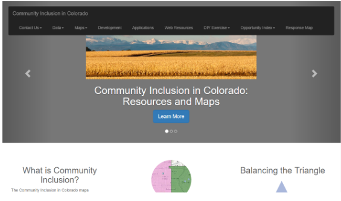

Produced by Colorado Department of Public Health and Environment, this document provides a quick glance resource for understanding how health care facilities are managed at the state of Colorado. These datasets can be found using keyword ‘gocodecolorado’ as they meet standards for Go Code Colorado publishing and metadata. All these datasets are related based on their theme, and this doc provides context for that relationship.

**Disclaimer**: There are no restrictions and legal prerequisites for using these datasets. The state of Colorado and the Colorado Department of Public Health and Environment assumes no liability to the completeness, correctness, or fitness for use of these datasets. Please contact the GIS Coordinator at the Colorado Department of Public Health and Environment for more information on how geospatial data was assembled, using the data set, or to request additional access to the data. Users of the data should consider factors such as the data source, time period, assignment of geography, statistical reliability, and calculation of rate.

### CDPHE Colorado Drug Treatment Programs and Resources

**Description**: Point geometry feature class representing known Colorado Drug Treatment Program Resource locations (Methadone Clinics and Narcotic Addiction Treatment Programs), developed directly from address information obtained from the Office of Emergency Preparedness and Response, Colorado Department of Public Health and Environment, in 2017.

CIM Link to Data: [Colorado Drug Treatment Programs and Resources](https://data.colorado.gov/Health/CDPHE-Colorado-Drug-Treatment-Programs-and-Resourc/ic4p-uss4)

External Link to Data: http://data-cdphe.opendata.arcgis.com/datasets/cdphe-colorado-drug-treatment-programs-and-resources

Tags/Keywords: cdphe, gis, colorado, facilities, health, drug treatment, gocodecolorado

### Colorado Household Medication Take-Back Program Locations

**Description**: This Google Fusion Table contains locations where person(s) can drop off unused household medication. This dataset was updated in March of 2017. The Colorado Household Medication Take-Back Program is now expanding with a goal of establishing at least one permanent collection location in every Colorado county. All locations can accept prescribed controlled substances (e.g. Percocet, Vicodin, Xanax, Ritalin and Adderall) along with other prescribed and over-the-counter medications.

CIM Link to Data: [Colorado Household Medication Take-Back Program Locations](https://data.colorado.gov/Health/Colorado-Household-Medication-Take-Back-Program-Lo/ngd4-gmgf)

External Link to Data:https://fusiontables.googleusercontent.com/embedviz?viz=GVIZ&t=TABLE&q=select+col0,+col1,+col2,+col3,+col4,+col5,+col6,+col7+from+1hwaEvVwQ0W-FjpqYGsc-OjzZ3cLSQypnlgv0sYTX+order+by+col5+asc&containerId=googft-gviz-canvas

Tags/Keywords: cdphe, gis, colorado, facilities, rx, drug, prescription, gocodecolorado

### Composite Socio-Demographic Dataset (Census Tract)

**Description**: This census tract geography dataset includes selected indicators (2011-2015 5-Year Averages) pertaining to population, age, race/ethnicity, language, housing, poverty/income, education, disability, health insurance, employment, and age*race*gender groups. This dataset is assembled annually from the U.S. Census American Community Survey American Factfinder website and is maintained by the Colorado Department of Public Health and Environment.

CIM Link to Data: [Composite Socio-Demographic Dataset (Census Tract)](https://data.colorado.gov/Demographics/CDPHE-Composite-Socio-Demographic-Dataset-Census-T/2x3x-4dkh)

External Link to Data: http://data-cdphe.opendata.arcgis.com/datasets/cdphe-composite-socio-demographic-dataset-census-tract

Tags/Keywords: cdphe, gis, colorado, demographics, social determinants of health, gocodecolorado

Disclaimer: This data set is provided as an estimate from the 2011-2015 American Community Survey Estimates (U.S. Census).  

### Community Behavioral Health Centers

Description: Point geometry feature class representing Community Behavioral Health Centers and Resource locations, developed directly from address information obtained directly from the Office of Emergency Preparedness and Response, Colorado Department of Public Health and Environment, in 2017.

CIM Link to Data: [Community Behavioral Health Centers](https://data.colorado.gov/Health/CDPHE-Community-Behavioral-Health-Centers/7jcr-yuy9)

External Link to Data: http://data-cdphe.opendata.arcgis.com/datasets/cdphe-community-behavioral-health-centers

Tags/Keywords: cdphe, gis, colorado, facilities, health, behavioral health, gocodecolorado

### Health Facilities
**Description**: Point geometry feature class representing known regulated health facilities in Colorado, developed directly from address information obtained directly from the Health Facilities and Emergency Medical Services Division of the Colorado Department of Public Health and Environment in January of 2017.

CIM Link to Data: [Health Facilities](https://data.colorado.gov/Health/CDPHE-Health-Facilities/98pp-s4r4)

External Link to Data: http://data-cdphe.opendata.arcgis.com/datasets/cdphe-health-facilities

Tags/Keywords: cdphe, gis, colorado, health, facilities, health facilities, gocodecolorado
Disclaimer: Some addresses of facilities were not matched to exact coordinate locations and are the defined locations may or may not be representative of the actual location of the facility.

### Composite Socio-Demographic Dataset (County)
**Description**: This county geography dataset includes selected indicators (2011-2015 5-Year Averages) pertaining to population, age, race/ethnicity, language, housing, poverty/income, education, disability, health insurance, employment, and age*race*gender groups. This dataset is assembled annually from the U.S. Census American Community Survey American Factfinder website and is maintained by the Colorado Department of Public Health and Environment.

CIM Link to Data: [Composite Socio-Demographic Dataset (County)](https://data.colorado.gov/Health/CDPHE-Composite-Socio-Demographic-Dataset-County-/rcsh-y5k8)

External Link to Data: http://data-cdphe.opendata.arcgis.com/datasets/cdphe-composite-socio-demographic-dataset-county

Tags/Keywords: cdphe, gis, colorado, demographics, social determinants of health, gocodecolorado

Disclaimer:  This data set is provided as an estimate from the 2011-2015 American Community Survey Estimates (U.S. Census).  

### Composite Selected Health Outcome Dataset (County)
**Description**: This county geography dataset contains eight selected 2011-2015 health outcome rates calculated at the county geography for all of the counties in Colorado: (Asthma Hospitalizations, Diabetes Hospitalizations, Heart Disease Mortality, Influenza Hospitalizations, Low Weight Birth, Motor Vehicle Accident Mortality, Suicide Mortality, and Teen Fertility).  The rates contained in this dataset represent 2011-2015 5-Year Averages and include the 95% confidence interval for each county rate as well as the Colorado state average.  Published rates that have large confidence intervals should be interpreted with caution.  This dataset is assembled and maintained annually by the Colorado Department of Public Health and Environment.

CIM Link to Data: [Composite Selected Health Outcome Dataset (County)](https://data.colorado.gov/Health/CDPHE-Composite-Selected-Health-Outcome-Dataset-Co/uppm-w53n)

External Link to Data: http://data-cdphe.opendata.arcgis.com/datasets/cdphe-composite-selected-health-outcome-dataset-county

Tags/Keywords: cdphe, gis, colorado, health, gocodecolorado

Disclaimer:  This data set is produced annually by the Colorado Department of Public Health and Environment and users of these data should consider factors such as the data source, time period, assignment of geography, statistical reliability, and calculation of rate.  

### Composite Selected Health Outcome Dataset (Census Tract)
**Description**: This census tract geography dataset contains eight selected 2011-2015 health outcome rates calculated at the census tract geography for all of the census tracts in Colorado: (Asthma Hospitalizations, Diabetes Hospitalizations, Heart Disease Mortality, Influenza Hospitalizations, Low Weight Birth, Motor Vehicle Accident Mortality, Suicide Mortality, and Teen Fertility).

CIM Link to Data: [Composite Selected Health Outcome Dataset (Census Tract)](https://data.colorado.gov/Health/CDPHE-Composite-Selected-Health-Outcome-Dataset-Ce/fqds-aa4n)

External Link to Data: http://data-cdphe.opendata.arcgis.com/datasets/cdphe-composite-selected-health-outcome-dataset-census-tract

Tags/Keywords: cdphe, gis, colorado, health, gocodecolorado

Disclaimer: This data set is produced annually by the Colorado Department of Public Health and Environment and users of these data should consider factors such as the data source, time period, assignment of geography, statistical reliability, and calculation of rate.  

### Disability Resource Providers: Colorado Community Inclusion
This data set represents the known locations of community resources in Colorado serving the Disability community.  This map details the agency locations for the following services:

- Area Agencies on Aging (AAA), Aging and Disability Resources (ADRC)
- Alzheimer’s Association (ALZHEIMERS), ARC Offices (ARC)
- Amyotrophic Lateral Sclerosis Resources (ALS)
- Board of Cooperative Educational Services (BOCES)
- Brain Injury Resources (BIR)
- Child Find Offices (Child Find)
- Congregate Meal Sites (CMS)
- Community Centered Board Offices (CCB)
- Diabetes Resources (DIABETES)
- Division of Vocational Rehabilitation Offices (DVR)
- Equipment Loan Program (ELP)
- Independent Living Centers (ILC)
- Meal Delivery Programs (MDP)
- Multiple Sclerosis Support (MS)
- Older Individuals Who are Blind Programs (OIB)
- Parkinson’s Disease Support Groups (Parkinson)
- Post-Polio Support Groups (Polio)
- Single Entry Points (SEP)
- Sign Language Interpreters and Services (CART)
- Stroke Support Groups (STROKE)
- Veteran Services (Veterans)

CIM Link to Data: [Disability Resource Providers: Colorado Community Inclusion](https://data.colorado.gov/dataset/Disability-Resource-Providers-Colorado-Community-I/7rm5-pqmc)

External Link to Data:  https://data-cdphe.opendata.arcgis.com/datasets/disability-resource-providers-colorado-community-inclusion

Tags/Keywords: cdphe, colorado, gis, disability, facilities, gocodecolorado

Disclaimer:  Some addresses of facilities were not matched to exact coordinate locations and are the defined locations may or may not be representative of the actual location of the facility.

### Composite Community Level Estimates (Census Tracts)

**Description**: The Colorado Department of Public Health and Environment has developed community-level estimates for adults in a set of 14 important health condition and risk behavior indicators.
CIM Link to Data: [Composite Community Level Estimates (Census Tracts)](https://data.colorado.gov/dataset/CDPHE-Composite-Community-Level-Estimates-Census-T/dmuh-5ewr)

External Link to Data:  https://data-cdphe.opendata.arcgis.com/datasets/cdphe-composite-community-level-estimates-census-tract

Tags/Keywords: cdphe, colorado, GIS, health, risk behavior, community level estimates, gocodecolorado

Disclaimer:   Please contact the Health Statistics Section at the Colorado Department of Public Health and Environment for more information on how these data were assembled, consultation on using this data set, or to request additional access to this data.

### Additional Resources
[Colorado Community Inclusion Maps](http://www.cohealthmaps.dphe.state.co.us/colorado_community_inclusion/)

To explore this dataset through a visualization tool, consider navigating to the Community Inclusion Maps.

In community inclusion map [geoJSON endpoint](http://www.cohealthmaps.dphe.state.co.us/arcgis/rest/services/COMMUNITY_INCLUSION/COLORADO_COMMUNITY_INCLUSION_DME/MapServer/1/query?where=objectid+%3D+objectid&outfields=*&f=json) gives all locations in one endpoint with ‘type’.

Review of unique data available in endpoint:

1. Medical facility locations by type
  a. Use of a [get request](http://www.cohealthmaps.dphe.state.co.us/colorado_community_inclusion/downloads/colorado_communityinclusion_resources_indicators_2015.zip) returns a zipped excel file
2. Durable Medical Equipment: Center for Medicaid/Medicare Equipment Counts (zip code)
  a. [Web Map](http://www.arcgis.com/home/webmap/viewer.html?webmap=11d901569afd42e898407f33288e2e9b&extent=-109.6075,37.3953,-101.4941,40.8086), [geoJSON endpoint](http://www.cohealthmaps.dphe.state.co.us/arcgis/rest/services/COMMUNITY_INCLUSION/COLORADO_COMMUNITY_INCLUSION_DME/MapServer/1/query?where=objectid+%3D+objectid&outfields=*&f=json)
3. Extra layers in web map that could be useful
  a. CDPHE Colorado Behavioral Health Centers
  b. CDPHE CO Drug Treatment Program Resources
  c. CDPHE Trauma Centers and Designation
  d. CDPHE EMS Ambulance Agencies
  e. CDPHE Local Public Health Agencies
4. NHD (FEMA Data seen on same web map)
  a. River Mile Markers
  b. Water Lines
  c. Flood hazard Boundaries
  d. Flood Hazard Zones
5. INCI Web Current Fires vs Public Safety Current Fires
  a, Both need to be investigated further
6. Behavioral Health Statistics from the Center for Disease Control
7. [CDC](https://nccd.cdc.gov/brfssprevalence/rdPage.aspx?rdReport=DPH_BRFSS.ExploreByLocation&rdProcessAction=&SaveFileGenerated=1&rdCSRFKey=a5a15692-4fa7-44c1-aaef-755c5f4fcb83&islLocation=08&islClass=CLASS17&islTopic=Topic15&islYear=2013&hidLocation=08&hidClass=CLASS17&hidTopic=Topic15&hidTopicName=Current+Smoker+Status&hidYear=2013&irbShowFootnotes=Show&iclIndicators_rdExpandedCollapsedHistory=&iclIndicators=_RFSMOK3&hidPreviouslySelectedIndicators=&DashboardColumnCount=2&rdShowElementHistory=&rdScrollX=0&rdScrollY=0&rdRnd=83627) - [(Socrata Portal)](https://chronicdata.cdc.gov/browse?category=Behavioral+Risk+Factors) - Center for Disease Control Behavioral Risk Factor Surveillance System. Has datasets related to Rates of Obesity, Rates of Cardiovascular Disease, Tobacco Use, Binge Drinking among Adults, Chronic Health Indicators, Rates of Physical Activity, Number of Fruits and Vegetables Per Week, Oral Health, WOmen’s Health, Immunization, Injury, Arthritis, Blood Pressure, Hypertension, Flu Shots, Prostate Cancer, etc
8. [Colorado Health Indicators](https://www.colorado.gov/pacific/cdphe/colorado-health-indicators)
These health indicators include county, regional and state level data on a variety of health, environmental and social topics. These data are used in Colorado’s Health Assessment and Planning System [(CHAPS)](https://www.colorado.gov/pacific/cdphe-lpha/chaps). CHAPS is a standard process created to help local public health agencies meet assessment and planning requirements. These indicators are useful for anyone who needs Colorado health data for a community health assessment or for other research purposes.
