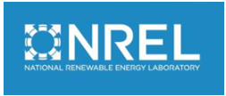

### NREL Developer Network

The National Renewable Energy Laboratory's Developer Network (http://developer.nrel.gov) helps developers access and use energy data via Web services, including renewable energy and alternative fuel data.

- Free to use, one-time sign-up to get an API key, and you are ready to go for all NREL APIs. Get an API key here: https://developer.nrel.gov/signup
- NREL APIs are RESTful and data can be returned in either JSON or XML, and in some cases CSV.
- APIs and datasets include:
  - City Energy Data (SLED)
  - Utility Rates (URDB via OpenEI and Ventyx data via NREL)
  - Energy Incentives (DSIRE data)
  - Energy Optimization (REopt Lite)
  - Transportation – (AFDC and Transportation Laws and Incentives)

### SLED - State and Local Energy Data

SLED allows users to access energy market data for cities and states related to buildings and industry, electricity and natural gas, and transportation.
These APIs power our State and Local Energy Data tool - https://apps1.eere.energy.gov/sled/cleap.html

- Buildings and Industry
- small_building_pv – get small building pv data for a city/state or ZIP
- Electricity and Natural Gas
- Emissions
- General
- Transportation

### Utility Rates

The Utility Rate Database ([URDB](https://openei.org/wiki/Utility_Rate_Database)) is a free storehouse of rate structure information from utilities in the United States. The URDB includes rates for utilities based on the authoritative list of U.S. utility companies maintained by the U.S. Department of Energy’s Energy Information Administration. 42,222 rates have been contributed for 3,760 EIA-recognized utility companies.Information about the URDB itself, as well as a limited querying capability, can be found at: http://en.openei.org/wiki/Utility_Rate_Database

The OpenEI Utility Rates API provides access to complex utility rate structure information (across all sectors) for most U.S. utility companies from the U.S. Utility Rate Database.
API documentation is available at: http://en.openei.org/services/doc/rest/util_rates/?version=3

The NREL utility rates API provides annual average utility rates ($/kWH) for residential, commercial and industrial sectors as well as the local utility name for a specific location. Data source is Ventyx Research Inc. (ABB) and the Energy Information Agency (EIA) and is updated with 2012 data. The documentation for this API can be found at: http://developer.nrel.gov/docs/electricity/utility-rates-v3

### Incentives

The Database of State Incentives for Renewables & Efficiency (DSIRE) is a comprehensive source of information on state, local, utility, and federal incentives and policies that promote renewable energy and energy efficiency. http://www.dsireusa.org

The DSIRE API (http://www.dsireusa.org/resources/data-and-tools) provides two endpoints for directly accessing their data:
1. oGetPrograms – returns data on all incentive programs (Note: these are large queries that return thousands of results)
2. oGetProgramsByDate – returns data on incentive programs that were last updated sometime between the two dates supplied

The OpenEI Incentives API Provides information about incentives for renewables and efficiency associated with a specific location. Filterable by sector (commercial, industrial, residential) and category (fed/state/local/etc). http://en.openei.org/services/doc/rest/incentives
OpenEI can filter by sector, category (fed/state/etc).

The NREL energy incentives API lists the incentives found in the DSIRE quantitative spreadsheet by location. Filterable by category (solar, wind, etc) and technology (solar pv, lighting, roofs, etc). http://developer.nrel.gov/docs/electricity/energy-incentives-v2
NREL can filter by category (solar, etc)  and technology (lighting, roofs, etc).

### REopt

The REopt Lite API recommends an optimal mix of renewable energy, conventional generation, and energy storage technologies to meet cost savings and energy performance goals, including the hourly optimal operation of the system.
Powers the REopt Lite web application: https://reopt.nrel.gov/tool

- Evaluate the economic viability of grid-connected PV and battery storage at a site.
- Identify system sizes and battery dispatch strategies to minimize energy costs.
- Estimate how long a system can sustain critical load during a grid outage.
- https://developer.nrel.gov/docs/energy-optimization/reopt-v1/

### Transportation APIs

APIs related to alternative fuel vehicles and infrastructure. Includes electric charging, biodiesel, compressed natural gas, ethanol, hydrogen, liquefied natural gas, and propane.
Powers many tools and apps, including the [alternative fuels data center](https://afdc.energy.gov/).

- [Alternative Fuel Stations](https://developer.nrel.gov/docs/transportation/alt-fuel-stations-v1/): A database of all the alternative fuel stations in the US & Canada. Find nearby stations, find stations along a route, or bulk download the entire dataset. API endpoints include:
  - All Stations
  - Stations by ID
  - Last Updated Date
  - Nearest Stations
  - Stations Nearby Route

- [Transportation Laws and Incentives](https://developer.nrel.gov/docs/transportation/transportation-incentives-laws-v1/): Includes information on both federal and state incentives for alternative fuel vehicles.
- API Documentation: https://developer.nrel.gov/docs/transportation/

### Building APIs

NREL offers services related to energy efficiency and the use of renewable technologies in residential and commercial buildings. Services included are:

- [Building Component Library](https://developer.nrel.gov/docs/buildings/building-component-library/): Here, users can access energy data on individual components or energy conservation measures for buildings. This data can be used to create building energy models.For web service details, documentation, and access, see the [Building Component Library API documentation](https://bcl.nrel.gov/developer).

- [Commercial Building Resource Database](https://developer.nrel.gov/docs/buildings/commercial-building-resource-database-v1/): Resources to support the adoption of energy-saving building technologies. Endpoints include:
  - Commercial Building Resource Events
  - Commercial Building Resource Vocabularies
  - Commercial Building Resources
- [High Performance Building Database](https://developer.nrel.gov/docs/buildings/building-case-studies/): The Buildings Database is a shared resource for the building industry. The Database, developed by the U.S. Department of Energy and the NREL, is a unique central repository of in-depth information and data on high-performance, green building projects across the United States and abroad.
- [Standard Work Specifications](https://developer.nrel.gov/docs/buildings/standard-work-spec-v1/): Retrieve standard work specification details for home energy upgrades.

### Colorado Subsets:

All of these APIs can be constrained in the query to return only Colorado related information. Alternately, these datsets are subset on the Colorado Information Marketplace as these select datasets.

- List
- And
- Link
- Datasets

### All Energy-Related Datasets on CIM:

| Dataset_Title                                                                 | Link      | Description                                                                                                                                                                                                                                                                    |
|-------------------------------------------------------------------------------|-----------|--------------------------------------------------------------------------------------------------------------------------------------------------------------------------------------------------------------------------------------------------------------------------------|
| Natural Gas Underground Storage in Colorado 2014                              | evkd-zgn4 | Information about the Natural Gas Underground Storage resources generated for Colorado Counties by the US Energy Information Administration (USEIA) and updated annually. Navigate to source for most current information.                                                     |
| Crude Oil Pipelines in Colorado 2014                                          | mv3v-5qet | Major crude oil pipelines data for Colorado are maintained by the US Energy Information Administration (USEIA) and updated annually. Navigate to source for most current information.                                                                                          |
| Natural Gas Prices in Colorado                                                | e4ky-6g2n | Natural gas prices by type per month, since 1989, from the US Energy Information Administration (USEIA).                                                                                                                                                                       |
| Alternative Fuels and Electric Vehicle Charging Station Locations in Colorado | team-3ugz | Alternative Fuels and Electric Vehicle Charging Station locations are gathered by the National Renewable Energy Laboratory (NREL) and verified annually.                                                                                                                       |
| Electricity Net Metering by Utility in US                                     | 4jjg-g3yq | Metering for various energy companies broken down by month and state, since 2011, from the US Energy Information Administration (USEIA).                                                                                                                                       |
| Wind Turbines in Colorado 2013                                                | knn6-7fy9 | Industrial-scale onshore wind turbine facility information, turbine technical specifications and corresponding locations in the Colorado produced by the US Geological Survey (USGS) as of July 22, 2013.                                                                      |
| Electricity Revenue in US                                                     | cdkn-c7n9 | Revenue and pricing for electricity consumption by month in each state, since 1990 from the US Energy Information Administration (USEIA).                                                                                                                                      |
| Energy Profile in Colorado 2014                                               | 443p-eijy | Data collected to measure success of implementing Smart Grid, and other quick facts about Colorado’s national ranking for energy use, production and efficiencies. Compiled in 2014 from the National Renewable Energy Laboratory (NREL).                                      |
| Crude Oil Rail Terminals in Colorado 2014                                     | hb4b-8v4q | Rail terminal locations that handle the loading and unloading of crude oil in the State of Colorado as produced by US Energy Information Administration (USEIA). Navigate to source for most current information.                                                              |
| Electricity Revenue by Utility in US                                          | ue5s-8u8t | Electricity revenue and counts broken down by utility company and by sector, since 1999, from the US Energy Information Administration (USEIA).                                                                                                                                |
| Alternative Energy Laws and Incentives in Colorado 2014                       | nxw4-ev8w | Law titles, text and dates for biofuels, natural gas, plug in electric and more categories from National Renewable Energy Laboratory (NREL) since 2007 and updated annually after each state’s legislative session ends. Navigate to NREL source for most current information. |
| Solar PV Capacity Factor in Colorado 2015                                     | f325-6r9c | Annual average capacity factor from the National Renewable Energy Laboratory (NREL).                                                                                                                                                                                           |
| Gasoline Prices in Colorado                                                   | 8pk9-mh2i | Gas prices for every week since 2000, broken down by type, from the US Energy Information Administration (USEIA).                                                                                                                                                              |
| Truck Station Electrification in Colorado 2014                                | c8jj-hcxj | Electrified parking spaces (EPS) for Colorado is updated annually by The U.S. Department of Transportation (DOT). Navigate to source for most current information.                                                                                                             |
| Biomass Potential in Colorado 2014                                            | 9bzu-nqxb | Information about the biomass resources generated for Colorado Counties by the National Renewable Energy Laboratory (NREL) and verified annually. Navigate to NREL source for most current information.                                                                        |
| Solar Global Horizontal Irradiance in Colorado 2014                           | rtw9-6tit | Average daily total solar global horizontal irradiance average from 1998 to 2014 from the National Renewable Energy Laboratory (NREL).                                                                                                                                         |
| Biomethane Potential in Colorado 2014                                         | fypu-tup4 | Information about the Biomethane resources generated for Colorado Counties by the National Renewable Energy Laboratory (NREL) and verified annually. Navigate to NREL source for most current information.                                                                     |
| Solar Direct Normal Irradiance in Colorado 2014                               | unz2-68bn | Daily total solar direct normal irradiance average from 1998 to 2014 from the National Renewable Energy Laboratory (NREL).                                                                                                                                                     |
| Geothermal Potential in Colorado 2009                                         | rpvk-ifh4 | Geothermal potential from the National Renewable Energy (NREL) Laboratory in 2009 clipped to the state of Colorado.                                                                                                                                                            |
| State Agency Electricity Usage in Colorado                                    | uir2-bpe7 | Electricity usage for facilities utilized by state agencies dating back to fiscal year 2015 provided by the Colorado Energy Office (CEO).                                                                                                                                      |
| State Agency Water and Sewer Usage in Colorado                                | nymn-sjs9 | Water, sewage, and steam useage for facilities utilized by state agencies dating back to fiscal year 2015 provided by the Colorado Energy Office (CEO).                                                                                                                        |
| State Agency Fuel Usage in Colorado                                           | et6s-ufjm | Fuel useage including natural gas, propane, oil, and diesel for facilities utilized by state agencies dating back to fiscal year 2015 provided by the Colorado Energy Office (CEO).                                                                                            |
