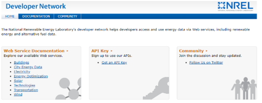
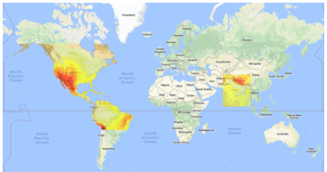
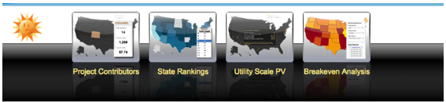

### NREL Developer Network

The National Renewable Energy Laboratory's Developer Network (http://developer.nrel.gov) helps developers access and use energy data via Web services, including renewable energy and alternative fuel data.

- Free to use, one-time sign-up to get an API key, and you are ready to go for all NREL APIs. Get an API key here: https://developer.nrel.gov/signup
- NREL APIs are RESTful and data can be returned in either JSON or XML, and in some cases CSV.
- NREL Solar and other energy-related APIs and datasets include:
  - PVWatts
  - Open PV
  - PVDAQ (PV Data Acquisition)
  - Solar Dataset Query
  - Solar Resource Data
  -  [All solar resources on the developer network](https://developer.nrel.gov/docs/solar/)

### PVWatts

The PVWatts API calculates the energy production of grid-connected photovoltaic (PV) energy systems. This service estimates the performance of hypothetical residential and small commercial PV installations.

- Updated this year to use the NREL Physical Solar Model (PSM) TMY for climate data by default, but can be adjusted to use older datasets as available for modeling.
- Specify location via lat/lon or address
- Other parameters include:
  - System capacity
  - Module type
  - Losses
  - Array type
  - Tilt (what angle the array is tilted at)
  - Azimuth (what direction the array faces)
  - And others…
- See http://developer.nrel.gov/docs/solar/pvwatts for full documentation and more info about the PVWatts model itself.
- Web tool available at http://pvwatts.nrel.gov

### Open PV

The Open PV Project database serves as a web-based resource for users to easily explore and understand the current and past trends of the US PV industry. The data collected is actively maintained by the contributors and are always changing to provide an evolving, up-to-date snapshot of the US solar power market.

The API has three endpoints to retrieve different slices of the PV installation data from the project:
- [installs](https://developer.nrel.gov/docs/solar/openpv/installs_index/) – info on individual installs such as cost, date installed, system size (kW), state and zipcode.
- [rankings](https://developer.nrel.gov/docs/solar/openpv/installs_rankings/) – install costs, capacity and counts, aggregated by state, county or ZIP
- [summaries](https://developer.nrel.gov/docs/solar/openpv/installs_summaries/) – summary cost and capacity data about installs

Documentation can be found at http://developer.nrel.gov/docs/solar/openpv, and the full dataset can also be downloaded from the Open PV website at https://openpv.nrel.gov

### PVDAQ
[PVDAQ](https://developer.nrel.gov/docs/solar/pvdaq-v3/) provides access to photovoltaic performance data collected by NREL for systems throughout the country. This also includes the [PVDAQ mapping application](https://maps.nrel.gov/pvdaq/?aL=zNVfnk%255Bv%255D%3Dt&bL=clight&cE=0&lR=0&mC=40.21244%2C-91.625976&zL=4). There are four API endpoints users can access:
1. **Aggregated Site Data**: Returns aggregated IEC61724 data for a specific PVDAQ system and date range.
2. **Annual Data for a System (CSV)**: Allows user to download a CSV file containing raw data for a specific PVDAQ system for a specific year. The file for the current year is updated as new data comes in. The first row of the CSV contains the field names.
3. **Raw Data**: Returns raw data for a specific PVDAQ system and date range. NOTE: Due to the large amounts of data being logged in some cases, some systems may only be able to return data for a single day at a time, or in some cases, a single hour at a time, without the queries timing out. Alternatively, you can download full-year CSV files of the raw data for systems via the PVDAQ data_file API.
4. **Sites Metadata**: Fetches metadata for PVDAQ sites.

### Solar Dataset Query

Using the [Solar Dataset Query](https://developer.nrel.gov/docs/solar/data-query-v1/), a user can obtain information on the closest climate data for a location. Request parameters include:
- Format
- Api_key
- Address
- Latitude
- Longitude
- Radius
- All

Request URL for this data is: `GET /api/solar/data_query/v1.format?parameters`

### Solar Resource Data

This endpoint returns various types of solar data for a location. The service currently returns data for average Direct Normal Irradiance, average Global Horizontal Irradiance, and average Tilt at Latitude. [Location on the Developer Network](https://developer.nrel.gov/docs/solar/solar-resource-v1/).
Request parameters include:
- Format
- Api_key
- Latitude
- Longitude
Request URL is: `GET /api/solar/solar_resource/v1.format?parameters`

### Testing API:

Postman is an easy and free platform through which users can test their API requests. Check it out here: https://www.getpostman.com/

### All Energy-Related Datasets on CIM:

| Dataset_Title                                                                 | Link      | Description                                                                                                                                                                                                                                                                    |
|-------------------------------------------------------------------------------|-----------|--------------------------------------------------------------------------------------------------------------------------------------------------------------------------------------------------------------------------------------------------------------------------------|
| Natural Gas Underground Storage in Colorado 2014                              | evkd-zgn4 | Information about the Natural Gas Underground Storage resources generated for Colorado Counties by the US Energy Information Administration (USEIA) and updated annually. Navigate to source for most current information.                                                     |
| Crude Oil Pipelines in Colorado 2014                                          | mv3v-5qet | Major crude oil pipelines data for Colorado are maintained by the US Energy Information Administration (USEIA) and updated annually. Navigate to source for most current information.                                                                                          |
| Natural Gas Prices in Colorado                                                | e4ky-6g2n | Natural gas prices by type per month, since 1989, from the US Energy Information Administration (USEIA).                                                                                                                                                                       |
| Alternative Fuels and Electric Vehicle Charging Station Locations in Colorado | team-3ugz | Alternative Fuels and Electric Vehicle Charging Station locations are gathered by the National Renewable Energy Laboratory (NREL) and verified annually.                                                                                                                       |
| Electricity Net Metering by Utility in US                                     | 4jjg-g3yq | Metering for various energy companies broken down by month and state, since 2011, from the US Energy Information Administration (USEIA).                                                                                                                                       |
| Wind Turbines in Colorado 2013                                                | knn6-7fy9 | Industrial-scale onshore wind turbine facility information, turbine technical specifications and corresponding locations in the Colorado produced by the US Geological Survey (USGS) as of July 22, 2013.                                                                      |
| Electricity Revenue in US                                                     | cdkn-c7n9 | Revenue and pricing for electricity consumption by month in each state, since 1990 from the US Energy Information Administration (USEIA).                                                                                                                                      |
| Energy Profile in Colorado 2014                                               | 443p-eijy | Data collected to measure success of implementing Smart Grid, and other quick facts about Colorado’s national ranking for energy use, production and efficiencies. Compiled in 2014 from the National Renewable Energy Laboratory (NREL).                                      |
| Crude Oil Rail Terminals in Colorado 2014                                     | hb4b-8v4q | Rail terminal locations that handle the loading and unloading of crude oil in the State of Colorado as produced by US Energy Information Administration (USEIA). Navigate to source for most current information.                                                              |
| Electricity Revenue by Utility in US                                          | ue5s-8u8t | Electricity revenue and counts broken down by utility company and by sector, since 1999, from the US Energy Information Administration (USEIA).                                                                                                                                |
| Alternative Energy Laws and Incentives in Colorado 2014                       | nxw4-ev8w | Law titles, text and dates for biofuels, natural gas, plug in electric and more categories from National Renewable Energy Laboratory (NREL) since 2007 and updated annually after each state’s legislative session ends. Navigate to NREL source for most current information. |
| Solar PV Capacity Factor in Colorado 2015                                     | f325-6r9c | Annual average capacity factor from the National Renewable Energy Laboratory (NREL).                                                                                                                                                                                           |
| Gasoline Prices in Colorado                                                   | 8pk9-mh2i | Gas prices for every week since 2000, broken down by type, from the US Energy Information Administration (USEIA).                                                                                                                                                              |
| Truck Station Electrification in Colorado 2014                                | c8jj-hcxj | Electrified parking spaces (EPS) for Colorado is updated annually by The U.S. Department of Transportation (DOT). Navigate to source for most current information.                                                                                                             |
| Biomass Potential in Colorado 2014                                            | 9bzu-nqxb | Information about the biomass resources generated for Colorado Counties by the National Renewable Energy Laboratory (NREL) and verified annually. Navigate to NREL source for most current information.                                                                        |
| Solar Global Horizontal Irradiance in Colorado 2014                           | rtw9-6tit | Average daily total solar global horizontal irradiance average from 1998 to 2014 from the National Renewable Energy Laboratory (NREL).                                                                                                                                         |
| Biomethane Potential in Colorado 2014                                         | fypu-tup4 | Information about the Biomethane resources generated for Colorado Counties by the National Renewable Energy Laboratory (NREL) and verified annually. Navigate to NREL source for most current information.                                                                     |
| Solar Direct Normal Irradiance in Colorado 2014                               | unz2-68bn | Daily total solar direct normal irradiance average from 1998 to 2014 from the National Renewable Energy Laboratory (NREL).                                                                                                                                                     |
| Geothermal Potential in Colorado 2009                                         | rpvk-ifh4 | Geothermal potential from the National Renewable Energy (NREL) Laboratory in 2009 clipped to the state of Colorado.                                                                                                                                                            |
| State Agency Electricity Usage in Colorado                                    | uir2-bpe7 | Electricity usage for facilities utilized by state agencies dating back to fiscal year 2015 provided by the Colorado Energy Office (CEO).                                                                                                                                      |
| State Agency Water and Sewer Usage in Colorado                                | nymn-sjs9 | Water, sewage, and steam useage for facilities utilized by state agencies dating back to fiscal year 2015 provided by the Colorado Energy Office (CEO).                                                                                                                        |
| State Agency Fuel Usage in Colorado                                           | et6s-ufjm | Fuel useage including natural gas, propane, oil, and diesel for facilities utilized by state agencies dating back to fiscal year 2015 provided by the Colorado Energy Office (CEO).                                                                                            |
