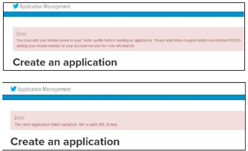
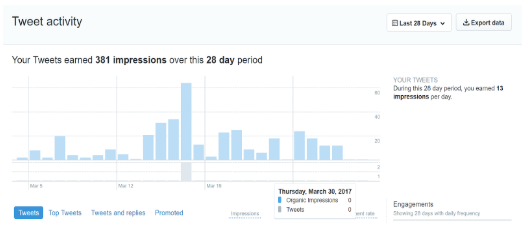
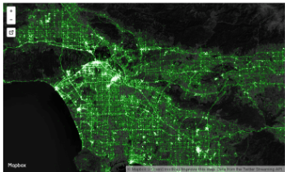
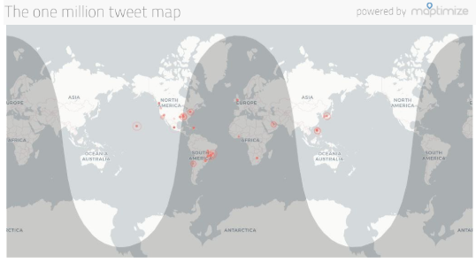
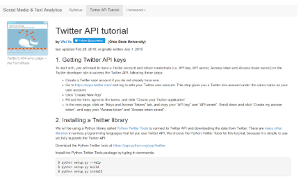
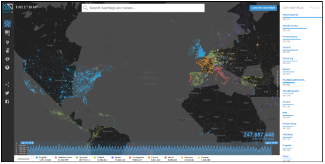
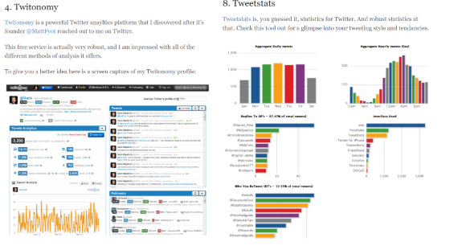
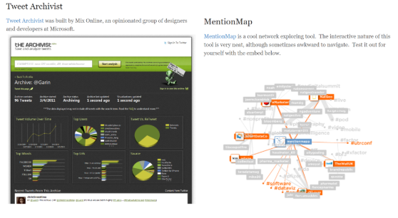

# Accessing Twitter Data

**Go Code Colorado and Twitter are joining together to provide competing teams with resources to integrate Twitter data into their apps and analytics.**

There is a compelling case for business applications built from the value created by combining public data with other data. The case is equally compelling for Twitter to discover business solutions that can arise from combining their data with public data.

Twitter is interesting to data scientists in the same way that public data is - Secondary Usage. Both Twitter and Government Data exist to serve a primary purpose. Analysts are looking to both of these data types to extract value. When that extracted value is combined, powerful resources are created from public and open resources. Let the fun begin!

### How can novice competitors use Twitter to compete in Go Code?

It's easy to get started with the Twitter API to search, show and automate Tweets.  The first thing to do is register and obtain credentials. After that, it's fairly simple to use Twitter developer community tools to enrich applications with messaging automation and live Tweet content.

1. Register at apps.twitter.com for access credentials
**Tips:**
- Authenticate with your phone
- Make sure to include https:// with your url

2. Review the documentation to find out what APIs/tools might be useful
  a. Go the Data Route:
    - Search Tweets & Gather Data with the [Standard API](https://developer.twitter.com/en/docs/tweets/search/api-reference/get-search-tweets) and [Premium API](https://developer.twitter.com/en/docs/tweets/search/overview/premium)
  b. Go the Automation Route:
    - [Listen for Tweets with the Streaming API](https://developer.twitter.com/en/docs/tutorials/consuming-streaming-data)
    - [Embed Timelines via the publishing portal](https://publish.twitter.com/#)
    - [Post to Twitter](https://developer.twitter.com/en/docs/tweets/post-and-engage/api-reference/post-statuses-update)
    - [New Direct Message API for building bots](https://developer.twitter.com/en/docs/direct-messages/sending-and-receiving/api-reference/new-event) or [Account Activity API](https://developer.twitter.com/en/products/accounts-and-users/account-activity-api)
3. Test using [Twurl](https://github.com/twitter/twurl)
  a. Review Twurl GitHub, Tutorials, and Quick links

4. Move process into the application creation using some example Twitter Libraries, keep current on API issues with the API Status Console, find GET Parameters for the Rest API, and more from following these quick links:

- [Twitter API](https://developer.twitter.com/en/docs)
- [Rest API](http://t.co/rest)
- [Automation Rules](http://t.co/automate)
- [TwitterDev Gallery](http://t.co/code)
- [Twitter Libraries](http://t.co/libs)
- [Twitter Apps](http://t.co/apps)
- [Twitter Developer Forums](http://t.co/apps)
- [API Status Console](https://api.twitterstat.us/)

### Go Code Colorado Analytics Track

Investigate the data to find signals that relate to trends your team are looking to represent. In the documentation, find resources to search Tweets and gather data using the Standard API and Premium API. Lots of interesting studies have been done to combine Tweet patterns with other data. Make data results dynamic with integrating listeners to update data and display of information in the data story.

### Go Code Colorado Product Tracks

Before building the product, start with exploring the data to learn the comments being made by people sharing information on your team’s area of focus. Use that information in combination with research to understand how Twitter can be used to interact with the users of the application. This will set the foundation for how Twitter could be integrated into the user’s experience. Specifically, how is information is gathered from users? What features of the tool listen to Tweets (Streaming API)? What interactions with the tool post to Twitter? When will the tool send direct messages? What scenarios require embedding Tweets?

### Should I Expect to pay Twitter for this service in the future?

All the APIs for this competition are publicly available, Twitter Data should be handled under what is specified in the [Twitter Developer Agreement](https://developer.twitter.com/en/developer-terms/agreement-and-policy). The Premium APIs require folks [submit an application](https://developer.twitter.com/en/apply-for-access), and all APIs require at least a Twitter account.

**Premium API**

A  command-line utility and a Python library to [Search Tweets with a Python Client](https://twitterdev.github.io/search-tweets-python/). Find out more about the features available with the Premium API, including the command line tools, Python Wrapper and more! And here’s a [Search Tweets Ruby client](https://github.com/twitterdev/search-tweets-ruby).

**Standard API**

Hosted and open-sourced on GitHub, [Tweepy](https://github.com/tweepy/tweepy) is the primary access for Standard APIs. It enables Python to communicate with Twitter platform and use its API, and uses the Twython library.

### What Exactly is Twitter?

Twitter is an online news and social networking service where users post and interact with messages "Tweets," which have a text content of up to 280 characters. Users can post Tweets, but even without an account, people can still follow what is happening. Twitter is what’s happening right now, and a great source of insight into what people around the world are thinking at any moment in time.

### Does Twitter Have Specs?

Twitter is known for having one of the most open and powerful developer APIs. There are many great examples of programming tutorials using the Twitter REST APIs.

- Twitter is very scalable and has an immense data pool.
- Twitter provides many additional developer features. Cards for additional display content. A publisher platform for embedding Tweets and timelines. Streaming for continuous delivery of new responses over a long-lived HTTP connection. Ads, and MoPub for largest ad revenue content. Gnip, which is Twitter’s Enterprise platform for commercial-grade access to real-time and historical Twitter Data collected.
- Twitter uses OAuth for endpoints to send secure, authorized requests to the API. OAuth has two forms of authentication, user authentication and application-only authentication. This two level authentication creates high security for users and developers as the application-only authentication sends requests to the API without a user context.
- Keep current on API issues in the [API Status](https://api.twitterstat.us/) console.
- There are several tutorials ranging from [Getting Started,  Hierarchy and Terminology, and Using Twurl](https://dev.twitter.com/ads/tutorials).

### Check Out the Twitter API information

Most of the documentation can be found on the [Twitter developer site](https://developer.twitter.com/) -- including specifics for the Tweet Search and Tweet Filter APIs.

### More Learning!

[Jupyter Notebooks](https://jupyter.org/) is a great resources for any data scientist!

Three deep tutorials for doing data science with Twitter data and our Search APIs can be found through exploring the [Do More With Twitter Data Series](https://twitterdev.github.io/do_more_with_twitter_data/). The first provides a great basic ‘how to’ on narrowing in on the ideal search parameters for an analysis. The second two walk through two basic but essential statistical methods - Clustering and Time Series - for taking the data found in exploration and doing something cool with it! To find the Jupyter notebooks, click on the “Please go here to see it!” link and scroll down to “Running this Notebook” and “find the link [here](https://github.com/twitterdev/do_more_with_twitter_data)”.

### Get to Know Your Own Twitter data

Check out [Twitter Analytics](https://analytics.twitter.com/about) to see the impact of your own activity.

**Check Out These Cool Examples We Found of Twitter Uses!**

[Twitter Dev Gallery](https://twitterdev.github.io/) --sample code and app examples.

- Article by Mapbox -  [Making the most detailed tweet map ever](https://blog.mapbox.com/making-the-most-detailed-tweet-map-ever-b54da237c5ac):

- [The One Million Tweet Map](http://onemilliontweetmap.com/)

- [Twitter API Tutorial](http://socialmedia-class.org/twittertutorial.html)

- [OmniSci Tweet Map Demo](https://www.omnisci.com/demos/tweetmap/)

- [10 Awesome Twitter Visualization Tools](http://twittertoolsbook.com/10-awesome-twitter-analytics-visualization-tools/)

