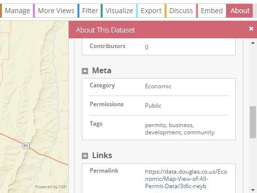
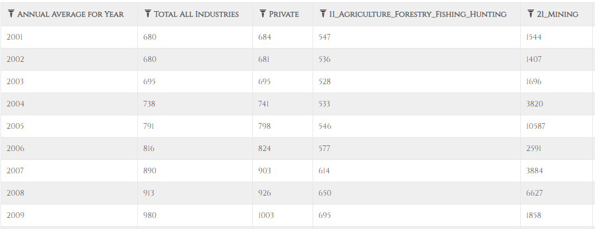
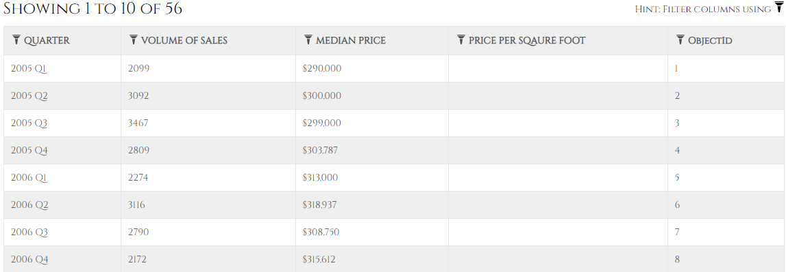
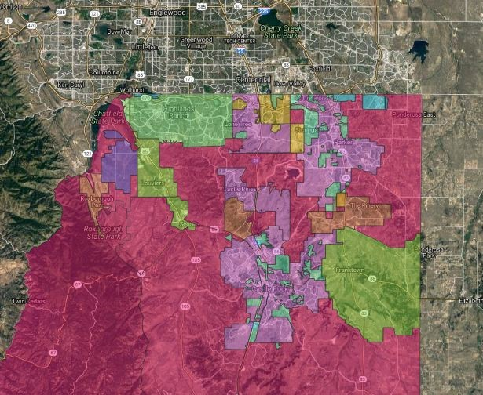

# Douglas County Data

Douglas County is located south of Denver, with its county seat in Castle Rock. DougCo has [its own public data website](https://data.douglas.co.us/), and much of its data can be found on the [CIM](https://data.colorado.gov/browse?federation_filter=1222).

## Douglas County - Overview of Relevant Datasets

DougCo has quite a variety of datasets available, categories available for browsing include Business Development, Community Development, Demographics, Economic, Education, Election Data, Financials, Fun, Government, Parks Trails and Open Space, Performance, Property Data, Public Safety, Recreation, Tax Data, and Transportation.

## How to Get Started
DougCo data can be found in the following locations:

1. [DougCo Data](https://data.douglas.co.us/browse)
2. [Colorado Information Marketplace](https://data.colorado.gov/)
3. [Douglas County's Geohub](https://gis-dougco.opendata.arcgis.com/)

## Working with this Data

If you have ever used the Colorado Information Marketplace (CIM), then you will find the DougCo open data website very easy to use. The two websites are laid out almost exactly the same, and are both powered by Socrata.

## Metadata

Metadata can be found on DougCo&#39;s website by clicking the &quot;About&quot; tab while viewing any dataset.

## Wages Annual Average

This dataset contains average annual weekly wages for jobs in Douglas County, by industry, from 2001 through 2018 [permits for Douglas County](https://gis-dougco.opendata.arcgis.com/datasets/douglas-wages-annual-average).

## Residential Sales Core Logic

Douglas County has a [dataset](https://gis-dougco.opendata.arcgis.com/datasets/douglas-residential-sales-corelogic) about residential sales in Douglas County by Quarter. It could be interesting to pair this dataset with the previous!

## Douglas County Alexa Requests

This is one of the more unique datasets available that has been provided by DougCo. Simply put, this data is a table for Amazon&#39;s Alexa to provide information about Douglas County from user requests. As of now the table is designed primarily for users making requests for [information about property values and taxes](https://data.douglas.co.us/dataset/Douglas-County-Alexa-Requests/ern2-hudh). The data can be downloaded as a csv, tsv, rff, rss, or xml.

## Douglas County GeoHub

The Douglas County GIS Services Team develops and produces standard maps that are available for internal (Douglas County Departments) and external customers. A wide range of standard maps are available, including transportation, land use, political, geologic, and other information. [The GeoHub](https://gis-dougco.opendata.arcgis.com/) has data on demographic, economic, education, election, government, health, hydrography, infrastructure, parks &amp; open space, planning, property, public safety, topography, and transportation.

Some interesting sample datasets:

1. [Water Supply Zones](https://gis-dougco.opendata.arcgis.com/datasets/f41be83add5f421d98c3d3f43f475a02_0): Map of groundwater supply zones
2. [Mental Health Data](https://gis-dougco.opendata.arcgis.com/items/026a751142d44975a2b0d380c66ee927): Suite of data relating to mental health in the area
3. [Land Use](https://gis-dougco.opendata.arcgis.com/datasets/3fda53fc9335458bb6c097228130328c_0): Comprehensive Master Plan 2030 Land Use Management Areas as approved by the Douglas County Planning Commission - April 21, 2008.

## Much More

There&#39;s a lot more on the site - go see for yourself!

- [GeoHub](https://gis-dougco.opendata.arcgis.com/)
- [DougCo Open Data](https://data.douglas.co.us/)
- [Colorado Information Marketplace](https://data.colorado.gov/)
