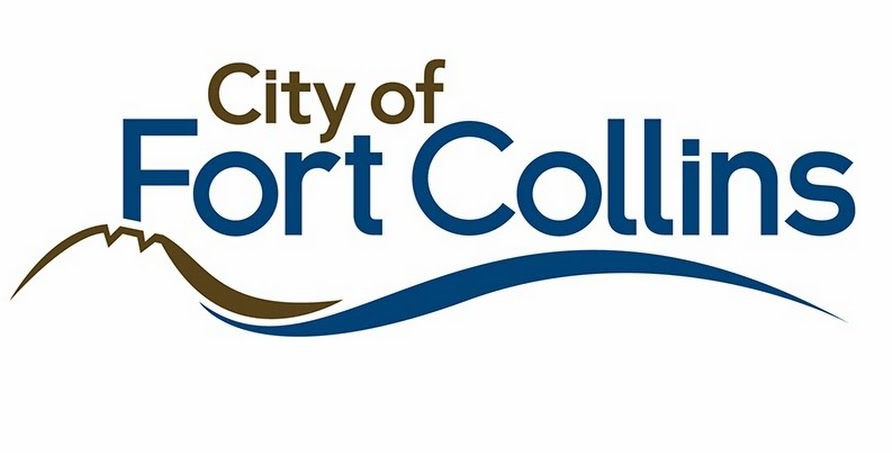
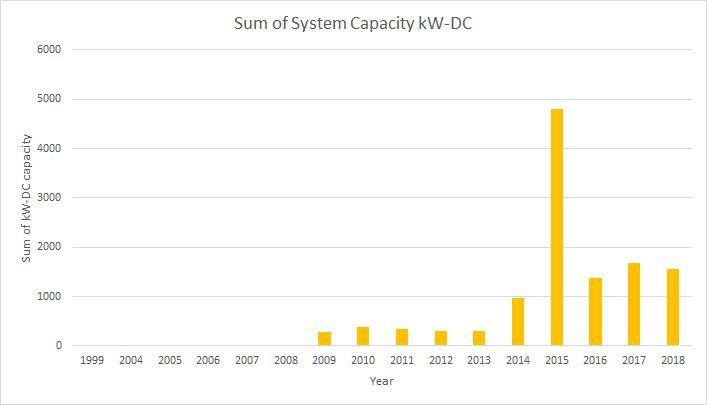
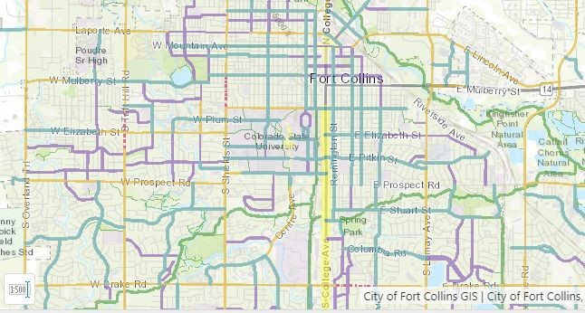
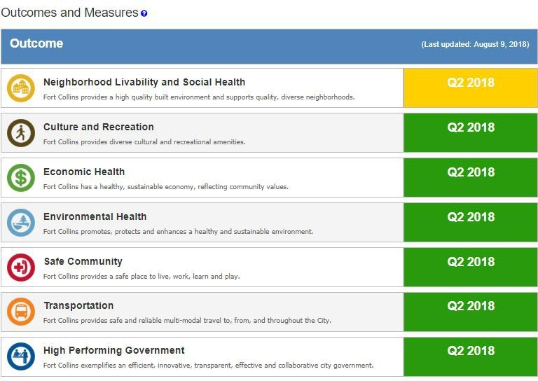

# City of Fort Collins Data

The goal of [Fort Collins Open Data](https://www.fcgov.com/opendata/) is to maintain a web portal to host data sets that are available to the public in a format that citizens can easily search, filter, and utilize in innovative and creative ways. Making data available allows citizens to learn about the City, help make decisions, and be a part of creating solutions.

## City of Fort Collins Overview of Relevant Datasets

The City of Fort Collins [open data portal](https://opendata.fcgov.com/) contains a wide variety of datasets that may be applicable to this challenge, including datasets focused on:

- Culture and Recreation
- Economic Health
- Environmental Health
- Safe Community
- Transportation
- High Performing Government
- Strategic Plans
- City Council Meetings

## How to Get Started

Fort Collins data can be accessed on [opendata.fcgov.com](https://opendata.fcgov.com/) and on [data.colorado.gov](https://data.colorado.gov/browse?federation_filter=1999). The layout of the two websites in nearly identical, as both are powered by Socrata. The City of Fort Collins also has its own [map-specific website](https://gisweb.fcgov.com/HTML5Viewer/Index.html?viewer=FCMaps), where pre-prepared map data can be visualized and exported for further explanation.

## Metadata

Metadata can be found under the &quot;About&quot; tab when viewing any dataset.

## Solar Installations Data

The [Solar Installations Data](https://opendata.fcgov.com/Environmental-Health/Solar-Installations/3ku5-x4k9) includes all solar (photovoltaic) systems interconnected with Fort Collins Utilities distribution system and includes three fields: the date of service, system address, and solar system capacity (kilowatts-DC).

## Bikeway System Map

Fort Collins is proud of its bike infrastructure and culture, and has provided a [map of their bikeway system](https://gisweb.fcgov.com/HTML5Viewer/Index.html?Viewer=FCMaps&amp;amp;layerTheme=Bikeway%20System).

The data can be exported in BMP, JPG, PNG, TIFF, GeoTIFF, and pdf.

## City of Fort Collins Community Performance Measurement Dashboard

The City of Fort Collins [Community Dashboard](http://fortcollins.clearpointstrategy.com/) is a quarterly snapshot of the community&#39;s progress in attaining key outcomes. This Dashboard reinforces the City of Fort Collins&#39; steadfast commitment to accountability and continuous improvement.

Users may find this data useful for many purposes. For example, the Neighborhood Livability and Social Health category on the dashboard tracks key metrics such as housing inventory, housing costs, graffiti removal, and code compliance to measure and track Neighborhood Livability. Progress towards environmental health is determined by tracking energy use, air quality, and wastewater treatment effectiveness.

## City Buildings Energy Star Score

This map contains data on [city-owned building Energy Star scores](https://opendata.fcgov.com/High-Performing-Government/City-Buildings-Energy-Star-Score/2x5v-i6zb) from 2016. The data can be exported to KML, KMZ, shapefile, and GeoJSON.

## Much More

Make sure to explore these sites:
- [Fort Collins Open Data](https://www.fcgov.com/opendata/)
- [Fort Collins GIS](https://www.fcgov.com/gis/maps.php)
- [Colorado Information Marketplace](https://data.colorado.gov/)
- [Fort Collins Community Dashboard](https://fortcollins.clearpointstrategy.com/)
