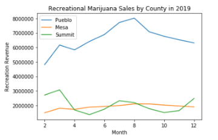
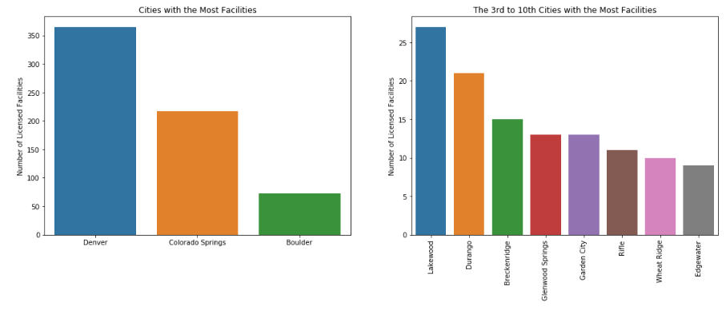

# CDOR Marijuana Datasets

The Colorado Department of Revenue (CDOR) has made several marijuana-related datasets available to the public. These datasets are updated at the source on a monthly basis. These datasets have been cleaned and aggregated and are now available on the CIM. Some useful aspects include:

  1) It is organized by county and date (month, year)
  2) The 'ID' column is a concatenation of the month, year, and county. This can be useful for merging discrete datsets

There are some noteworthy distinctions for each dataset. Here is some information about each:

### [Marijuana Sales Revenue in Colorado](https://data.colorado.gov/Revenue/Marijuana-Sales-Revenue-in-Colorado/j7a3-jgd3)

This is updated monthly and is two months behind. For example, the March 2020 update’s new data is from February 2020. It is seperated by medical and recreational revenue. There are codes for both medical and recreational. Each row details the medical and recreational sales for a specific county during a month and year. Each row also contains medical and recreational codes. The code details are:

**NL**: not listed in source data
**NR**: Not reported due to personally identifiable information

Here's an example of quick visualization to compare recreational revenue for 3 counties during 2019.

### [State Sales Tax Revenue from Marijuana in Colorado](https://data.colorado.gov/Revenue/State-Sales-Tax-Revenue-from-Marijuana-in-Colorado/3sm5-jtur)

This is updated monthly and is one month behind. For example, the March 2020 update’s new data is from February 2020. This is the tax at the standard rate of 2.9%. It’s worth noting that this dataset stopped reporting the recreational tax revenue after a certain time and ‘NR’ counties (see above). Each row represents sales tax revenues for medical and recreational marijuana sales for a given month, year, and county.

### [State Retail Marijuana Sales Tax Revenue by County in Colorado](https://data.colorado.gov/Revenue/State-Retail-Marijuana-Sales-Tax-Revenue-by-County/v9m8-x8dh)

This is the special tax data that is different than the data mentioned above. Per the CDOR:

These reports show the monthly state and local shares of the state retail marijuana sales tax revenue.

- From January 1, 2014 - June 30, 2017, the state retail marijuana sales tax rate was 10%, the state share was 85% of the total tax collected, and the local government share was 15% of the total tax collected.
- Starting July 1, 2017, the state retail marijauana sales tax rate is 15%, the state share is 90% of the total tax collected, and the local government share is 10% of the total tax collected. (Note: The first report reflecting the 15% rate is August 2017.)

These differences and proportion of tax revenue is reflected in this dataset.

Each row is a month, year, county, revenues for record, portion of tax retained by county, special tax rate, list of counties for counties designated as "Remainder of State", and a code if the data was reported as "NR" (not reported) due to customer personal information.

### [State Retail Marijuana Sales Tax Revenue by City in Colorado](https://data.colorado.gov/Revenue/State-Retail-Marijuana-Sales-Tax-Revenue-by-City-i/ehk3-i5tr)

The last month that this dataset was published by CDOR was October 2019. CIM currently has data from 02/2014 -  10/2019.  Special note, there is currently no ‘ID’ column of this dataset.

### [Licensed Marijuana Businesses in Colorado](https://data.colorado.gov/Business/Licensed-Marijuana-Businesses-in-Colorado/sqs8-2un5)

This dataset provides the license information and addresses of all MED Licensed Medical and Retail businesses in Colorado as of Jan 1 2020, from the Colorado Department of Revenue.

Each row is a different facility with information about their business (name, address, city, zip code, etc). The ‘DBA’ column stands for “Doing Business As” and might be different than the ‘Licensee’ column.

Other fields are specific to the license, such as the category and the certification (only used for testing facilities).

Here is a quick visualization for graphs. Note these two do not share a y-axis.

