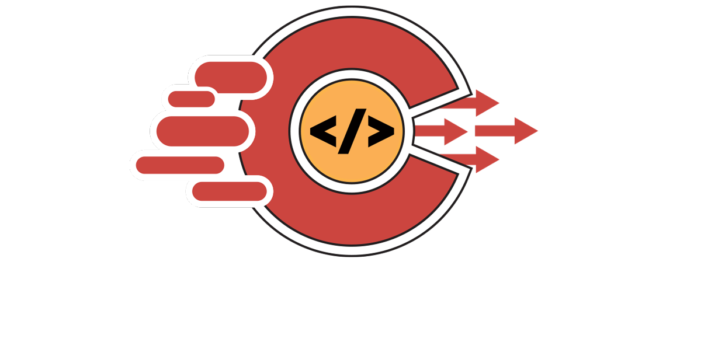

# CARTO for GoCode Colorado

### How can novice competitors use Carto to compete in Go Code?

Time is of the essence during the challenge, and CARTO can create an environment for aggregation, combination and data cleaning for quick exploration and new location insight creation. CARTO provides a SaaS or PaaS depending on how it is used. This means that once data has been uploaded, it’s fully cloud managed in real-time, and instantly visualized in Builder.

From there, competitors can use CARTO Builder to run advanced and or real-time analytics,  visualize data, and create complete dashboard applications that update live, and may be published or embedded into their applications. Learn how to use Builder in minutes [here](https://carto.com/help/tutorials/your-account/).

Alternately, data can be retrieved, integrated into other frameworks, and applications can be built with ease using the APIs and Javascript libraries. With the backend completely managed, competitors can spend all of their time building the frontend functionality from the start. Quickly get building applications with their straightforward documentation.

### How can experienced competitors use CARTO to compete in Go Code?

CARTO is a one-stop shop of geospatial tools, services, and APIs for discovering and analyzing location data. It’s the next level for insightful data management, data display, and geospatial  analysis integration within the application. There are many connectable libraries available through Catro that allow more advanced users the ability to build more complex geospatial tools. Leaflet is an example and provides the ability for cross-dataset queries, custom legends,  on the fly map naming, and other interactive map features.    

### CARTO Engine

An Open Source tool that enables users to utilize several APIs to build advanced, dynamic geospatial datasets and scalable maps for other applications. Engine is CARTO’s one-stop shop for developers to power location applications in their organization. CARTO Engine is designed for customization and ease of application deployment with fully cloud-managed databases, APIs, and software development libraries. From data enrichment to analysis and visualization, Engine gives users the fastest path to delivering business impact.

With CARTO Engine, the backend infrastructure and database is maintained and exposed through easy-to-use developer tools. This means development teams can spend less time worrying about servers and maintenance, and more time building fast, easily deployable business-driven solutions for clients.

[API Documentation Link](https://carto.com/help/)
[Creating Mobile Apps with CARTO](https://carto.com/engine/mobile/)

### CARTO Help Center

CARTO now has a [Help Center](https://carto.com/help) where users can find documentation on common issues/questions. The Help Center has a search bar, as well has sections dedicated to getting started, building maps, working with data, and personal account/plan settings.

### CARTO Developer Center

CARTO now has a [Developer Center](https://carto.com/developers) to aid developers in using CARTO to improve location intelligence. The Dev Center has everything from learning the Fundamentals of developing with CARTO to using APIs, to Styling tips. The Dev Center also has documentation on integrating libraries into applications that utilize CARTO.

### CARTO Blog

It’s worth checking out the [CARTO Blog](https://carto.com/blog/), as it often highlights ways CARTO can be integrated into “real” use cases. The CARTO blog has an abundance of blog posts for categories such as Technology, Data Science, Customer Stories, and news about CARTO as a company.

## FAQ’s

**How do I share my data architecture or other visualization of the Carto platform to include in my final competition presentation?**
This is an important question with an easy answer! Build the data architecture in Carto, and then export to a diagram.

For quick access and ease of use for developers, use [Client Libraries for Different Programming Languages](https://carto.com/developers/sql-api/).

Embedding a map is easy with CARTO’s share and publication options. Here is a Guide on publishing and sharing a CARTO map. [Share and Publish Reference Guide](https://carto.com/help/tutorials/publishing-and-sharing-maps/).    

**Is my environment locked into Carto once I start there?**

**AND**

**What if the teams have to port into a production infrastructure if their needs change or they need to migrate their data pool?**

No, CARTO is an ecosystem designed to avoid lock-in. Data inside of CARTO can be analyzed, visualized, and used directly from the database using our SQL API. The SQL API allows data to live in CARTO's cloud, but may be used with any library elsewhere even if it's not affiliated with CARTO. In addition, CARTO is open source. This makes it easy to leverage data from there or anywhere. Alternately, data loaded into CARTO does not have to remain in CARTO. Analysis and data manipulations can be performed and then exported to a wide range of formats including, but not limited to CSV, Shapefile, and GeoJSON.

**What exactly is Carto?**

Data Integration Software:

CARTO is focused on location based analysis, visualization with an emphasis on leading dynamic analysis and data-driven location applications. It is an open source software using tools such as Javascript for front-end web application, and backend Node.js based APIs. It uses PostGIS on top of PostgreSQL as its geospatial component.

Context on what that means:

80% of all data has a location component to it. We are only just beginning to understand the full potential of this location data and the ways we can leverage it to obtain new insights.

Other examples?

CARTO works better using Google Chrome. It runs successfully on Amazon EC2, Linode, OS X and Ubuntu 12.04, and Windows. Permissions may be needed to install successfully. There are also other [support and installation guides](https://cartodb.readthedocs.io/en/latest/install.html).

Due to Carto being a cloud based infrastructure, processing is quick. Visualizations are built server side and returned as tiles at runtime. CARTO uses tile layers. Multiple layers can be merged into one tile layer. This dramatically reduces the number of layers the client application has to render.

[ETL cheatsheet](https://github.com/CartoDB/carto-etl)

### Software Migration
There are several integrations, which are not included with participant accounts. For more information, or some examples of the integration software [click here](https://carto.com/integrations/).

Database:

  - Recommended using the [Import API](https://carto.com/developers/import-api/) or [SQL API](https://carto.com/developers/sql-api/) depending on the frequency in which the data needs to be updated, and the size of datasets being brought in.

Cloud Storage:

- [Google Drive](https://carto.com/integrations/google-drive/)
- [Box](https://carto.com/integrations/box/)
- [Dropbox](https://carto.com/integrations/dropbox/)

Third party tools:

- [ArcGIS](https://carto.com/integrations/arcgis/)
- [Qlik](https://carto.com/integrations/qlik/)
- [Splunk](https://carto.com/integrations/splunk/)
- [Alteryx](https://carto.com/integrations/alteryx/)
- [Twitter Maps](https://carto.com/integrations/twitter-maps/)
- [Excel Data](https://carto.com/integrations/excel/)
- [DigitalGlobe Satellite Imagery](https://carto.com/integrations/satellite-imagery/)

There are plenty of [tutorials based on level](https://carto.com/help/). There are also [quick reference guides](https://carto.com/help/tutorials/your-account/).

CARTO is constantly auditing their systems for top performance and support. Data security stores are processing layers redundantly. Backups occur using continuous streaming replication and regular snapshots. There are firewalls in place on the servers and origin load balancers. CARTO data is stored on Amazon Web Services.

Performance and Monitoring go hand-in-hand. CARTO guarantees 99.9% uptimes, in other words, it’s always running, and has and On-Call Team continually monitoring performance and integrity of their services from individual API requests to configuration changes and responses. It’s a continuous process.

CARTO is a scalable solution for spatial analytics and can handle up to hundreds of millions of records.
