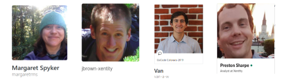
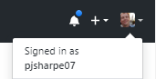
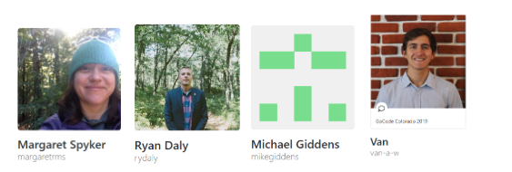
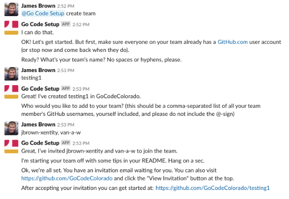
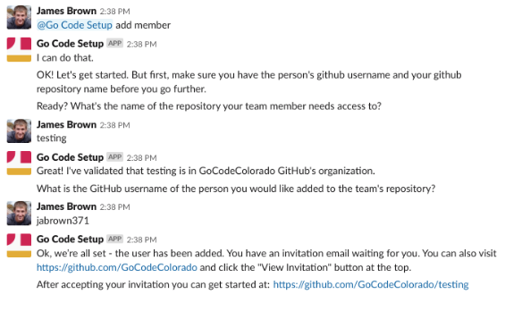
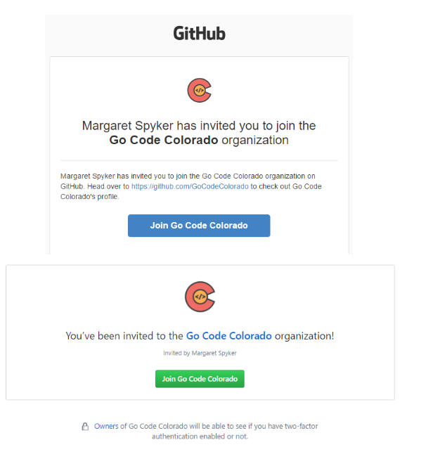
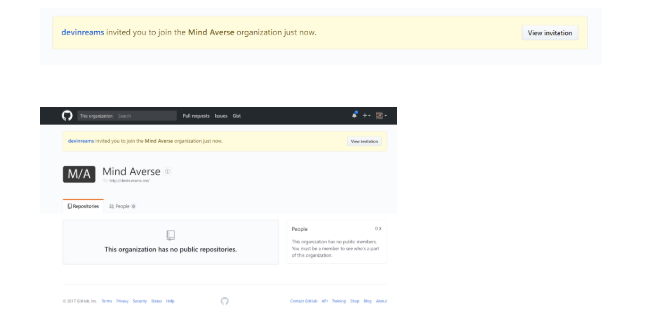
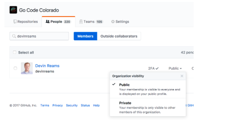
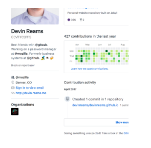

# 2020 GitHub Setup Instructions and Tips

If you don't know how to get setup in Slack for the competition, please go to [our website](https://gocode.colorado.gov/compete/join-us-on-slack/)

### How To Setup Your Account
  1. Join #welcome-and-setup channel
  2. Type: `@Go Code Setup create team`
  3. Follow prompts from there

### How To Add a Team Member
  1. Join #welcome-and-setup channel
  2. Type: `@Go Code Setup add member`
  3. Follow prompts from there

Need more help tag any of these folks in the github channel:

`@van wallace`, `@Preston Sharpe`, `@margaretrms`, `@James Brown`, `@rydaly`, `@devinreams`

### Important Notes

  - Spaces and hyphens are NOT allowed in team names.
  - Be sure to include your own GitHub username in the list when prompted.
  - Make sure you know all of your team’s GitHub usernames (careful! NOT their aliases) when adding your team member list.
  - Once your team is created, a link will appear in slack, but this link will NOT work for you until you accept the email invitation -from github (unless you have competed before and are already a part of the GoCode GitHub organization)
  - The Bot will remember your conversation specifically, so even if someone else starts a conversation the bot will be able to differentiate between them
  - As a courtesy, please wait if the bot is currently in conversation with someone else to avoid confusion
  - Please do not “monopolize” the bot, and complete the responses in a timely manner. You can always add members at a later time if you cannot get everyone’s github username.

### Meet Your Support Team

Here’s our Go Code GitHub Team - our names are the same in slack! We are around on Challenge Day:

@margaretrms, @James Brown, @Van Wallace, and @preston

### What is your GitHub username? How do you know?

- This is important to create your team in the Go Code Colorado GitHub Organization
- To determine your GitHub username, sign in to GitHub and click your image in the top right corner. Your username is directly below "Signed in as:". See screenshot below:

### Interface with the Slackbot to Create a Team

Here's an example team. These photos are from GitHub.

- Note -- the **GitHub username** is the name in italics below our name
  - Don’t use profile names - in black. Also called Alias Names or Full Names

- To use GitHub usernames with the bot, don’t put an “@-sign” in front of their name. See screen shot below for entering usernames into Slack.

Check out James interfacing directly with the bot and sailing smoothly to a new private repo in Go Code Colorado with a Project Board designed for you to succeed!

See full screen shot below.

### What Happens If I Didn’t Have Everyone When I Made my Team and I Need to Add Someone?

Any team wanting to add an additional team member after they use the bot for initial team creation can do this using the bot. Simply type `@Go Code Setup add member` and follow the prompts to input your repository name and the name of the user you would like to add (only 1 at a time).
Check out James adding a team member:

### I Think We Setup Our Team, but I Can’t Find It

There are a couple ways to accept your invite, the first is to find it in your email.

Another way to accept the invitation is to go to your GitHub profile page -- you should find a button to view the invitation there. Here’s an example of said button:

### Show your Go Code Colorado involvement on your GitHub profile

BONUS: Don’t Forget to Get Your Badge!

If you want to show off your involvement in the Go Code Colorado community, browse to [https://github.com/orgs/GoCodeColorado/people](https://github.com/orgs/GoCodeColorado/people) and find your name and change your visibility from “Private” to “Public”. You’ll get a nifty badge on your GitHub profile!

1. Browse to [http://github.com/gocodecolorado](https://github.com/gocodecolorado)
1. Click the “People” tab
2. Search and find yourself
3. Click the “Private” link and change your visibility to “Public”

This will then show a Go Code Colorado badge linking to the organization in your profile:

### More Resources

Here’s a “Getting started with GitHub” [1-minute video](https://www.youtube.com/watch?v=QoqWEqAufOE) for Go Code Colorado:.

Other official sources with helpful information:

- [https://guides.github.com/](https://guides.github.com/)
- [https://help.github.com/](https://help.github.com/)
- [https://opensource.guide/](https://opensource.guide/)

### Github Project Boards

The Github bot will automatically create a Project board for your team, which has been created specifically for teams to succeed in this competition. Please check it out from your repository page and go through the cards to get a feel for what should be prioritized!

These cards are stored as GitHub “Issues”, so make sure to go through and resolve as you complete it. Or, setup automation in the GitHub project boards to mark them resolved as they are moved to the done column!
