# PowerBI for GoCode Colorado

Last Updated: April 20, 2018

[Power BI](https://powerbi.microsoft.com/en-us/) is a business intelligence app from Microsoft that allows for complex visualization of data. Utilizing a couple built in features on the Colorado Information Marketplace, it’s simple to harness the power of Power BI. This brief walkthrough will give you a starting point for creating visualizations. For more tutorials, navigate to Microsoft’s [Power BI Guided Learning](https://docs.microsoft.com/en-us/power-bi/guided-learning/).

For this walkthrough we are going to create a table and graph visualization to display the “highest average annual wage by occupation in Colorado by Metropolitan Statistical Areas and selected regions” using the [Employment Wages in Colorado](https://data.colorado.gov/Labor-Employment/Employment-Wages-in-Colorado/busm-qa5b) dataset.

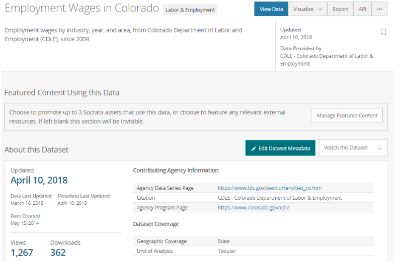

## Walkthrough on Creating Query for Highest Average Annual Wage by Occupation

1. Open dataset and View Data on CIM

2. Export OData Feed

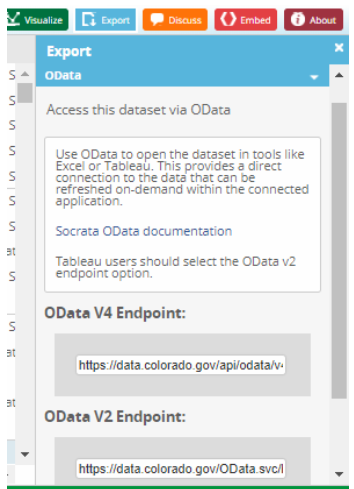

3. Get Data > OData Feed

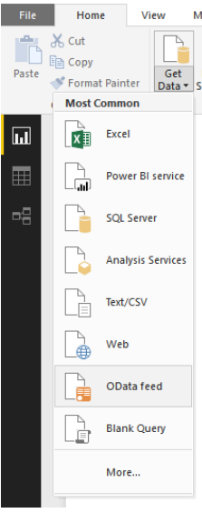

4. Enter OData v2 URL in the Basic URL field

5. Once OData feed is established, click Load to load the dataset

6. Build SQL query. For this example: [here](https://data.colorado.gov/resource/vu7j-izta.json?$query=SELECT%20MAX(mean),%20areaname,%20periodyear%20WHERE%20codetitle%20!=%20%27Total%20All%20occupationsANDratetype%20=4%27%20GROUP%20BY%20areaname,%20periodyear)

- SELECT MAX (mean) areaname, periodyear, codetitle = occupations AND ratetype = 4
- Select the max average salary, the area name, and the period where codetitle does not equal “Total All Occupations” and ratetype = 4 (annual wage or salary).
- Group by area name and period

7. Select Edit Queries from the Ribbon to open the Power Query Editor

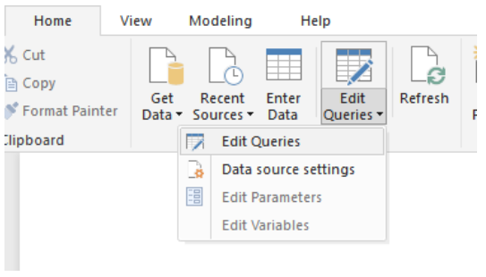

8. In the Power Query Editor window, select New Source, From Web, and enter the SOQL query (above) in the Basic URL field

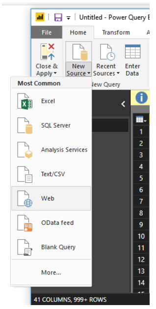

9. In the new query, right click list and select "To Table" and click OK

10. Click the expand icon and press OK to show the data from the Query

11. Rename the columns to match the original data and change the column types to the appropriate type by right clicking the header and selecting “Change Type”

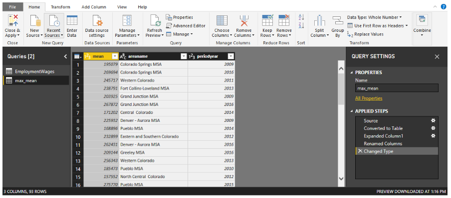

12. In the upper right corner of the Power Query Editor, select Combine > Dropdown next to Merge Queries > Select Merge Queries as new

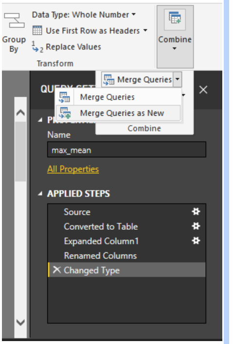

13. Select all three headers by CTRL+clicking the headers for the SOQL query, on the bottom dropdown, select the OData Feed and, in order, click the first header to match the SOQL query, then CTRL+click the remaining headers

14. Check the box in the Privacy levels pop-up to continue

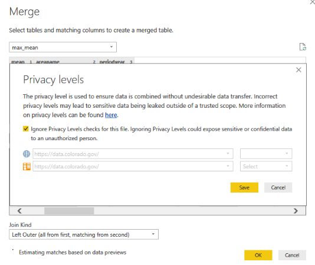

15. Select Inner Join to join only matching rows and select OK to complete the Merge

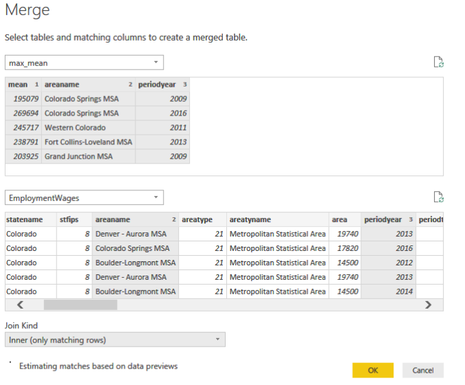

16. Click the expand icon for the new merged query and select the desired field (in this case, codetitle)

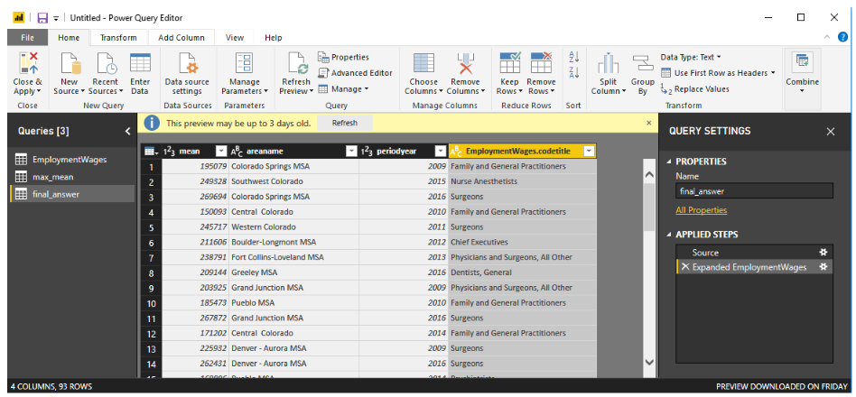

17. You may then click Close & Apply in the top left and begin creating visualizations based on the final_answer

18. To create a table and graph visualization, add a Table and add a Clustered Graph

19. For the graph, axis = areaname or code title (depending on how the data should be displayed), legend = periodyear, value = Max of Mean

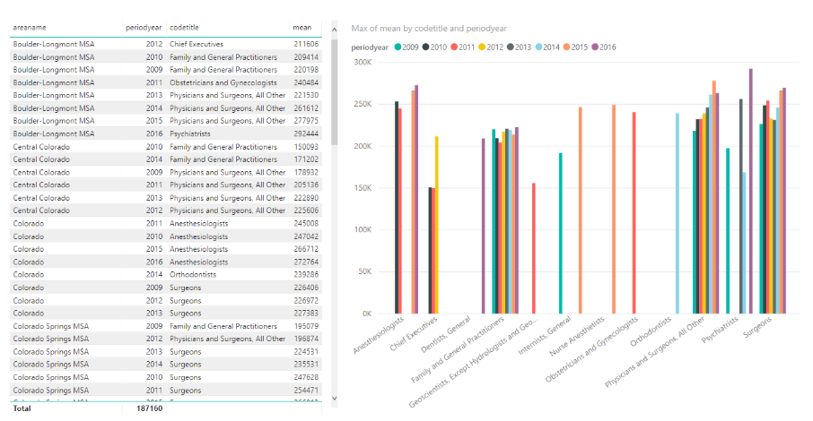
