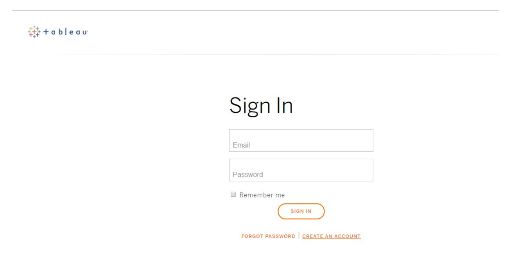

# GoCode Colorado 2020 - Tableau Setup Instructions

1. Navigate to tableau.com and click the "Try Now" link on the right side of the page.

2. If you have an account, sign in. If you do not have an account, click the "Create An Account" link

  a. You will then enter your account details.

  b. Now go to your email that you used to create the account and follow the link:

3. Now download and install Tableau Desktop

4. Once the install is complete, you will be taken to a sign-in page where you can either sign up for the free 30 day trial or use the extended trial provided to GoCode.

  a. Click "Activate Tableau" at the top to enter your GoCode Colorado provided access key.

You're all set!

If you are feeling a little lost with how to start in Tableau, there are plenty of online resources to help you out. Check out Tableau's very own ["Get Started with Tableau"](https://help.tableau.com/current/guides/get-started-tutorial/en-us/get-started-tutorial-home.htm) page. Make sure you attend Challenge Day! There will be a Tableau mentor at Challenge Days.
